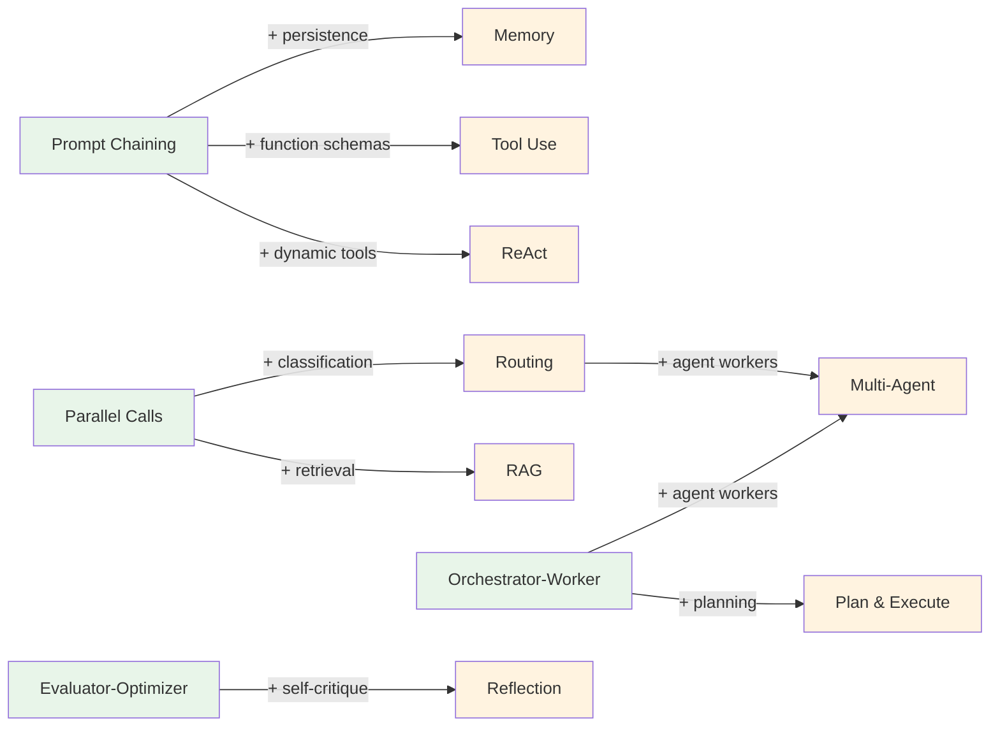

# Agent Blueprints

[](https://github.com/jagguvarma15/agent-blueprints/actions/workflows/docs.yml)
[](./LICENSE)
[](./foundations/README.md)
[](./meta/contributing.md)

**An architecture-first guide to designing LLM workflow and agent systems.**

---

This repository teaches you how to *think about and design* agent systems — before you write a single line of code. It covers both LLM workflows (where the developer controls the flow) and agent patterns (where the LLM controls the flow), with an explicit progression showing how one evolves into the other.

Every pattern is documented at three levels of depth. Read only what you need:
- **Overview** (Tier 1) — Architecture diagram, tradeoffs, when to use it. 1–2 pages.
- **Design** (Tier 2) — Component breakdown, data flow, error handling, scaling. 3–5 pages.
- **Implementation** (Tier 3) — Pseudocode, interfaces, testing strategy, pitfalls. 5–10 pages.

---

## Start Here

| If You... | Read This |
|-----------|-----------|
| Are new to LLM systems | [Foundations](./foundations/README.md) — concepts, terminology, mental models |
| Need to pick a pattern | [Choosing a Pattern](./foundations/choosing-a-pattern.md) — decision flowchart |
| Want structured LLM pipelines | [Workflows](./workflows/README.md) — 4 pre-agent patterns |
| Want autonomous LLM behavior | [Agent Patterns](./patterns/README.md) — 8 agent architectures |
| Are designing a production system | [Composition](./composition/README.md) — how patterns combine |
| Want to avoid common mistakes | [Anti-Patterns](./foundations/anti-patterns.md) — what not to build |

## Workflow Patterns

Workflows are orchestrated patterns where **the code controls the flow**. The developer defines the structure; the LLM fills in the content.

| Pattern | What It Does | Overview | Design | Implementation |
|---------|-------------|----------|--------|----------------|
| **Prompt Chaining** | Sequential LLM calls with validation gates | [overview](./workflows/prompt-chaining/overview.md) | [design](./workflows/prompt-chaining/design.md) | [implementation](./workflows/prompt-chaining/implementation.md) |
| **Parallel Calls** | Concurrent LLM calls on independent inputs | [overview](./workflows/parallel-calls/overview.md) | [design](./workflows/parallel-calls/design.md) | [implementation](./workflows/parallel-calls/implementation.md) |
| **Orchestrator-Worker** | LLM decomposes task, delegates to workers | [overview](./workflows/orchestrator-worker/overview.md) | [design](./workflows/orchestrator-worker/design.md) | [implementation](./workflows/orchestrator-worker/implementation.md) |
| **Evaluator-Optimizer** | Generate-evaluate feedback loop | [overview](./workflows/evaluator-optimizer/overview.md) | [design](./workflows/evaluator-optimizer/design.md) | [implementation](./workflows/evaluator-optimizer/implementation.md) |

## Agent Patterns

Agents are systems where **the LLM controls the flow**. The developer provides tools and constraints; the LLM decides what to do.

| Pattern | What It Does | Evolves From | Overview | Design | Implementation |
|---------|-------------|-------------|----------|--------|----------------|
| **ReAct** | Reason-act loop with tools | Prompt Chaining | [overview](./patterns/react/overview.md) | [design](./patterns/react/design.md) | [impl](./patterns/react/implementation.md) |
| **Plan & Execute** | Plan first, then execute steps | Orchestrator-Worker | [overview](./patterns/plan-and-execute/overview.md) | [design](./patterns/plan-and-execute/design.md) | [impl](./patterns/plan-and-execute/implementation.md) |
| **Tool Use** | Structured function calling | Prompt Chaining | [overview](./patterns/tool-use/overview.md) | [design](./patterns/tool-use/design.md) | [impl](./patterns/tool-use/implementation.md) |
| **Memory** | Persistent state across sessions | Prompt Chaining | [overview](./patterns/memory/overview.md) | [design](./patterns/memory/design.md) | [impl](./patterns/memory/implementation.md) |
| **RAG** | Retrieval-augmented generation | Parallel Calls | [overview](./patterns/rag/overview.md) | [design](./patterns/rag/design.md) | [impl](./patterns/rag/implementation.md) |
| **Reflection** | Self-critique and refinement | Evaluator-Optimizer | [overview](./patterns/reflection/overview.md) | [design](./patterns/reflection/design.md) | [impl](./patterns/reflection/implementation.md) |
| **Routing** | Intent classification + dispatch | Parallel Calls | [overview](./patterns/routing/overview.md) | [design](./patterns/routing/design.md) | [impl](./patterns/routing/implementation.md) |
| **Multi-Agent** | Supervisor-worker delegation | Orchestrator-Worker + Routing | [overview](./patterns/multi-agent/overview.md) | [design](./patterns/multi-agent/design.md) | [impl](./patterns/multi-agent/implementation.md) |

## How Workflows Become Agents

Each agent pattern evolves from a workflow. When a workflow's conditional logic becomes too complex, it's time to let the LLM make those decisions.



Each agent pattern includes an [evolution.md](./patterns/react/evolution.md) document that traces this bridge in detail.

## Repository Structure

```
agent-blueprints/
├── foundations/          # Core concepts, terminology, pattern selection
├── workflows/           # 4 pre-agent workflow patterns (3 tiers each)
├── patterns/            # 8 agent patterns (3 tiers + evolution bridge each)
├── composition/         # How patterns combine into production systems
├── meta/                # Contributing, style guide, roadmap
└── legacy/              # Archived code implementations from Phase 1
```

## Design Principles

1. **Architecture-first** — Teach readers to design before they build
2. **3-tier depth** — Overview → Design → Implementation. Read only what you need.
3. **Workflows → Agents** — Workflows are the foundation. Agents build on them.
4. **Generalized, not use-case-bound** — Patterns are abstract and composable
5. **Framework-agnostic** — No provider lock-in. The LLM is a swappable layer.

## Contributing

See the [Contributing Guide](./meta/contributing.md) and [Style Guide](./meta/style-guide.md).

## Roadmap

This is Phase 1 (documentation). Code implementations, advanced patterns, and tooling are planned for future phases. See the [full roadmap](./meta/roadmap.md).

## License

Released under the [MIT License](./LICENSE). Copyright (c) 2026 Jagadesh Varma Nadimpalli.
