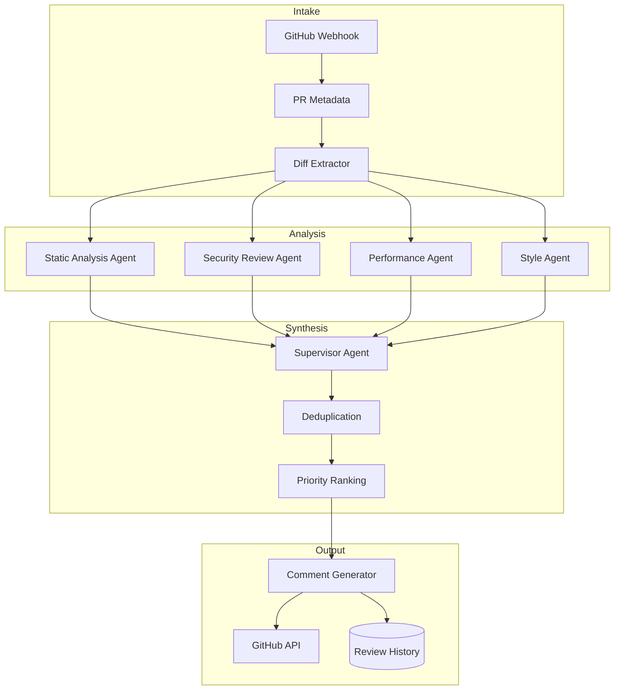

# Reference Architecture: Code Review Agent

## Use Case Overview

An automated code review system that analyzes pull requests, identifies bugs, security vulnerabilities, performance issues, and style violations, and generates actionable review comments. The system integrates with GitHub/GitLab via webhooks, runs static analysis in parallel with LLM-based semantic review, and learns from accepted/rejected suggestions over time.

## System Diagram

## Component Inventory

| Component | Role | Technology |
|-----------|------|------------|
| Diff Extractor | Parses PR diff into file-level chunks | Python / GitHub API |
| Static Analysis Agent | AST-level bug detection, type errors | Claude + language-specific tools |
| Security Review Agent | OWASP Top 10, injection, secrets detection | Claude claude-sonnet-4-6 + regex |
| Performance Agent | N+1 queries, inefficient algorithms | Claude + code analysis |
| Style Agent | Naming, complexity, readability | Claude claude-haiku-4-5-20251001 (cost-optimized) |
| Supervisor Agent | Deduplicates and prioritizes findings | Multi-Agent Supervisor (Blueprint 04) |
| Comment Generator | Formats findings as PR review comments | Claude claude-sonnet-4-6 |

## Technology Choices & Rationale

- **Parallel analysis agents** — all four analysis types run simultaneously; review latency = max(agents) not sum
- **Claude claude-haiku-4-5-20251001** for Style Agent — fast and cost-effective for pattern-based review
- **Claude claude-sonnet-4-6** for Security and Comment Generation — nuanced reasoning required
- **Webhook-driven** — event-driven architecture avoids polling and scales naturally

## Scaling Considerations

- Fan-out analysis agents per file chunk (not per PR) — enables line-level parallelism
- Cache analysis results per file SHA — unchanged files reuse previous review
- Rate limit GitHub comment API — batch comments rather than posting one-by-one
- Use diff context windows carefully — each agent receives only its relevant file chunks

## Observability

- Emit metrics: review_latency_p99, comments_per_pr, accepted_suggestion_rate, false_positive_rate
- Log all LLM inputs/outputs with PR SHA for reproducibility
- A/B test different prompts and track accepted_suggestion_rate over time
- Alert when p99 review latency exceeds SLA (e.g., 5 minutes)

## Security Considerations

- Never log full source code to third-party services — all LLM calls stay within your VPC/region
- Validate webhook signatures before processing
- Strip secrets detected in diffs before logging (regex + entropy analysis)
- Scope GitHub token to read-only (PRs, code) + write (comments only)

## Cost Estimates (rough)

| PRs/day | Avg files/PR | Monthly Cost |
|---------|-------------|--------------|
| 50 | 10 | ~$30–100 |
| 500 | 10 | ~$300–800 |
| 5,000 | 10 | ~$2,000–6,000 |

*Assumes claude-sonnet-4-6 for security/synthesis, claude-haiku-4-5-20251001 for style.*

## Blueprint Composition

- [Blueprint 04: Multi-Agent Supervisor](../../blueprints/04-multi-agent-supervisor/) — parallel agent orchestration
- [Blueprint 05: Multi-Agent Parallel](../../blueprints/05-multi-agent-parallel/) — concurrent analysis fan-out
- [Blueprint 09: Tool Calling](../../blueprints/09-tool-calling/) — GitHub API integration
