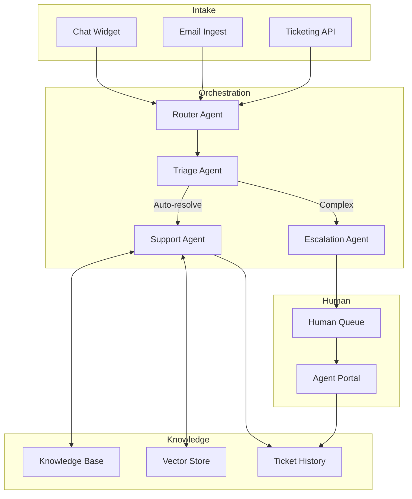

# Reference Architecture: Customer Support Agent

## Use Case Overview

An end-to-end AI agent system that handles customer support tickets across channels (chat, email, ticketing system). The system triages incoming requests, retrieves relevant knowledge base articles, resolves common issues autonomously, escalates complex cases to human agents, and learns from resolved tickets to improve future responses.

## System Diagram

## Component Inventory

| Component | Role | Technology |
|-----------|------|------------|
| Router Agent | Normalises and routes incoming requests | Anthropic SDK, ReAct (Blueprint 01) |
| Triage Agent | Classifies intent, urgency, and complexity | Claude claude-haiku-4-5-20251001 |
| Support Agent | Retrieves KB articles and drafts responses | RAG Basic (Blueprint 07) |
| Escalation Agent | Prepares context packet for human handoff | Multi-Agent Supervisor (Blueprint 04) |
| Vector Store | Semantic search over KB and past tickets | ChromaDB / Pinecone |
| Ticket History | Structured store for closed tickets | PostgreSQL |
| Human Queue | Priority queue for human agent pickup | Redis / SQS |

## Technology Choices & Rationale

- **Claude claude-sonnet-4-6** for Support Agent — best balance of quality and latency for customer-facing responses
- **Claude claude-haiku-4-5-20251001** for Triage — fast classification doesn't need frontier reasoning
- **ChromaDB** — open-source, self-hostable, no vendor lock-in
- **PostgreSQL** — structured ticket data with full-text search fallback

## Scaling Considerations

- Triage and Support agents are stateless — scale horizontally behind a load balancer
- Vector store requires memory-optimised instances; use managed service (Pinecone, Weaviate Cloud) at scale
- Implement request queuing (SQS/Kafka) to buffer spikes and prevent API rate limit errors
- Cache embeddings for frequently-accessed KB articles

## Observability

- Trace every ticket lifecycle with OpenTelemetry span IDs
- Emit metrics: resolution rate, escalation rate, mean time to resolve, human handoff rate
- Log all LLM inputs/outputs for quality review and fine-tuning data collection
- Alert on: escalation rate spike (>20% above baseline), p99 response latency > 5s

## Security Considerations

- PII redaction before logging LLM inputs (regex + NER model)
- Role-based access: support agents see tickets only in their queue
- All KB content goes through an approval workflow before ingestion
- API key rotation every 90 days; use secrets manager (AWS Secrets Manager / Vault)

## Cost Estimates (rough)

| Scale | Monthly Cost |
|-------|-------------|
| 1,000 tickets/day | ~$50–150 |
| 10,000 tickets/day | ~$400–1,200 |
| 100,000 tickets/day | ~$3,000–8,000 |

*Assumes 80% auto-resolved, ~500 tokens per resolution. Costs vary by model mix.*

## Blueprint Composition

This architecture composes:
- [Blueprint 01: ReAct Agent](../../blueprints/01-react-agent/) — Router and Triage
- [Blueprint 07: RAG Basic](../../blueprints/07-rag-basic/) — Knowledge retrieval
- [Blueprint 04: Multi-Agent Supervisor](../../blueprints/04-multi-agent-supervisor/) — Orchestration
- [Blueprint 10: Human-in-the-Loop](../../blueprints/10-human-in-the-loop/) — Escalation flow
