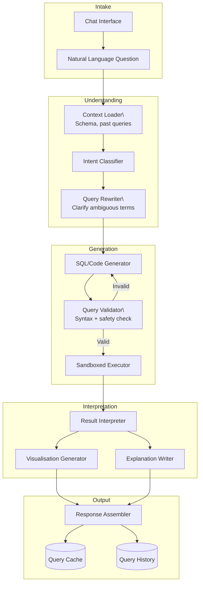

# Reference Architecture: Data Analyst Agent

## Use Case Overview

A natural language data analysis system that allows non-technical users to query databases and data warehouses by describing what they want in plain English. The agent translates questions to SQL or pandas code, executes it safely in a sandboxed environment, interprets the results, generates visualisations, and explains findings in natural language.

## System Diagram

## Component Inventory

| Component | Role | Technology |
|-----------|------|------------|
| Context Loader | Loads schema, table descriptions, sample data | RAG Basic (Blueprint 07) |
| Intent Classifier | Identifies query type (aggregation, trend, comparison) | Claude claude-haiku-4-5-20251001 |
| Query Rewriter | Resolves ambiguous terms against schema | Claude claude-sonnet-4-6 |
| SQL Generator | Translates NL to SQL with schema context | Claude claude-sonnet-4-6 |
| Query Validator | Syntax check + DML/DDL injection guard | sqlparse + allowlist |
| Sandboxed Executor | Runs SQL in read-only connection with timeout | PostgreSQL read replica |
| Result Interpreter | Explains what the numbers mean in context | Claude claude-sonnet-4-6 |
| Visualisation Generator | Produces Chart.js spec from results | Claude + structured output |
| Query Cache | Caches identical query results for 5 minutes | Redis |

## Technology Choices & Rationale

- **Two-stage SQL generation**: Query Rewriter handles term disambiguation separately from SQL generation, improving accuracy on domain-specific terminology
- **Read-only replica** — analyst agent never touches the primary database; eliminates data mutation risk
- **Sandboxed Executor** — hard timeout (30s), row limit (10k), no DDL/DML — prevents runaway queries
- **Schema RAG** — only relevant table definitions are sent in context, not the full schema, reducing tokens and confusion on large warehouses

## Scaling Considerations

- Cache common queries (daily active users, revenue summaries) with short TTL
- Parallelize chart generation and text explanation generation (both start after result arrives)
- Queue requests during peak hours — LLM inference is the bottleneck, not the database
- Pre-compute schema embeddings and refresh nightly, not per-query

## Observability

- Track: SQL correctness rate (manual evaluation sample), query execution time, empty result rate, user satisfaction (thumbs up/down)
- Log all generated SQL for audit and fine-tuning
- Alert on: query timeout rate > 5%, empty result rate > 30% (signal prompt issues)
- Record null results separately — often indicate query misinterpretation, not data absence

## Security Considerations

- **Read-only database user** with no schema modification privileges
- **Query timeout** hard limit — prevents expensive queries from affecting other users
- **Row limit** — never return more than 10,000 rows to LLM context (sample and explain)
- **PII columns** — mask sensitive columns (SSN, email) in schema definitions shared with LLM
- **SQL injection prevention** — validate that generated SQL contains no DDL, DML, or multi-statement patterns before execution

## Cost Estimates (rough)

| Queries/day | Monthly Cost |
|------------|-------------|
| 100 | ~$20–60 |
| 1,000 | ~$150–400 |
| 10,000 | ~$1,000–3,000 |

*Assumes ~2k tokens per query round-trip, claude-sonnet-4-6 for generation/interpretation.*

## Blueprint Composition

- [Blueprint 01: ReAct Agent](../../blueprints/01-react-agent/) — iterative SQL generation with error correction
- [Blueprint 07: RAG Basic](../../blueprints/07-rag-basic/) — schema context retrieval
- [Blueprint 09: Tool Calling](../../blueprints/09-tool-calling/) — database execution tools
- [Blueprint 10: Human-in-the-Loop](../../blueprints/10-human-in-the-loop/) — confirmation step for complex/expensive queries
