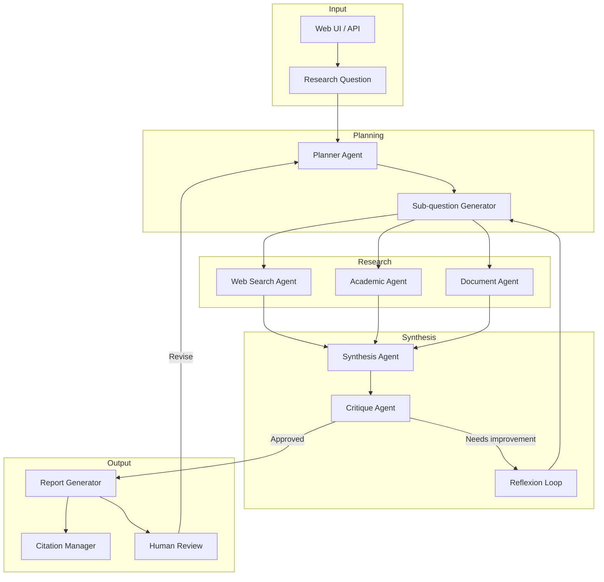

# Reference Architecture: Research Assistant Agent

## Use Case Overview

An autonomous research assistant that accepts a research question, decomposes it into sub-questions, searches multiple sources (web, academic databases, internal documents), synthesises findings, identifies gaps, and produces a structured report with citations. Supports iterative refinement through a human-in-the-loop review step.

## System Diagram

## Component Inventory

| Component | Role | Technology |
|-----------|------|------------|
| Planner Agent | Decomposes research question into sub-questions | Plan & Execute (Blueprint 02) |
| Web Search Agent | Searches web, extracts relevant content | ReAct + web tools (Blueprint 01) |
| Academic Agent | Queries Semantic Scholar / arXiv APIs | ReAct + API tools (Blueprint 01) |
| Document Agent | Searches internal document corpus | RAG Advanced (Blueprint 08) |
| Synthesis Agent | Integrates findings into coherent draft | Claude claude-sonnet-4-6 |
| Critique Agent | Evaluates quality, flags gaps | Reflexion (Blueprint 03) |
| Citation Manager | Normalises and deduplicates references | Structured extraction |
| Human Review | Async approval gate before final delivery | Human-in-the-Loop (Blueprint 10) |

## Technology Choices & Rationale

- **Claude claude-opus-4-6** for Planner and Synthesis — complex reasoning requires the most capable model
- **Claude claude-haiku-4-5-20251001** for web content extraction — high throughput, lower cost
- **Reflexion loop** — self-critique improves report quality without requiring more human input
- **Parallel research agents** — fan-out across sources reduces wall-clock time significantly

## Scaling Considerations

- Research agents are embarrassingly parallel — run all source agents concurrently
- Rate-limit external APIs independently (web search, Semantic Scholar, arXiv)
- Implement result caching keyed on sub-question hash to avoid redundant queries
- Long-running jobs (>5 min) should use async job queue with webhook callback

## Observability

- Track per-source retrieval quality scores
- Measure synthesis coherence via automated evaluation (LLM-as-judge)
- Monitor reflexion iteration count — >3 iterations signals a poorly-scoped question
- Emit events: job_started, source_retrieved, synthesis_complete, human_approved

## Security Considerations

- Sandbox web search execution — do not follow redirects to untrusted domains
- Validate and sanitise all external content before passing to LLM context
- Rate-limit per-user to prevent API cost abuse
- Audit log all research sessions for compliance

## Cost Estimates (rough)

| Report Type | Estimated Cost |
|-------------|---------------|
| Quick summary (5 sources) | ~$0.50–2.00 |
| Standard report (20 sources) | ~$3.00–10.00 |
| Deep research (50+ sources) | ~$15.00–40.00 |

*Costs vary significantly by model mix and document corpus size.*

## Blueprint Composition

- [Blueprint 01: ReAct Agent](../../blueprints/01-react-agent/) — Source search agents
- [Blueprint 02: Plan & Execute](../../blueprints/02-plan-and-execute/) — Research planning
- [Blueprint 03: Reflexion](../../blueprints/03-reflexion/) — Quality self-improvement
- [Blueprint 05: Multi-Agent Parallel](../../blueprints/05-multi-agent-parallel/) — Concurrent source agents
- [Blueprint 08: RAG Advanced](../../blueprints/08-rag-advanced/) — Internal document retrieval
- [Blueprint 10: Human-in-the-Loop](../../blueprints/10-human-in-the-loop/) — Final review gate
