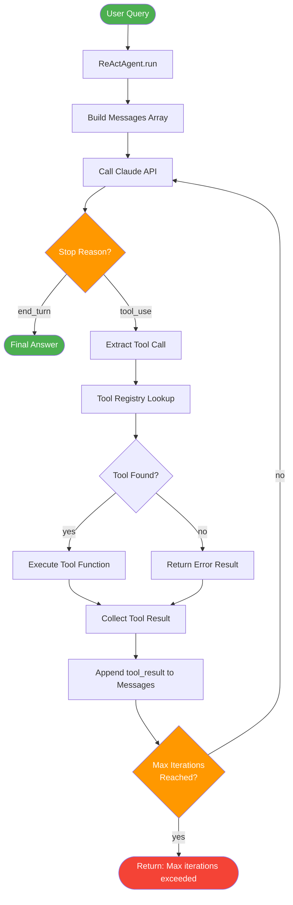

# Architecture: ReAct Agent

## High-Level Flowchart



## Component Breakdown

### 1. Agent Loop (`ReActAgent.run`)

The core orchestration component. It maintains the **message history** and drives the
think-act-observe cycle.

**Responsibilities:**
- Initialise and accumulate the message history
- Call the LLM with the current messages and tool definitions
- Inspect the stop reason to decide whether to continue or return
- Guard against infinite loops via `max_iterations`

**Key invariant:** The message history always ends with a valid alternating user/assistant sequence
that satisfies the Anthropic Messages API contract.

```
messages = [
    {"role": "user",      "content": "<original query>"},
    {"role": "assistant", "content": [tool_use block]},
    {"role": "user",      "content": [tool_result block]},
    {"role": "assistant", "content": [tool_use block]},
    {"role": "user",      "content": [tool_result block]},
    {"role": "assistant", "content": "<final text answer>"},
]
```

### 2. Tool Registry

A mapping from tool names (strings) to Python/TypeScript functions. The registry is built at agent
initialisation time.

**Python implementation:**

```python
self._tool_registry: dict[str, Callable[..., str]] = {
    "calculator":        calculator,
    "get_current_time":  get_current_time,
    "web_search":        web_search,
}
```

**Tool contract:** Every tool function must:
- Accept keyword arguments matching the tool's `input_schema`
- Return a plain `str` (the agent serialises non-string values)
- Be pure or side-effect-free where possible (makes testing easier)
- Never raise unhandled exceptions — catch and return an error string instead

### 3. Memory / Context Window

ReAct agents use the **conversation history as implicit memory**. There is no external memory store
in this baseline blueprint.

| Type | Implementation | Notes |
|------|---------------|-------|
| Short-term | Full message history passed on each call | Context window is the limit |
| Long-term | Not included in this blueprint | See Blueprint 06: Memory Patterns |
| Tool results | Appended as `tool_result` blocks | Automatically in context |

**Context window management:** For long-running agents, the message history can grow large. Common
strategies (not implemented here, see the advanced blueprints):
- Summarise old messages
- Slide a window over recent messages
- Use Claude's extended thinking to reduce repeated reasoning

### 4. LLM (Claude via Anthropic SDK)

The model receives:
- The full message history (includes past reasoning, tool calls, and tool results)
- The system prompt (optional; used to set persona and constraints)
- The tool definitions (JSON Schema format)

The model returns:
- A list of content blocks: zero or more `text` blocks, zero or more `tool_use` blocks
- A `stop_reason`: `"end_turn"` (done) or `"tool_use"` (wants to call a tool)

## Data Flow

```
1. USER INPUT
   "What is the square root of the number of seconds in a day?"

2. FIRST API CALL
   → Model receives: [user message]
   ← Model returns: stop_reason=tool_use
                    tool_use: calculator("86400 ** 0.5")

3. TOOL EXECUTION
   calculator("86400 ** 0.5") → "293.9387691339814"

4. SECOND API CALL
   → Model receives: [user, assistant(tool_use), user(tool_result)]
   ← Model returns: stop_reason=end_turn
                    text: "The square root of 86,400 (seconds in a day) is approximately 293.94."

5. RETURN FINAL ANSWER
   "The square root of 86,400 (seconds in a day) is approximately 293.94."
```

## Key Design Decisions

### Decision 1: Full History vs. Stateless

**Choice:** Maintain full conversation history in memory (stateless across `run()` calls).

**Rationale:** Simplicity. The agent is assumed to handle one query at a time. For multi-turn
conversations, callers should manage and pass session history themselves.

**Alternative:** Store history in a database and retrieve by session ID — this is a natural
extension for production deployments.

### Decision 2: Sequential Tool Execution

**Choice:** Execute one tool at a time, even when the model requests multiple tools in a single
response.

**Rationale:** The baseline ReAct pattern is sequential. This makes debugging straightforward and
matches the original paper's formulation.

**Alternative:** See Blueprint 02 (Parallel Tool Calls) — when the model returns multiple `tool_use`
blocks, execute them concurrently with `asyncio.gather` / `Promise.all`.

### Decision 3: String-Only Tool Returns

**Choice:** All tool functions return plain strings.

**Rationale:** Strings are universally serialisable, easy to read in logs, and the model handles
them well. Structured data (JSON, tables) can be embedded as formatted strings.

**Alternative:** Return typed objects and let the agent layer serialise them. This adds complexity
but enables richer downstream processing.

### Decision 4: Max Iterations as Hard Stop

**Choice:** Hard-stop after `max_iterations` and return an error message rather than raising an
exception.

**Rationale:** In production, a runaway agent should degrade gracefully rather than crash the
caller. The caller can inspect the return value and decide how to handle the failure.

**Alternative:** Raise a custom `MaxIterationsError` exception — preferred when the caller needs to
distinguish between "agent completed" and "agent gave up".

### Decision 5: Tool Errors Stay In-Context

**Choice:** When a tool raises an exception, the error is caught and returned as a `tool_result`
with `is_error: true` — the model sees the error and can retry or change strategy.

**Rationale:** This mirrors how humans recover from failed tool use: they read the error, adjust,
and try again. It makes the agent more robust without special-casing error handling in the loop.

**Alternative:** Raise immediately — appropriate when tool errors indicate a programming bug rather
than a runtime condition.
