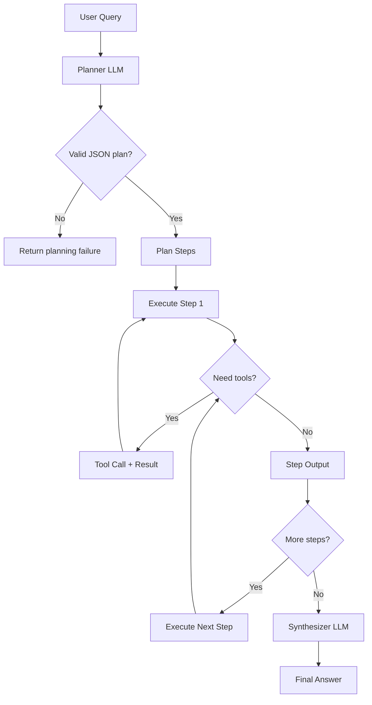

# Architecture: Plan-and-Execute Agent

## High-Level Flow

## Components

- **Planner**: converts the user request into a compact JSON array of steps.
- **Executor**: iterates through steps and can invoke tools per step.
- **Tool registry**: maps tool names to local implementations.
- **Synthesizer**: transforms step-level outputs into one final response.

## Failure Modes and Handling

- Invalid plan JSON: return a clear planning failure message.
- Unknown tool: convert tool errors into text and keep execution moving.
- Runaway steps: cap with `max_tool_rounds_per_step`.
- Overly long plans: truncate with `max_steps`.

## Trade-offs

- Better interpretability than ReAct, but higher latency.
- Stronger control flow, but less flexible than free-form tool loops.
- Easier governance and auditing, at the cost of extra prompting overhead.
