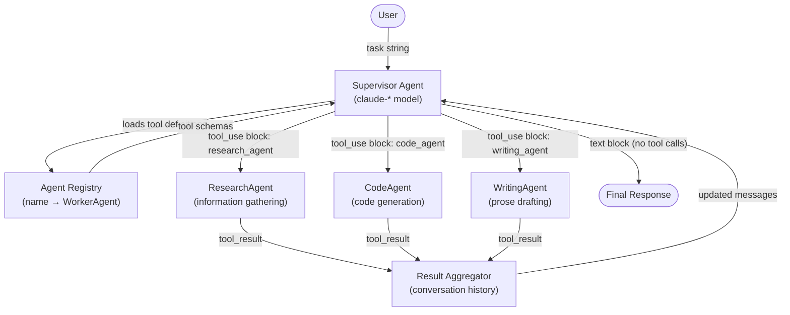
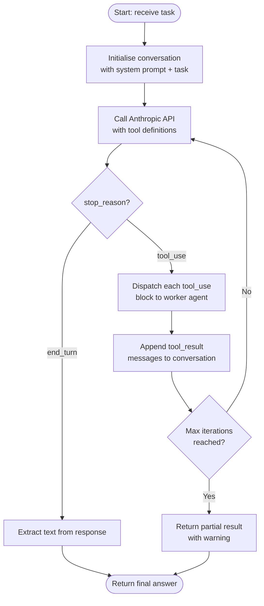
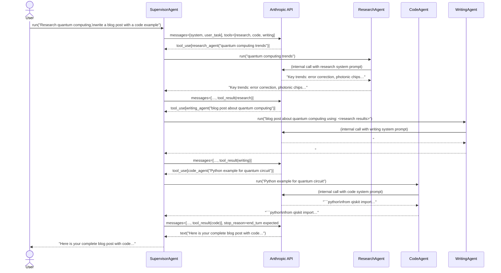

# Architecture: Multi-Agent Supervisor

This document describes the design of Blueprint 04 in detail. Read the [README](./README.md) first for the high-level motivation.

---

## System Diagram



---

## Decision Flowchart



---

## Component Breakdown

### Supervisor LLM

**Responsibility:** Orchestrate the overall task. Decide which worker agents to call, in what order, and synthesise their outputs into a final answer.

**Implementation:** A stateful object that maintains a `messages` list (the conversation history). It calls the Anthropic API in a loop, appending tool results, until the model stops calling tools.

**Key decisions:**
- Uses `claude-sonnet-4-5` by default (configurable via `ANTHROPIC_MODEL`). A capable model is needed here because routing quality determines overall system quality.
- Sets `max_tokens` generously to allow multi-step reasoning in the final synthesis step.
- Caps the dispatch loop at `max_iterations` (default: 10) to prevent runaway costs.

```
SupervisorAgent
├── client: Anthropic          # SDK client
├── model: str                 # model id from env
├── agents: dict[str, WorkerAgent]
├── max_iterations: int
└── run(task: str) -> str
    ├── build_tools()          # derive tool schemas from agent registry
    ├── dispatch loop
    │   ├── api_call()
    │   ├── handle_tool_use()  # call worker agents
    │   └── append_results()
    └── extract_final_text()
```

---

### Agent Registry

**Responsibility:** Provide a single source of truth for which worker agents exist and what they can do.

**Implementation:** A plain `dict[str, WorkerAgent]` (Python) / `Map<string, WorkerAgent>` (TypeScript). The supervisor iterates over it to generate Anthropic tool schemas — one tool per agent.

**Tool schema shape** (derived automatically from each agent's `name` and `description`):

```json
{
  "name": "research_agent",
  "description": "Gathers information, finds facts, summarises research on any topic.",
  "input_schema": {
    "type": "object",
    "properties": {
      "task": {
        "type": "string",
        "description": "The research task to perform."
      }
    },
    "required": ["task"]
  }
}
```

---

### Worker Agents

Each worker agent is an independent Anthropic API client with a domain-specific system prompt. Workers are **stateless** — every call to `run(task)` is a fresh conversation. This keeps them simple and avoids cross-contamination of context between tasks.

#### ResearchAgent

- **System prompt focus:** Thorough, factual information retrieval. Cite sources where possible.
- **Simulated tool:** `web_search` (returns mocked results in tests; can be wired to a real search API in production).
- **Output format:** Bullet-pointed findings with brief explanations.

#### CodeAgent

- **System prompt focus:** Write idiomatic, well-commented code. Prefer clarity over brevity. Explain non-obvious choices.
- **Output format:** Fenced code blocks followed by a brief explanation.

#### WritingAgent

- **System prompt focus:** Clear, engaging prose. Adapt tone to the requested format (blog post, summary, email, etc.).
- **Output format:** Structured markdown with headings where appropriate.

---

### Result Aggregator

**Responsibility:** Collect tool results and feed them back into the supervisor's conversation history so the model has full context for synthesis.

**Implementation:** Not a separate class — the supervisor's `messages` list acts as the aggregator. After each round of tool calls the supervisor appends:

```python
{
    "role": "user",
    "content": [
        {
            "type": "tool_result",
            "tool_use_id": "<id>",
            "content": "<worker output>"
        },
        # … one entry per tool call in this round
    ]
}
```

The Anthropic API then sees all prior reasoning + all worker results in the next call, enabling the supervisor to make informed synthesis decisions.

---

## Sequence Diagram



---

## Design Decisions and Alternatives

### Why tool-calling instead of prompt-based routing?

Prompt-based routing (e.g. "respond with JSON: `{agent: 'research', task: '…'}`") is brittle: it requires output parsing, has no guaranteed schema, and breaks when the model adds surrounding prose. Anthropic's tool-calling API provides structured, typed dispatch with reliable `tool_use` blocks that require no parsing beyond what the SDK already handles.

### Why stateless workers?

Stateful workers would complicate the blueprint significantly: you would need to manage worker conversation histories, decide when to reset them, and handle partial results if a worker is called multiple times. Stateless workers are simpler to reason about and easier to test in isolation. For use cases that genuinely need worker state, see Blueprint 06 (Memory Agent).

### Why a single supervisor model instead of a committee?

A single supervisor is easier to debug and cheaper. Committee-style consensus among supervisors can improve robustness for adversarial inputs, but adds significant complexity and latency. Start with a single supervisor and escalate to a committee only if you observe systematic routing failures.

### Why cap iterations at 10?

Without a cap, a misbehaving model could enter an infinite tool-call loop. 10 iterations is generous enough for realistic tasks (most complete in 2–4 rounds) while preventing runaway API costs. The limit is configurable via `MAX_SUPERVISOR_ITERATIONS` in the environment.

---

## Performance Characteristics

| Metric | Typical value |
|--------|---------------|
| Supervisor LLM calls per request | 2–4 |
| Worker LLM calls per request | 1–3 (one per agent invoked) |
| Total latency (3 workers, sequential) | 8–20 s |
| Token cost multiplier vs. single agent | ~3–5× |

To reduce latency, worker calls that appear in the **same tool_use round** can be executed in parallel (the Python implementation uses `concurrent.futures.ThreadPoolExecutor` for this). See `supervisor.py` for details.
