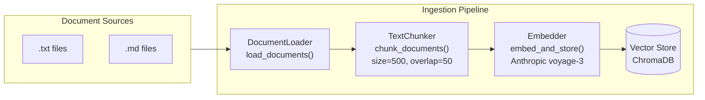
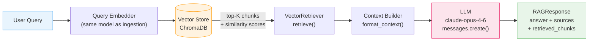

# Architecture: RAG Basic

## High-Level Overview

RAG has two distinct pipelines that share the same embedding model and vector store:

1. **Ingestion Pipeline** — Converts raw documents into searchable vector embeddings (run offline)
2. **Query Pipeline** — Retrieves relevant chunks and generates grounded answers (run at inference time)

---

## Ingestion Pipeline



### Ingestion Steps

| Step | Component | Input | Output |
|------|-----------|-------|--------|
| Load | `DocumentLoader` | File paths | `Document` objects with raw text + metadata |
| Chunk | `TextChunker` | `Document` list | `Chunk` objects with positional metadata |
| Embed | `Embedder` | `Chunk` list | Embedding vectors (float arrays) |
| Store | `ChromaDB` | Vectors + metadata | Persisted collection |

---

## Query Pipeline



### Query Steps

| Step | Component | Input | Output |
|------|-----------|-------|--------|
| Embed query | `Embedder` | Query string | Query vector |
| Vector search | `ChromaDB` | Query vector, top-K | Chunk IDs + distances |
| Hydrate chunks | `VectorRetriever` | Chunk IDs | `Chunk` objects with text + metadata |
| Build context | `RAGChain` | Retrieved chunks | Formatted context string |
| Generate answer | Anthropic API | System prompt + context + query | Answer text |
| Package response | `RAGChain` | Answer + chunks | `RAGResponse` |

---

## Component Breakdown

### `Document` (data model)

```
Document
├── id: str              # Unique identifier (file path hash)
├── content: str         # Full raw text
├── source: str          # File path or URL
└── metadata: dict       # title, file_type, char_count, etc.
```

### `Chunk` (data model)

```
Chunk
├── id: str              # "{doc_id}_chunk_{index}"
├── content: str         # Chunk text (≤ chunk_size chars)
├── source: str          # Inherited from parent Document
├── metadata: dict       # chunk_index, total_chunks, char_start, char_end
└── embedding: list[float] | None   # Populated after embed_and_store()
```

### `DocumentIngester`

```
DocumentIngester
├── load_documents(path: str) -> list[Document]
│     └── Recursively finds .txt and .md files
├── chunk_documents(docs, chunk_size=500, overlap=50) -> list[Chunk]
│     └── Sliding window with overlap to preserve sentence context
└── embed_and_store(chunks, collection_name) -> None
      └── Calls Anthropic embeddings API, upserts into ChromaDB
```

### `VectorRetriever`

```
VectorRetriever
├── __init__(collection_name, chroma_host, chroma_port)
│     └── Connects to ChromaDB, loads or creates collection
└── retrieve(query: str, top_k: int = 5) -> list[Chunk]
      └── Embeds query → similarity search → returns hydrated Chunks
```

### `RAGChain`

```
RAGChain
├── __init__(retriever, model, top_k)
│     └── Composes VectorRetriever + Anthropic client
├── query(question: str) -> RAGResponse
│     ├── 1. retriever.retrieve(question, top_k)
│     ├── 2. format_context(retrieved_chunks)
│     ├── 3. anthropic.messages.create(system=..., user=context+question)
│     └── 4. return RAGResponse(answer, sources, retrieved_chunks)
└── format_context(chunks: list[Chunk]) -> str
      └── Formats chunks as numbered citations for the prompt
```

### `RAGResponse` (data model)

```
RAGResponse
├── answer: str            # LLM-generated answer grounded in context
├── sources: list[str]     # Deduplicated source file paths
└── retrieved_chunks: list[Chunk]   # Raw chunks passed to the LLM
```

---

## Vector Store Schema

ChromaDB collection layout:

| Field | Type | Description |
|-------|------|-------------|
| `id` | str | Chunk ID (`{doc_id}_chunk_{n}`) |
| `embedding` | list[float] | Dense vector from embedding model |
| `document` | str | Chunk text (ChromaDB `documents` field) |
| `metadata.source` | str | Original file path |
| `metadata.chunk_index` | int | Position within parent document |
| `metadata.total_chunks` | int | Total chunks from parent document |
| `metadata.char_start` | int | Character offset start in original document |
| `metadata.char_end` | int | Character offset end in original document |

---

## Embedding Model

This blueprint uses **Anthropic's `voyage-3` embedding model** (via the Anthropic API) for
both ingestion and query embedding. Using the same model for both is critical — embeddings are
only comparable when produced by the same model.

| Property | Value |
|----------|-------|
| Model | `voyage-3` |
| Dimensions | 1024 |
| Max input tokens | 32,000 |
| Similarity metric | Cosine similarity |

---

## System Prompt Design

The generation prompt is designed to:

1. **Constrain the model** to answer only from provided context
2. **Force citation** by requiring document references
3. **Acknowledge uncertainty** when the context is insufficient

```
You are a helpful assistant that answers questions based on the provided context.

Rules:
1. Answer ONLY using the information in the context below.
2. If the context does not contain enough information to answer the question,
   say "I don't have enough information in the provided documents to answer that."
3. Always cite which document(s) you used by referencing the source name.
4. Be concise and accurate.
```

---

## Scaling Considerations

| Scale | Recommendation |
|-------|---------------|
| < 10,000 chunks | In-memory ChromaDB (no Docker needed) |
| 10,000–1M chunks | Persistent ChromaDB (this blueprint) |
| > 1M chunks | ChromaDB distributed or switch to Pinecone/Weaviate/pgvector |
| High QPS | Add a retrieval cache (Redis) keyed on query embedding |
| Mixed content | Add metadata filtering to pre-filter by doc type or date |
