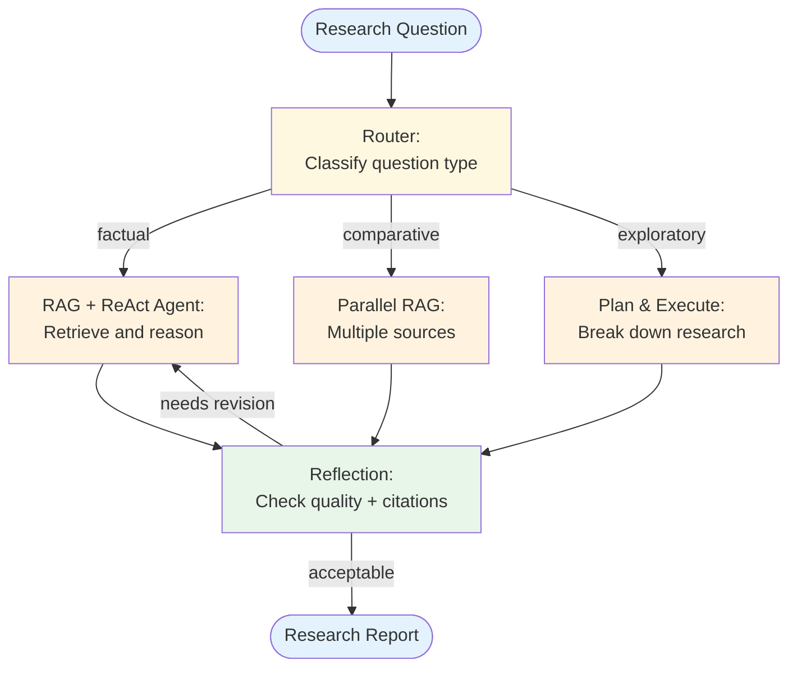
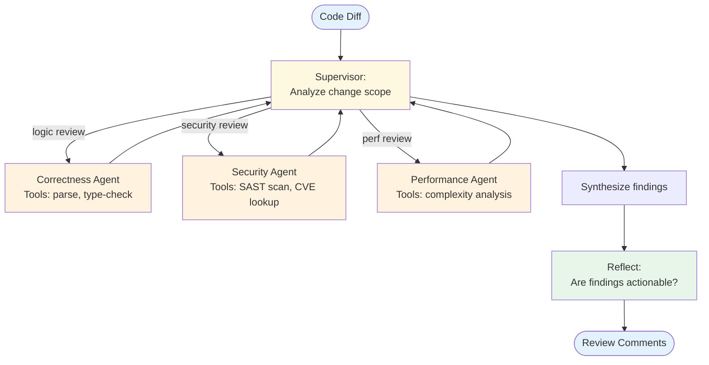
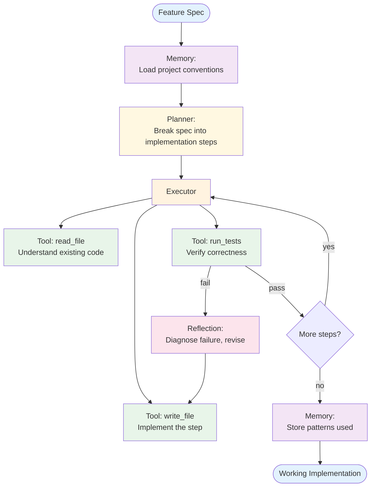
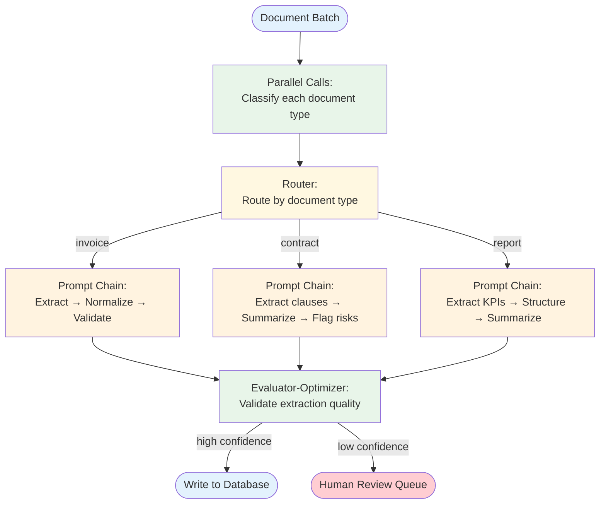
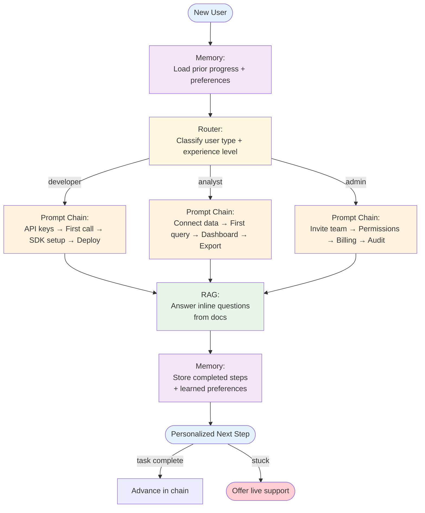

# Reference Architectures

These are example composed systems showing how patterns combine to solve real-world problems. Each architecture is an *application* of composable patterns — not a pattern itself.

Use these as starting points and adapt them to your specific requirements.

## 1. Research Assistant

**Patterns used:** Routing + RAG + ReAct + Reflection

**What it does:** Takes a research question, retrieves relevant sources, reasons through the evidence, and produces a cited, quality-checked analysis.

**Design decisions:**
- Routing separates factual queries (single retrieval) from comparative queries (multi-source) and exploratory queries (planning needed)
- Reflection validates citation accuracy and argument completeness
- Iteration budget: max 2 reflection cycles to control cost

## 2. Code Review Agent

**Patterns used:** Multi-Agent + Tool Use + Reflection

**What it does:** Reviews code changes using specialized agents for different aspects (correctness, security, performance), then synthesizes findings.

**Design decisions:**
- Specialized agents with domain-specific tools and prompts
- Supervisor decides which agents to invoke based on the change scope (a CSS-only change skips the security agent)
- Reflection ensures findings are specific and actionable, not vague

## 3. Customer Support System

**Patterns used:** Routing + RAG + Memory + Tool Use

**What it does:** Handles customer inquiries by classifying intent, retrieving relevant knowledge, remembering conversation history, and taking actions when needed.

**Design decisions:**
- Memory loads before routing so the classifier has conversation context
- Routing includes an explicit escalation path for issues agents can't handle
- RAG for knowledge questions, Tool Use for account actions (refund, update, etc.)
- Every interaction is stored for future context

## 4. Data Analysis Pipeline

**Patterns used:** Plan & Execute + Tool Use + Evaluator-Optimizer

**What it does:** Takes an analytical question, plans a data analysis approach, executes queries and transformations, then validates the results.

**Design decisions:**
- Plan & Execute ensures the analysis follows a methodical approach
- Each step has specialized tools (data querying, transformation, statistical analysis)
- Evaluator-Optimizer validates the methodology and results before producing the final report
- Replanning if the evaluator finds methodological issues

## 5. Content Generation System

**Patterns used:** Orchestrator-Worker + Reflection + Memory

**What it does:** Generates long-form content by breaking it into sections, writing each section with relevant context, and iteratively improving quality.

**Design decisions:**
- Orchestrator-Worker for parallel section writing
- Reflection checks coherence across sections (not just individual quality)
- Memory stores learned style preferences for future content generation
- Workers can receive style guidance from memory

## 6. Autonomous Coding Agent

**Patterns used:** Plan & Execute + Tool Use + Reflection + Memory

**What it does:** Takes a feature specification, plans an implementation, writes and runs code iteratively, fixes failures, and stores project conventions in memory for future tasks.

**Design decisions:**
- Plan & Execute creates an ordered implementation plan upfront (read existing code → write tests → implement → verify), reducing the ad-hoc thrashing of a pure ReAct approach
- Tool Use provides grounded access to the actual filesystem and test runner — the agent operates on real files, not simulated output
- Reflection is scoped specifically to test failures: diagnose the error, identify the fix, revise the relevant file only
- Memory stores coding conventions, directory structure, and patterns discovered in previous tasks — a new task on the same codebase doesn't re-explore from scratch
- Iteration guard: max 3 reflection cycles per step; if exceeded, escalate to the developer

**Key tradeoff:** Upfront planning is efficient for straightforward specs but brittle for exploratory tasks where requirements emerge through implementation. For exploratory work, replace Plan & Execute with ReAct.

---

## 7. Document Processing Pipeline

**Patterns used:** Parallel Calls + Prompt Chaining + Evaluator-Optimizer + Routing

**What it does:** Ingests batches of documents (invoices, contracts, reports), classifies each, extracts structured fields in parallel, validates extraction quality, and routes anomalies for human review.

**Design decisions:**
- Parallel Calls for classification: all documents in the batch are typed simultaneously before any extraction begins, making the pipeline significantly faster
- Routing on document type: each type has a different extraction chain (invoices need line items; contracts need clause identification; reports need KPI extraction)
- Prompt Chaining for extraction: multi-step transformation (raw text → extracted fields → normalized format → validated structure) with gates between steps to catch format errors early
- Evaluator-Optimizer as a confidence gate: low-confidence extractions go to a human review queue rather than silently propagating errors to the database
- Cost note: use a cheap model for classification (short, structured output) and a more capable model for extraction (complex structured output)

**Key tradeoff:** This architecture favors throughput over latency. For interactive document Q&A, replace the Prompt Chain with a RAG pipeline.

---

## 8. Personalized Onboarding Agent

**Patterns used:** Routing + Memory + RAG + Prompt Chaining

**What it does:** Guides new users through onboarding by adapting the flow to their role and experience level, answering questions from documentation, and remembering progress across sessions.

**Design decisions:**
- Memory loads first: if the user returns mid-onboarding, they resume from their last completed step rather than starting over — the single most impactful improvement to onboarding completion rates
- Routing on user role + experience level: a developer with 5 years of API experience gets a different chain than a first-time developer; detection is a short LLM call at session start
- Prompt Chaining for each path: each step in the chain is a discrete task (complete the action, confirm it worked) with a gate that checks completion before advancing
- RAG for inline Q&A: users can ask "what does this parameter do?" at any point without leaving the onboarding flow; answers come from the actual documentation, not the LLM's training data
- Human escalation: if a user is stuck on the same step for 2+ attempts, offer a live support link rather than looping indefinitely
- Memory stores not just progress but also which explanations were helpful, enabling personalization of future onboarding sessions

**Key tradeoff:** This architecture assumes users follow a sequential path. For products with non-linear onboarding, replace the Prompt Chain paths with Plan & Execute so the agent can adapt the sequence based on user actions.

---

## Architecture Selection Guide

| If You Need... | Start With | Then Add | Reference |
|----------------|-----------|----------|-----------|
| Knowledge-grounded Q&A | RAG | + ReAct for multi-step reasoning | #1 Research Assistant |
| Automated code review | Multi-Agent | + Tool Use for static analysis tools | #2 Code Review Agent |
| Customer-facing support | Routing | + RAG + Memory + Tool Use | #3 Customer Support |
| Analytical pipelines | Plan & Execute | + Tool Use for data tools | #4 Data Analysis |
| Long-form content generation | Orchestrator-Worker | + Reflection + Memory | #5 Content Generation |
| Writing and running code | Plan & Execute | + Tool Use + Reflection + Memory | #6 Autonomous Coding |
| Batch document processing | Parallel Calls | + Routing + Prompt Chaining + Evaluator-Optimizer | #7 Document Processing |
| User onboarding / guided flows | Routing + Memory | + RAG + Prompt Chaining | #8 Personalized Onboarding |
| Multi-domain complex tasks | Multi-Agent | + RAG + Memory per worker | #1, #2, #6 |
| High-quality output guarantee | Any generator | + Reflection or Evaluator-Optimizer | #4, #5, #7 |

## Design Considerations for All Architectures

### Cost Control
- Set iteration limits on every loop (ReAct, Reflection, Evaluator-Optimizer)
- Use cheaper models for classification/routing, more capable models for generation
- Cache retrieval results and tool outputs where possible

### Latency
- Identify the critical path and parallelize where possible
- Put routing early to avoid unnecessary processing
- Set timeouts on tool calls and agent loops

### Observability
- Log every pattern boundary crossing (routing decisions, delegation, reflection cycles)
- Track token usage and latency per pattern per request
- Alert on iteration count anomalies (agent loops using max iterations too often)

### Failure Modes
- Define fallback behavior at each composition point
- Graceful degradation: if RAG retrieval fails, can the agent still provide a useful (if less grounded) response?
- Human escalation paths for cases the system can't handle
