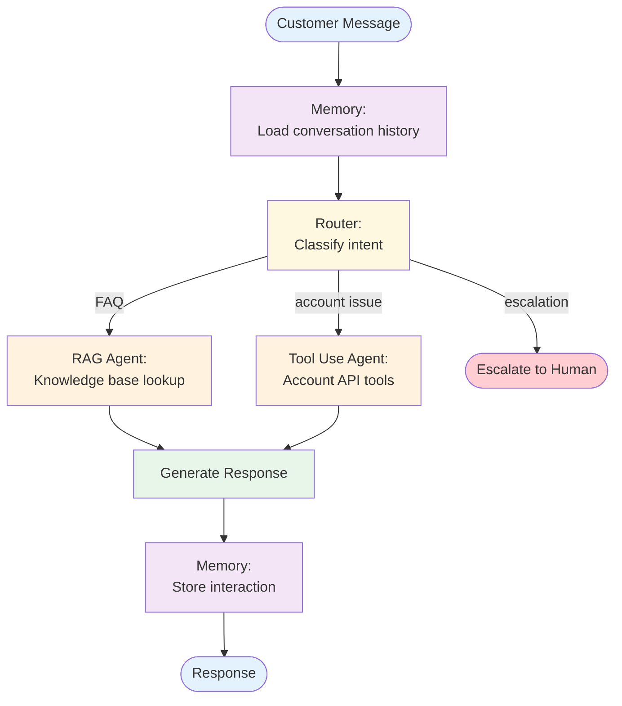
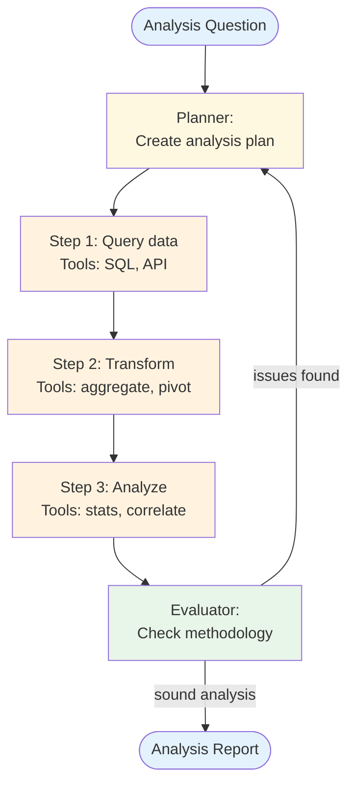
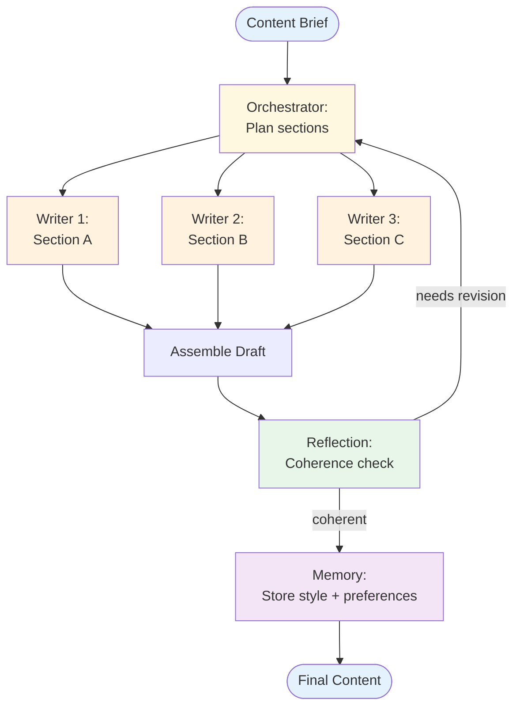

# Reference Architectures

These are example composed systems showing how patterns combine to solve real-world problems. Each architecture is an *application* of composable patterns — not a pattern itself.

Use these as starting points and adapt them to your specific requirements.

## 1. Research Assistant

**Patterns used:** Routing + RAG + ReAct + Reflection

**What it does:** Takes a research question, retrieves relevant sources, reasons through the evidence, and produces a cited, quality-checked analysis.

**Design decisions:**
- Routing separates factual queries (single retrieval) from comparative queries (multi-source) and exploratory queries (planning needed)
- Reflection validates citation accuracy and argument completeness
- Iteration budget: max 2 reflection cycles to control cost

## 2. Code Review Agent

**Patterns used:** Multi-Agent + Tool Use + Reflection

**What it does:** Reviews code changes using specialized agents for different aspects (correctness, security, performance), then synthesizes findings.

**Design decisions:**
- Specialized agents with domain-specific tools and prompts
- Supervisor decides which agents to invoke based on the change scope (a CSS-only change skips the security agent)
- Reflection ensures findings are specific and actionable, not vague

## 3. Customer Support System

**Patterns used:** Routing + RAG + Memory + Tool Use

**What it does:** Handles customer inquiries by classifying intent, retrieving relevant knowledge, remembering conversation history, and taking actions when needed.

**Design decisions:**
- Memory loads before routing so the classifier has conversation context
- Routing includes an explicit escalation path for issues agents can't handle
- RAG for knowledge questions, Tool Use for account actions (refund, update, etc.)
- Every interaction is stored for future context

## 4. Data Analysis Pipeline

**Patterns used:** Plan & Execute + Tool Use + Evaluator-Optimizer

**What it does:** Takes an analytical question, plans a data analysis approach, executes queries and transformations, then validates the results.

**Design decisions:**
- Plan & Execute ensures the analysis follows a methodical approach
- Each step has specialized tools (data querying, transformation, statistical analysis)
- Evaluator-Optimizer validates the methodology and results before producing the final report
- Replanning if the evaluator finds methodological issues

## 5. Content Generation System

**Patterns used:** Orchestrator-Worker + Reflection + Memory

**What it does:** Generates long-form content by breaking it into sections, writing each section with relevant context, and iteratively improving quality.

**Design decisions:**
- Orchestrator-Worker for parallel section writing
- Reflection checks coherence across sections (not just individual quality)
- Memory stores learned style preferences for future content generation
- Workers can receive style guidance from memory

## Architecture Selection Guide

| If You Need... | Start With | Then Add |
|----------------|-----------|----------|
| Knowledge-grounded Q&A | RAG | + ReAct for multi-step reasoning |
| Task automation | Tool Use | + ReAct for adaptive tool selection |
| Complex task decomposition | Plan & Execute | + Multi-Agent for specialized workers |
| Diverse input handling | Routing | + specialized handlers per route |
| High-quality generation | Any generator | + Reflection for iterative improvement |
| Multi-session continuity | Any agent | + Memory for cross-session context |
| Multi-domain problems | Multi-Agent | + RAG + Memory per worker |

## Design Considerations for All Architectures

### Cost Control
- Set iteration limits on every loop (ReAct, Reflection, Evaluator-Optimizer)
- Use cheaper models for classification/routing, more capable models for generation
- Cache retrieval results and tool outputs where possible

### Latency
- Identify the critical path and parallelize where possible
- Put routing early to avoid unnecessary processing
- Set timeouts on tool calls and agent loops

### Observability
- Log every pattern boundary crossing (routing decisions, delegation, reflection cycles)
- Track token usage and latency per pattern per request
- Alert on iteration count anomalies (agent loops using max iterations too often)

### Failure Modes
- Define fallback behavior at each composition point
- Graceful degradation: if RAG retrieval fails, can the agent still provide a useful (if less grounded) response?
- Human escalation paths for cases the system can't handle
