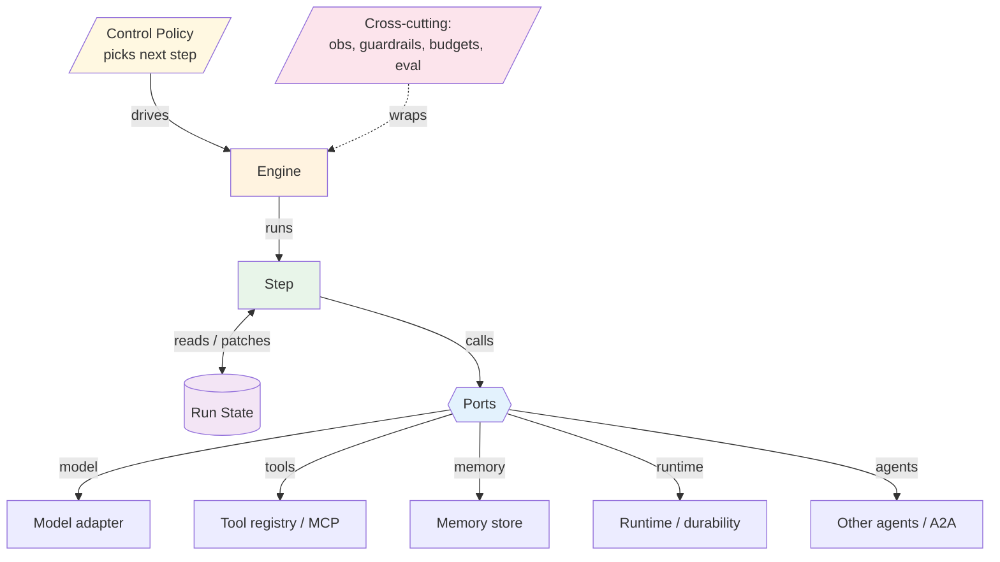

# Kernel Architecture

> Architecture level. The static structure: the six elements, their
> responsibilities, and the contracts they expose. No time dimension — see
> [Flow](./flow.md) for runtime behaviour.

## Step

The uniform unit of work. **Everything is a step**: an LLM call, a tool call, a
retrieval, a sub-graph, a human gate, or plain code. A step is a pure function of
`(state, context)` returning a `StepResult` — a *patch* to merge into run state
rather than an in-place mutation, so concurrent steps merge cleanly and replay is
exact.

- Every step has an `id` (namespaced by its entry, e.g. `react.loop`) and a
  `kind` drawn from a closed set (`llm`, `tool`, `retrieval`, `router`, `reducer`,
  `subgraph`, `human`, `compensation`, `eval`, `code`).
- A step with external side effects may also supply a `compensate` handler so the
  engine can unwind a failed multi-step transaction (the saga contract).
- Streaming and tracing share one optional `emit` sink on the context.

Contract: [`interfaces/python/kernel.py`](./interfaces/python/kernel.py) ·
[`interfaces/typescript/kernel.ts`](./interfaces/typescript/kernel.ts).

## Engine

Runs the graph. Its responsibilities are fixed regardless of pattern:

- Resolve the next step via the control policy.
- Enforce retries, timeouts, and the run's budget.
- Append a `TraceEntry` per step (the determinism / replay log).
- Checkpoint run state through the runtime port.
- Support pause/resume — an `interrupt` before a `human` step suspends the run
  until a resume token arrives.

The engine never contains pattern logic; pattern logic lives in steps and the
control policy.

## Control Policy

Decides the next step given the current run state, returning the next step id or
`None` to terminate. This is the single knob that turns a workflow into an agent:

- `static_graph` — code decides the next step → **workflow**.
- `router` — a classifier chooses one branch.
- `planner` — the model plans the next step(s) → **agent**.
- `hybrid` — a static skeleton with model-chosen sub-steps.

## Run State

One serializable object threaded through every step and checkpointed by the
engine. The base ([`interfaces/python/state.py`](./interfaces/python/state.py))
carries what the engine and cross-cutting layer need regardless of pattern — the
message transcript, the per-step trace, the resource budget, recorded outputs, and
the run id. Each pattern subclasses it (`ReActState`, etc.) and adds its own
fields. Run state **is** the agent's working memory; see [Design](./design.md) for
why durable memory and context assembly are deliberately *not* here.

## Ports

The seams where the core meets the outside world. Interfaces live in the kernel;
adapters live in `agent-deployments` and bind by selection.

- **Model** — the LLM.
- **Tool registry** — native functions or an MCP server (model-controlled).
- **Memory** — durable storage + retrieval (vector / key-value / graph).
- **Runtime** — where the engine runs and how it persists, carrying a durability
  tier (`none` / `checkpoint` / `durable`).
- **Agents** — delegation to another agent, in-process or remote over A2A.

Contract: [`interfaces/python/ports.py`](./interfaces/python/ports.py).

## Cross-cutting

Concerns that wrap the whole graph rather than living in one step: observability,
guardrails, budgets, context-window assembly, and eval hooks. The kernel owns
their *design-time* shape; their operational realization is an `agent-deployments`
binding. They are detailed in [Design](./design.md).
