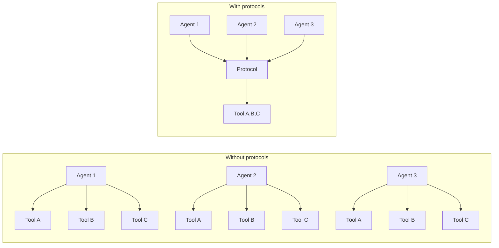
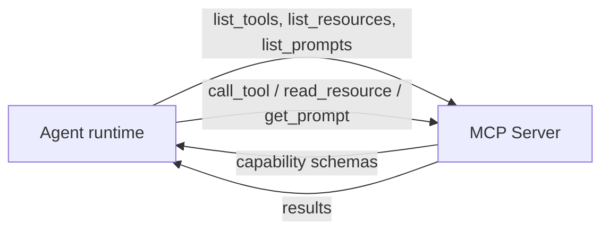
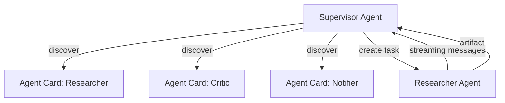

# Agent Protocols: MCP and A2A

Two open protocols have emerged as the connective tissue of the 2026 agent stack: **MCP** (Model Context Protocol, from Anthropic) standardizes how agents talk to tools and data sources; **A2A** (Agent-to-Agent Protocol, originally Google, now Linux Foundation) standardizes how agents talk to other agents. This doc explains what each one is, what shape its abstractions take, when to pick which, and how they compose.

It stays cognitive — protocol *shape* and *decision criteria*. Operational specifics (MCP server authoring, A2A registry deployment, runtime libraries) belong in [`agent-deployments/docs/stack/`](https://github.com/jagguvarma15/agent-deployments/tree/main/docs/stack/).

## Why protocols matter

Without protocols, every agent ships its own bespoke glue: ad-hoc JSON schemas for tool calls, hand-rolled HTTP for agent delegation, copy-pasted auth flows per integration. That works at demo scale and breaks at production scale — every new tool, every new agent collaborator, every new vendor is a one-off integration.

Protocols collapse N × M integrations into N + M:



A protocol that achieves this needs three things: a typed surface (tool / resource / prompt / capability descriptions), a transport (how messages flow), and an auth story (who can call what).

## MCP — Model Context Protocol

**Question MCP answers:** "What is true right now over there, and what actions can I take on it?"

MCP exposes three kinds of capability from a server to a client (the agent):

| Capability | What it represents | Read or write? |
|---|---|---|
| **Tool** | An operation the agent can invoke. Has a JSON schema for params + return type. | Write (or read with side effects). |
| **Resource** | A piece of context the agent can read. URIs identify them; the server returns content. | Read. |
| **Prompt** | A reusable prompt template the server publishes. The agent can request it pre-filled. | Read. |

The model is intentionally narrow: every integration with an external system (filesystem, GitHub, Postgres, Slack, Linear, your internal API) becomes a server exposing some combination of these three things. The agent client doesn't know how the server is implemented — only what's in the schema.

### MCP shape



The handshake is symmetric: client introspects the server's capabilities, server answers any subsequent call against those capabilities. There's no global registry — every server stands alone.

### Transports

MCP defines two transports; pick per the deployment topology, not per the server:

- **stdio** — the server runs as a child process of the agent runtime. Lowest latency, no network surface. Ships well as `npx @vendor/mcp-server-x` style packages. Default for local-dev integrations.
- **streamable HTTP** — the server runs as a long-lived HTTP service. Multiple agents can share it; auth flows through OAuth or bearer tokens; scales horizontally. Default for remote / shared integrations.

The schema is identical across transports. A server that supports both lets the client pick at runtime.

### Auth

- `none` — local dev, sandboxed contexts.
- `api_key` — bearer token in env. Most common for SaaS integrations.
- `oauth` — for user-facing integrations where the agent acts on behalf of a human; the agent client redirects through the OAuth flow and stores the access token. Recommended for production HTTP-transport servers.
- `pat` — personal access token; OAuth's plainer cousin, common for GitHub-style integrations.

Whichever you choose, the principle is the same: the agent runtime never holds plaintext credentials in its prompt context. Credentials live in env or a secret store; only the resolved bearer / OAuth token flows over the wire.

### Where MCP fits in the agent loop

MCP slots cleanly into the [Tool Use](../patterns/tool_use/overview.md) and [ReAct](../patterns/react/overview.md) patterns. The pattern handles the reasoning loop; MCP handles the tool boundary:

```
Pattern (ReAct):              MCP integration:
  Think                         (no MCP)
    │
    ▼
  Act → tool_call               agent.call_tool(server_id, name, args)
    │                                            │
    │                                            ▼
    │                                       MCP server
    │                                            │
    ▼                                            ▼
  Observe ← tool_result         observation = JSON from server
```

The pattern doesn't change — only the *implementation* of the Act step. Same `ReAct` loop, but tools are MCP servers instead of in-process Python functions. This is a clean substitution: a recipe can swap in-process tools for MCP servers without rewriting its pattern logic.

## A2A — Agent-to-Agent Protocol

**Question A2A answers:** "Which agents are available, and how do I hand work to one of them?"

A2A elevates the agent itself to a first-class network entity. Every A2A-compatible agent publishes an **agent card** declaring what it can do; clients (other agents, orchestrators, registry lookups) read the cards to discover and delegate.

| A2A primitive | What it represents |
|---|---|
| **Agent Card** | Self-describing manifest: name, supported tasks, input/output schemas, auth requirements, streaming support. |
| **Task** | A unit of work delegated to another agent. Has an id, input, expected output schema, lifecycle (pending → running → completed / failed). |
| **Message** | Communication within a running task — partial results, status updates, requests for clarification. |
| **Artifact** | A typed output produced by a task (file, structured object, stream). |

### A2A shape



Three things matter conceptually:

1. **Discovery via cards.** A multi-agent system shouldn't hard-code which agent does what — it should look up agents dynamically. Cards make this possible. Cards are static for registered agents, dynamic for agents that publish themselves at runtime.
2. **Task lifecycle.** Unlike RPC, A2A tasks are first-class state machines. They can be paused, resumed, cancelled, retried. The orchestrator polls or streams updates; the worker agent reports progress.
3. **Artifacts, not just text.** Worker agents return typed artifacts (structured data, files, streams), not plain strings. This is what lets composed agent systems pass real work between them rather than re-parsing each other's natural-language output.

### Where A2A fits in patterns

A2A slots into the [Multi-Agent](../patterns/multi_agent/overview.md) and [Orchestrator-Worker](../workflows/orchestrator-worker/overview.md) patterns. The pattern decides *what* coordination shape to use (flat peers vs hierarchical supervisor); A2A is the *wire* the coordination flows over.

```
Pattern (Multi-Agent hierarchical):    A2A integration:
  Supervisor reasons about task         (no A2A)
    │
    ▼
  Pick a worker by capability    a2a.discover(skill="legal-research")
    │                                       │
    ▼                                       ▼
  Delegate                       a2a.create_task(worker_card, input)
    │                                       │
    ▼                                       ▼
  Receive result                 task.await_completion() → artifact
```

## When to use MCP, A2A, both, or neither

| Question | Answer |
|---|---|
| You need an agent to call an external system it can't reach (API, database, file, …) | **MCP.** Wrap the system in an MCP server. |
| You need multiple specialized agents collaborating on parts of a single user request | **A2A.** Give each agent a card; let a supervisor or peer agent discover and delegate. |
| You need one agent to call a tool that's actually another agent | **Both.** Wrap the worker agent in an A2A card so other agents discover it; the supervisor still uses MCP for non-agent tools alongside A2A tasks for delegated work. |
| You need an LLM to think with no external state | **Neither.** A single-shot prompt with no tools and no collaborators. |

The protocols are orthogonal: MCP is agent ↔ tool; A2A is agent ↔ agent. A production system commonly uses both — MCP for low-level integrations (filesystem, postgres, slack), A2A for high-level delegation between specialized agents.

## Threat model crosswalk

Protocols inherit the security concerns of what they connect, plus their own attack surface:

| Vector | MCP-specific risk | A2A-specific risk |
|---|---|---|
| **Prompt injection** | A tool's output is untrusted content; if injected into the agent's context, can hijack reasoning. | A worker agent's artifact is untrusted output; same risk applies. |
| **Tool poisoning** | A malicious or compromised MCP server can return crafted tool descriptions that the agent then uses, redirecting behavior. | Compromised agent card can advertise false capabilities to lure delegation. |
| **Credential exfil** | Tool output is one of the few channels through which a server can elicit and leak secrets. | Same — A2A task results are untrusted. |
| **Excessive agency** | Agent calls more tools than necessary, or tools with broader scope than required. | Agent over-delegates, fanning out work beyond budget. |
| **Indirect injection** | Resources (e.g. documents fetched via MCP) carry adversarial content that influences subsequent reasoning. | Streamed messages from worker agents carry adversarial content. |

Mitigations live in [`security-and-safety.md`](./security-and-safety.md) and (for production) [`agent-deployments/docs/cross-cutting/security-hardening.md`](https://github.com/jagguvarma15/agent-deployments/blob/main/docs/cross-cutting/security-hardening.md). The two highest-leverage architectural patterns:

- **Dual-LLM** — segregate "privileged" reasoning (holds tools, no untrusted input) from "quarantined" reading (parses untrusted content, can't act). Pairs especially well with MCP — the quarantined LLM consumes tool/resource output; only structured summaries reach the privileged LLM.
- **Capability allowlists** — explicit per-role allowlists of which MCP tools / which A2A workers each agent role may invoke. Sits in front of both protocols; deny-by-default.

## What protocols don't solve

- **Reasoning quality.** MCP gives you a clean tool boundary; A2A gives you delegation. Neither fixes a bad prompt, a wrong pattern choice, or an LLM that hallucinates tool calls.
- **Cost / latency.** Both protocols add round trips. A network-transported MCP server is slower than an in-process function; A2A delegation is slower than a same-process call. Use [`cost-and-model-selection.md`](./cost-and-model-selection.md) and per-pattern `cost-and-latency.md` to size budgets.
- **Idempotency.** A2A's task lifecycle includes retry semantics, but the worker's tools must be idempotent for retries to be safe. Same applies to MCP write tools.
- **State coordination.** Neither protocol prescribes how agents share state. Use [Memory](../patterns/memory/overview.md) for cross-session state, [Saga](../patterns/saga/overview.md) for distributed-transaction-style state, an external store for shared state.

## See also

- [`patterns/tool_use/overview.md`](../patterns/tool_use/overview.md) — the cognitive pattern MCP plugs into.
- [`patterns/multi_agent/overview.md`](../patterns/multi_agent/overview.md) — the cognitive pattern A2A plugs into.
- [`patterns/skills/overview.md`](../patterns/skills/overview.md) — the third connectivity primitive (skills are procedural knowledge, MCP is access, A2A is delegation).
- [`foundations/security-and-safety.md`](./security-and-safety.md) — the broader threat model these protocols inherit from.
- [`foundations/sandboxed-execution.md`](./sandboxed-execution.md) — what to do when a tool execution itself is untrusted.
- [`composition/blueprints-to-deployments.md`](../composition/blueprints-to-deployments.md) — how cognitive patterns + protocols compose into production recipes.
