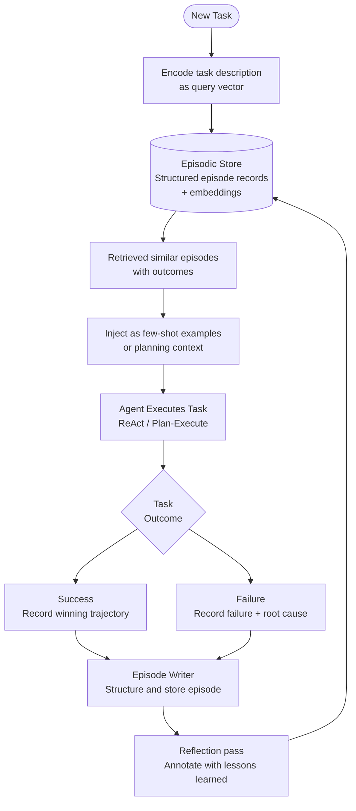

# Pattern: Episodic Memory

## Problem Statement

Vector store memory excels at retrieving individual facts but loses the narrative structure of experiences. Knowing that "the user prefers concise answers" is useful, but knowing that "in session 42, the user tried approach X, it failed for reason Y, and they ultimately succeeded with approach Z" is far more useful for similar future tasks. This structured, sequential record of *what happened* — an episode — is what episodic memory provides. Without it, agents repeat the same mistakes and cannot improve from past failures.

## Solution Overview

Episodic Memory stores complete, structured records of past experiences — called episodes — in a retrievable format. Each episode captures the task goal, the sequence of actions taken, observations received, and the final outcome (success, failure, partial). At inference time, the agent retrieves episodes that are similar to the current task and uses them as few-shot examples, cautionary tales, or templates for planning. Over time, the episodic memory acts as a learned library of worked examples, enabling agents to improve on familiar task types without retraining.

This pattern draws from cognitive science's model of human episodic memory — the autobiographical record of "what I did, when, and what happened."

## Architecture Diagram (Mermaid)

## Key Components

- **Episode schema**: A structured record containing:
  - `episode_id`: Unique identifier
  - `task_description`: The original goal in natural language
  - `task_category`: Categorical tag (e.g., "code_debug", "research", "data_analysis")
  - `trajectory`: Ordered list of (thought, action, observation) tuples
  - `outcome`: "success" | "failure" | "partial"
  - `outcome_summary`: Brief natural-language description of what happened
  - `lessons_learned`: Key takeaways distilled by a reflection pass
  - `timestamp`: When the episode occurred
  - `metadata`: Tags, agent version, tool set used, duration, cost
- **Episode writer**: Triggered at task completion, it structures the trajectory into the schema above and runs a reflection pass (an LLM call that extracts lessons learned from the trajectory and outcome).
- **Embedding index**: Each episode is embedded (typically using the task description + outcome summary) and stored in a vector index for semantic retrieval.
- **Retrieval module**: Given a new task, embeds the task description and retrieves the top-k most similar past episodes, filtered by outcome (prefer successes for planning templates; include failures for cautionary context).
- **Context injector**: Formats retrieved episodes as few-shot examples in the agent's system prompt or user message. The format should present: "When asked to do X, I tried Y, which resulted in Z. The lesson was: ..."

## Implementation Considerations

- **Episode granularity**: An episode should represent one coherent task attempt. Do not split multi-step tasks into micro-episodes (too granular, loses narrative structure) or merge unrelated tasks into one episode (too coarse, loses specificity).
- **Failure episode value**: Failed episodes are often more valuable than successes because they encode what *not* to do and why. Never discard failure episodes — tag them explicitly and retrieve them alongside successes.
- **Reflection quality**: The lessons_learned field is the highest-leverage part of the schema. A weak reflection ("the task was completed successfully") adds no value. Use a structured reflection prompt: "What was the key challenge? What approach worked? What would you do differently next time?"
- **Retrieval diversity**: When retrieving episodes, ensure diversity — avoid returning 5 episodes that all describe the same approach. Use MMR (Maximal Marginal Relevance) to balance relevance and diversity.
- **Episode compression**: For very long trajectories, compress the middle of the trajectory (summarize repeated similar steps) while preserving the beginning (initial approach) and end (resolution) verbatim.
- **Privacy and retention**: Episodes may contain sensitive user information. Implement TTL policies and user-level episode scoping. Support episode deletion on user request.

## Trade-offs

| Dimension | Benefit | Cost |
|-----------|---------|------|
| Learning | Agent improves on familiar tasks | Storage grows unboundedly |
| Context richness | Narratives vs. isolated facts | Episodes are verbose; context cost is high |
| Failure recovery | Explicit cautionary examples | Failure episodes may propagate bad patterns |
| Generalization | Retrieved episodes guide novel tasks | May anchor agent to past approaches |

## When to Use / When NOT to Use

**Use when:**
- Tasks are recurring or fall into recognizable categories that the agent will encounter repeatedly
- You want agents to learn from failures without retraining the underlying model
- Task complexity is high and few-shot episode examples meaningfully improve performance
- You have the infrastructure to store and retrieve structured, potentially large records

**Do NOT use when:**
- Tasks are unique one-offs that will never recur — no retrieval benefit
- The agent handles a narrow, fixed set of tasks better served by a curated prompt library
- Episode storage size and retrieval latency are prohibitive
- Privacy requirements prevent storing any record of past task trajectories

## Variants

- **Case-Based Reasoning Agent**: A formalization of episodic memory from AI research: retrieve most similar past case, adapt its solution to the current case, apply, and store the new case. Explicit adaptation step between retrieval and application.
- **Experience Replay**: Periodically sample random past episodes and use them to fine-tune the agent model via RLHF or supervised learning. Combines episodic memory with online learning.
- **Shared Team Memory**: Multiple agents write to and read from a shared episodic store, allowing a team of agents to collectively learn from each other's experiences.
- **Hierarchical Episodes**: Store both fine-grained step-level episodes and coarse-grained project-level episodes. Query at the appropriate granularity based on the new task scope.

## Related Blueprints

- [In-Context Memory](./in-context.md) — episodic episodes are retrieved into the in-context window
- [Vector Store Memory](./vector-store.md) — the embedding index backing episodic retrieval
- [Reflexion Pattern](../orchestration/reflexion.md) — Reflexion's self-critique is the source of lessons_learned annotations
- [Plan & Execute Pattern](../orchestration/plan-execute.md) — retrieved episodes can serve as plan templates
