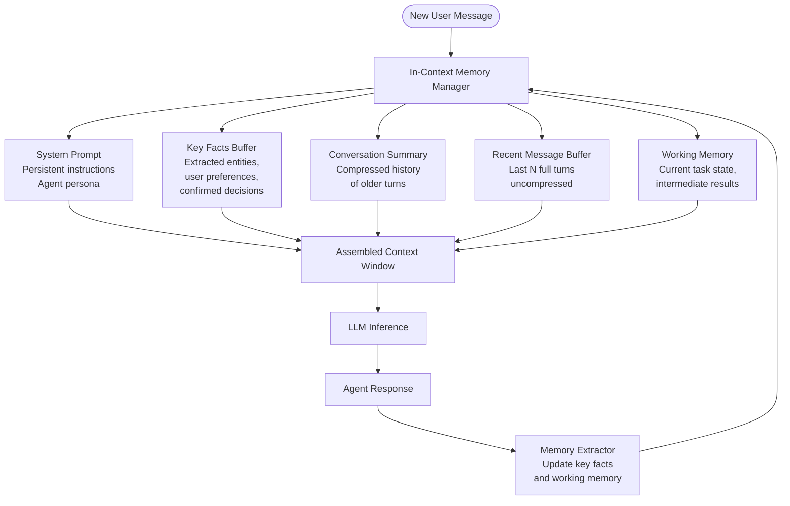

# Pattern: In-Context Memory

## Problem Statement

Language models are stateless by design — each API call receives a fresh context with no inherent memory of prior interactions. For conversational agents, this means every response requires manually reconstructing the relevant history. Without a coherent strategy for what to include, agents either: (a) include everything, causing context windows to overflow and costs to skyrocket, or (b) include nothing, forgetting critical information from earlier in the session and frustrating users.

## Solution Overview

In-Context Memory manages what information is explicitly placed in the model's active context window at inference time. Rather than naive full-history appending, a well-designed in-context memory strategy curates the context: maintaining a **conversation buffer** for recent messages, **key facts** extracted from the conversation, **working memory** for the current task's intermediate state, and **system instructions** that persist across turns. The model only "remembers" what is currently in its context, so thoughtful curation is the primary lever for memory quality.

This pattern is the foundational memory mechanism — it is the simplest to implement and has the lowest latency, but is bounded by the context window size.

## Architecture Diagram (Mermaid)

## Key Components

- **System prompt**: Persistent, immutable instructions at the top of every context. Defines agent role, constraints, and behavioral guidelines. Should be as concise as possible to preserve space for dynamic content.
- **Conversation buffer**: The last N complete turns (user + assistant messages) retained verbatim. Provides the model with recent conversational continuity. Typical values: N = 5–20 turns depending on context window size.
- **Key facts store**: A curated, compact representation of important information extracted from the conversation — user name, stated preferences, confirmed decisions, domain-specific entities. Stored as a structured block (e.g., a bulleted list or JSON object) prepended to the context.
- **Conversation summary**: A compressed summary of older turns that fell out of the rolling buffer. Generated by a summarization call when the buffer reaches its limit. Preserves important context from early in long conversations.
- **Working memory**: The agent's current task state — open questions, intermediate results, and in-progress plans. Distinct from conversation history; it represents the agent's cognitive state, not the dialogue.
- **Memory extractor**: After each agent response, a lightweight pass that identifies new key facts to persist and updates the working memory representation.

## Implementation Considerations

- **Buffer sizing**: Calculate token budgets explicitly. For a 200k token model with a 2k system prompt, budget roughly: 50k for key facts + summary, 100k for recent messages, 50k for tool results and the new turn. Monitor usage and alert when approaching limits.
- **Summarization triggers**: Trigger summarization when the total context exceeds 70–80% of the window, not when it's full. Summarizing at the limit leaves no room for the model's response.
- **Key fact extraction quality**: Use a structured extraction prompt that asks the model to identify facts, preferences, and decisions explicitly stated by the user. Avoid inferring facts the user did not state — this leads to confabulation.
- **Message pruning strategy**: When removing old messages from the buffer, prefer removing the oldest complete turn (both user and assistant messages) rather than truncating mid-conversation, which can leave the model with dangling references.
- **Multi-session persistence**: In-context memory is inherently session-scoped. For cross-session persistence, serialize the key facts buffer and conversation summary to a database and reload them at session start.

## Trade-offs

| Dimension | Benefit | Cost |
|-----------|---------|------|
| Simplicity | No external infrastructure required | Bounded by context window size |
| Latency | No retrieval step needed | Large contexts increase inference time |
| Reliability | Model always sees relevant context | Context overflow causes silent truncation |
| Cost | Full control over what's included | Large contexts increase per-call cost |

## When to Use / When NOT to Use

**Use when:**
- Conversations are short-to-medium length (under ~100 turns)
- Tasks require tight reasoning over recent dialogue (e.g., negotiation, debugging sessions)
- You need zero additional infrastructure — no vector stores, no databases
- Latency is critical and retrieval overhead is unacceptable

**Do NOT use when:**
- Conversations are very long or cross multiple sessions (use vector store or episodic memory)
- The agent needs to recall specific facts from thousands of past interactions
- Context costs are prohibitive and most of the conversation history is rarely relevant to the current turn

## Variants

- **Sliding Window Buffer**: Keep only the last N tokens of conversation history. Simple but can cut mid-turn, breaking context coherence.
- **Turn-Based Buffer**: Keep the last N complete turns. Slightly more expensive but maintains conversational coherence.
- **Summarize-and-Keep**: Progressively summarize older turns and prepend the summary, keeping recent turns verbatim. The most effective general-purpose strategy.
- **Selective Retention**: Use an LLM call to tag each message as "important" or "disposable" and prune disposable messages first. Higher quality but higher overhead.
- **Structured Working Memory**: Replace free-text working memory with a typed schema (JSON) that the agent updates via tool calls. More reliable for complex multi-step tasks.

## Related Blueprints

- [Vector Store Memory](./vector-store.md) — extends in-context with semantic long-term retrieval
- [Episodic Memory](./episodic.md) — structured storage of complete past sessions for cross-session learning
- [Basic RAG](../rag/basic-rag.md) — retrieval-augmented generation uses a similar context assembly step
- [ReAct Pattern](../orchestration/react.md) — working memory in in-context memory stores the ReAct trace
