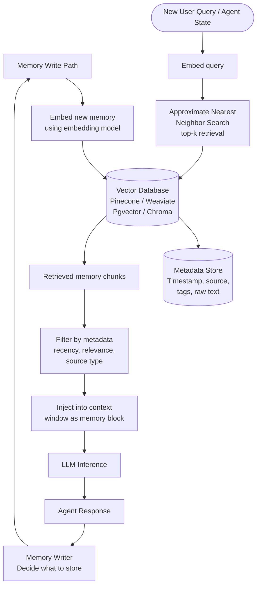

# Pattern: Vector Store Memory

## Problem Statement

In-context memory is limited by the context window: as conversations grow long, cross sessions, or accumulate knowledge from thousands of interactions, it becomes impossible to include everything relevant in a single context. The agent needs a way to store arbitrary amounts of information externally and retrieve only the semantically relevant subset at inference time — without requiring exact keyword matches or knowing in advance what will be needed.

## Solution Overview

Vector Store Memory encodes memories as dense vector embeddings and stores them in a vector database. At inference time, the agent's current context (query, conversation turn, or task description) is embedded and compared against stored memories using approximate nearest-neighbor search. The top-k most semantically similar memories are retrieved and injected into the active context window, giving the agent access to relevant long-term knowledge without overwhelming it with everything stored.

This pattern enables effectively unbounded long-term memory with sub-second retrieval, at the cost of infrastructure complexity and potential retrieval imprecision.

## Architecture Diagram (Mermaid)

## Key Components

- **Embedding model**: Converts text into dense vector representations (typically 768–3072 dimensions). Embedding quality directly determines retrieval quality. Use a model specialized for your language and domain. Common choices: OpenAI `text-embedding-3-large`, Cohere Embed v3, or open-source alternatives (E5, BGE).
- **Vector database**: Stores embeddings and supports fast ANN search. Key selection criteria: hosted vs. self-managed, metadata filtering support, update/delete support, and scale. Common options: Pinecone (managed), Weaviate (open-source), pgvector (Postgres extension), Chroma (lightweight local), Qdrant (self-hosted).
- **Metadata store**: Each memory vector is paired with metadata — raw text, timestamp, source identifier, tags, importance score, and access count. Metadata enables filtered retrieval (e.g., "only return memories from this user's profile").
- **Memory writer**: A decision component that determines when and what to write to the vector store. Options: write everything (high recall, noisy), write only LLM-designated "important" memories (selective, requires an extra LLM call), or write on a time/event trigger.
- **Query encoder**: Embeds the current agent state into a query vector. The query should represent what information the agent *needs*, not just the raw user message — consider augmenting with task context.
- **Retrieval filter**: Post-retrieval filtering based on metadata (recency, source type, minimum relevance score threshold) to remove low-quality hits.

## Implementation Considerations

- **Chunk size**: Split long documents or memories into chunks of 256–512 tokens before embedding. Smaller chunks have better retrieval precision; larger chunks provide more context when retrieved. Use overlapping chunks (50-100 token overlap) to avoid cutting at sentence boundaries.
- **Retrieval quality degradation**: Cosine similarity does not always correlate with semantic relevance for complex, multi-faceted queries. Use reranking (e.g., a cross-encoder model) to re-score the top-k candidates before injecting into context.
- **Memory decay**: Implement importance weighting that combines recency (exponential decay over time), access frequency (memories retrieved often are probably important), and explicit tagging. This prevents the store from being dominated by old, low-value memories.
- **Deduplication**: When writing memories, check for near-duplicate entries (cosine similarity > 0.95 with existing memories) and update rather than insert a new record. Vector stores with unbounded inserts degrade in quality over time.
- **Write-time enrichment**: Before embedding, enrich the raw text with metadata annotations (timestamp, source, topic tags). This information is embedded into the vector and improves retrieval even when metadata filters are not used.

## Trade-offs

| Dimension | Benefit | Cost |
|-----------|---------|------|
| Capacity | Effectively unlimited memory | Infrastructure and operational cost |
| Retrieval | Semantic matching across any volume | Imperfect — relevant memories may not be top-k |
| Latency | Sub-100ms retrieval at scale | Embedding + search adds ~50-200ms |
| Freshness | Real-time writes | Eventual consistency in distributed stores |

## When to Use / When NOT to Use

**Use when:**
- Agents need to recall information from hundreds or thousands of past interactions
- Knowledge bases are large and cannot fit in context (product catalogs, documentation corpora, user history)
- Cross-session memory is required (the agent must remember a user across multiple conversations)
- Tasks are knowledge-intensive and benefit from semantic retrieval over exact-match lookup

**Do NOT use when:**
- The total memory footprint is small enough to fit in the context window — in-context memory is simpler and more reliable
- You need guaranteed retrieval of specific records (use a relational database with indexed lookups instead)
- Embedding latency is unacceptable for your use case
- You lack the infrastructure to operate a vector database reliably

## Variants

- **Hybrid Search**: Combine vector similarity search with BM25 keyword search and merge the ranked lists (Reciprocal Rank Fusion). Captures both semantic and lexical relevance.
- **Hierarchical Memory**: Short-term memories live in a fast, small vector store. Periodically, an LLM summarizes and consolidates them into a long-term store with higher-quality, compressed representations.
- **User-Scoped Memory**: Each user has their own namespace in the vector store. Retrieval is always namespace-filtered to prevent cross-user memory leakage.
- **Memory with Expiration**: Set TTL (time-to-live) policies on memories so they are automatically deleted after a configurable period. Useful for session-specific context that should not persist indefinitely.

## Related Blueprints

- [In-Context Memory](./in-context.md) — simpler alternative; vector store retrieves into in-context memory
- [Episodic Memory](./episodic.md) — structured experience storage that complements semantic vector retrieval
- [Basic RAG](../rag/basic-rag.md) — RAG applies the same retrieval mechanism to static knowledge bases
- [Advanced RAG](../rag/advanced-rag.md) — reranking and hybrid search techniques are directly applicable here
