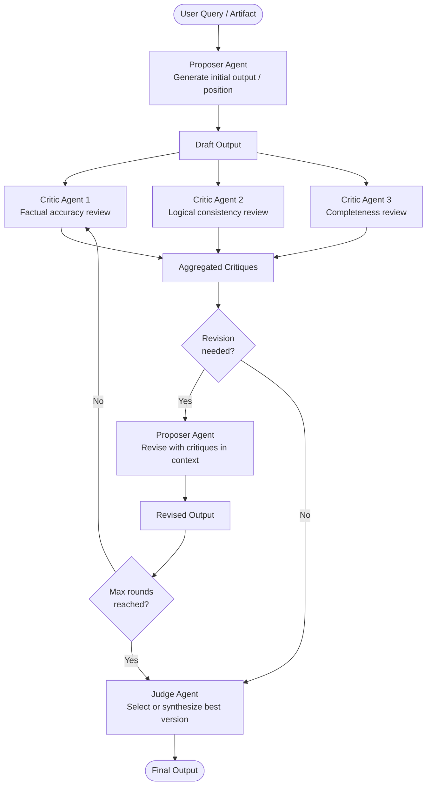

# Pattern: Debate & Critique

## Problem Statement

A single LLM agent tends to be overconfident, self-consistent (agreeing with its own prior outputs), and susceptible to anchoring on the first plausible solution it generates. Reflexion's self-critique partially addresses this, but a model evaluating its own output has an inherent blind spot: it uses the same weights that produced the error to evaluate whether the error exists. External, adversarial scrutiny from a separate agent — with a different role, perspective, or prompt — catches errors and weaknesses that self-evaluation misses.

## Solution Overview

Debate & Critique deploys multiple agents with explicitly different roles — proposers and critics — to iteratively challenge and improve a shared artifact. In the **debate variant**, agents argue opposing positions on a question and a judge synthesizes the strongest points. In the **critique variant**, a primary agent produces an output and one or more critic agents systematically attack it; the primary agent then defends or revises based on the critique. Multiple rounds of this exchange drive the output toward higher quality through adversarial pressure.

The pattern draws from the "Society of Mind" concept and constitutional AI principles, where diverse perspectives and structured disagreement improve aggregate reasoning quality.

## Architecture Diagram (Mermaid)

## Key Components

- **Proposer agent**: Generates the initial draft, position paper, code solution, or argument. Uses a system prompt focused on creativity and depth rather than defensiveness.
- **Critic agents**: Each critic is given a specific lens for evaluation:
  - *Factual critic*: Challenges accuracy of stated facts and statistics
  - *Logic critic*: Identifies fallacies, inconsistencies, and gaps in reasoning
  - *Completeness critic*: Points out missing perspectives, edge cases, or requirements
  - *Devil's advocate*: Argues the strongest possible counter-position
- **Critique aggregator**: Combines individual critiques into a structured feedback document, deduplicating overlapping points and ranking critiques by severity.
- **Revision loop**: The proposer receives all critiques and produces a revised output. The revision prompt should explicitly instruct the agent to address each numbered critique point or explain why it disagrees.
- **Judge agent**: After a set number of rounds (typically 2–4), a judge agent compares all versions and either selects the best or synthesizes a final output incorporating the strongest elements of each draft.
- **Round counter**: A guard that prevents infinite debate. In practice, quality improvements plateau quickly; 2–3 rounds capture most of the benefit.

## Implementation Considerations

- **Role distinctness**: If all critics share the same generic "please critique this" prompt, they tend to produce very similar feedback and the debate adds little value. Invest in role-specific critic prompts with concrete evaluation dimensions.
- **Parallelizing critics**: Multiple critics can evaluate the same draft simultaneously, reducing round latency. Only the proposer's revision step needs to wait for all critiques.
- **Sycophancy guard**: The proposer may capitulate to every critique, including incorrect ones, due to RLHF-induced agreeableness. Explicitly instruct the proposer that it should defend correct points and only revise where the critique is valid.
- **Judge prompt design**: The judge should be instructed to evaluate based on objective criteria, not just prefer the most recent version. Provide the evaluation rubric in the judge's system prompt.
- **Cost vs. rounds**: Each round multiplies cost by (1 proposer + N critics). Start with 1 round and add rounds only if the quality delta justifies the cost.

## Trade-offs

| Dimension | Benefit | Cost |
|-----------|---------|------|
| Output quality | Adversarial pressure catches errors | High token cost per round |
| Bias reduction | Multiple perspectives reduce anchoring | Critics may have systematic biases too |
| Transparency | Full debate trail is auditable | Long, verbose traces |
| Robustness | Misses fewer edge cases | Diminishing returns after 2-3 rounds |

## When to Use / When NOT to Use

**Use when:**
- High-stakes outputs where errors are costly (policy documents, legal briefs, safety-critical code)
- Questions with genuine uncertainty or multiple valid perspectives (strategic decisions, ethical analysis)
- When Reflexion has been tried and self-critique quality is insufficient
- Long-form content generation where completeness and consistency matter

**Do NOT use when:**
- Tasks have a single correct answer verifiable by code execution — use Reflexion with programmatic tests instead (cheaper and more reliable)
- Latency is constrained — debate is inherently multi-round and slow
- The question is subjective and preference-based, where debate degenerates into arbitrary disagreement
- The proposer model is already at its quality ceiling — critics cannot improve what the proposer cannot revise

## Variants

- **Society of Agents Debate**: 3+ agents each independently generate a position, then debate each other simultaneously (not sequential critique). A moderator agent steers the debate and calls consensus.
- **Red Team / Blue Team**: A "blue team" agent proposes a plan or decision; a "red team" agent tries to find exploits, failure modes, or attack vectors. Used for security and robustness analysis.
- **Constitutional Critique**: Critics are each assigned a specific principle from a constitution (safety, helpfulness, honesty, etc.) and evaluate only on their assigned dimension.
- **Blind Critique**: Critics receive the output without knowing which agent produced it, reducing bias toward or against specific proposer identities.

## Related Blueprints

- [Reflexion Pattern](../orchestration/reflexion.md) — single-agent self-critique; Debate is the multi-agent generalization
- [Parallel Execution Pattern](./parallel.md) — critics run in parallel within each debate round
- [Supervisor Pattern](./supervisor.md) — the judge role mirrors the supervisor's synthesis step
- [LATS Pattern](../orchestration/lats.md) — debate can serve as a high-quality value function for LATS node evaluation
