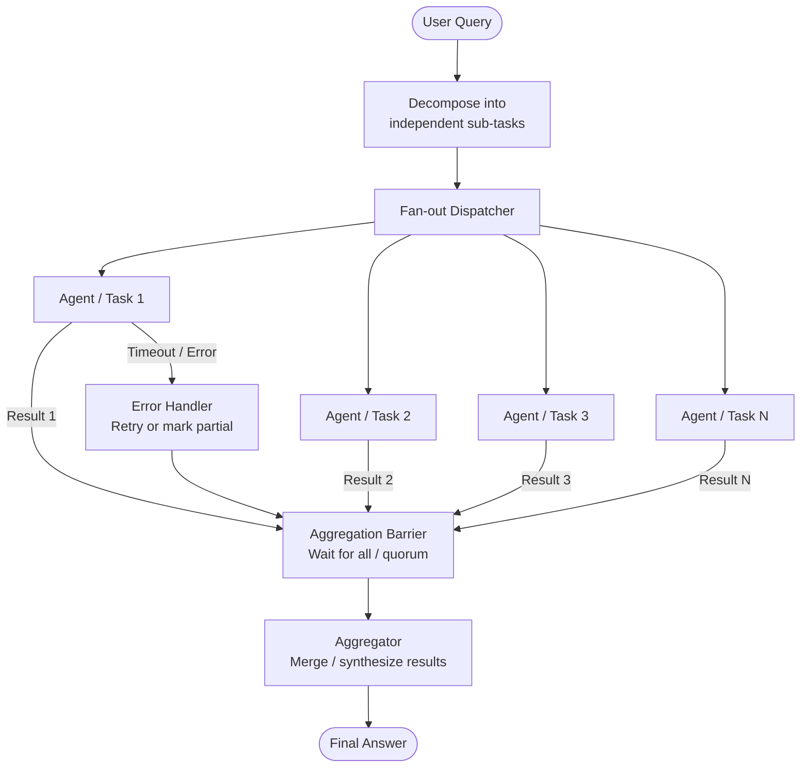

# Pattern: Parallel Execution

## Problem Statement

Sequential agent pipelines are a latency bottleneck. When a task has multiple independent sub-components — researching several topics simultaneously, running analyses on different data segments, generating multiple drafts for comparison — forcing them to execute one at a time wastes time proportional to the number of steps. For time-sensitive applications, this sequential bottleneck is unacceptable.

## Solution Overview

The Parallel Execution pattern fans out multiple agent invocations simultaneously, waits for all (or a sufficient subset) to complete, and then aggregates their results. This is the agent equivalent of parallel processing: independent units of work are dispatched concurrently, dramatically reducing wall-clock time from O(n) sequential to O(max) — the time of the slowest individual task.

The pattern requires identifying which sub-tasks are truly independent (no data dependency between them), designing a clean aggregation step, and handling partial failures gracefully.

## Architecture Diagram (Mermaid)

## Key Components

- **Decomposer**: Analyzes the user's query and identifies independent sub-tasks. This can be a dedicated LLM call or a deterministic routing function based on input structure.
- **Fan-out dispatcher**: Launches all sub-tasks concurrently using async primitives (async/await, thread pools, futures, etc.). Each sub-task receives its own isolated context.
- **Independent workers**: These may be identical agents operating on different inputs (e.g., "summarize document A", "summarize document B") or different agents with specialized roles (e.g., "research", "analyze", "draft").
- **Aggregation barrier**: A synchronization point that waits for all (or a quorum of) workers to complete. Supports configurable timeout policies and partial-result handling.
- **Aggregator**: Combines individual results into a coherent output. This may be as simple as concatenation or as complex as a synthesis LLM call that reconciles conflicting results.
- **Error handler**: Manages individual worker failures. Options include: retry the failed worker, substitute a default value, exclude the result and flag it, or propagate the error if the result is critical.

## Implementation Considerations

- **Dependency analysis**: Incorrectly marking dependent tasks as independent will produce race conditions or wrong results. Build an explicit dependency graph and only parallelize nodes with no ancestors in the current execution set.
- **Rate limiting**: Launching many agents simultaneously may hit API rate limits. Implement a semaphore or token-bucket rate limiter to cap concurrent LLM calls.
- **Result ordering**: Parallel results arrive in non-deterministic order. If the aggregator requires ordered inputs (e.g., a document with sections in a specific sequence), re-sort results by a task ID before aggregating.
- **Timeout strategy**: Use a deadline-based timeout (all tasks must finish within X seconds) rather than a per-task timeout, so the system adapts to overall latency budgets.
- **Cost amplification**: Parallelism reduces latency but not total token cost — it may even increase cost slightly due to duplicated context. Make sure the latency benefit justifies the cost.

## Trade-offs

| Dimension | Benefit | Cost |
|-----------|---------|------|
| Latency | Reduces wall-clock time to max(tasks) | Does not reduce total token cost |
| Throughput | Processes more work per unit time | Increases peak API concurrency |
| Isolation | Worker failures are contained | Aggregation logic adds complexity |
| Simplicity | Each worker is simpler (narrower task) | Overall system has more moving parts |

## When to Use / When NOT to Use

**Use when:**
- Multiple independent sub-tasks must be completed to answer a query
- Latency reduction is a primary requirement
- Sub-tasks are clearly decomposable with well-defined interfaces
- Workers can run on different data segments (map-reduce style)

**Do NOT use when:**
- Sub-tasks have sequential data dependencies (output of task A feeds task B)
- The overhead of spawning and synchronizing workers exceeds the time savings (for very small tasks)
- API rate limits make true concurrency impossible at your scale
- Aggregation is so complex that it negates the parallelism benefit

## Variants

- **Map-Reduce Agent**: Apply the same agent function to N data chunks in parallel (map), then combine all results (reduce). Ideal for document processing at scale.
- **Speculative Execution**: Launch multiple agents on the same task simultaneously and return the first valid result. Trades cost for latency in unpredictable-duration tasks.
- **Scatter-Gather with Quorum**: Fan out to N agents and return when K of them have completed (K < N). Provides a latency bound without waiting for stragglers.
- **Parallel with Voting**: Each agent produces a candidate answer; a voting or ranking step selects the best. Combines parallelism with ensemble quality improvement.
- **Pipeline Parallelism**: Stage-based processing where stage 2 begins on completed outputs from stage 1 before all stage-1 tasks finish (streaming fan-out).

## Related Blueprints

- [Supervisor Pattern](./supervisor.md) — supervisors commonly use parallel dispatch for independent sub-tasks
- [Debate & Critique Pattern](./debate-critique.md) — debate agents run in parallel, generating simultaneous arguments
- [Plan & Execute Pattern](../orchestration/plan-execute.md) — independent plan steps can be executed in parallel
- [Tool Parallel Execution](../tools/parallel-tools.md) — the same fan-out principle applied at the tool call level within a single agent
