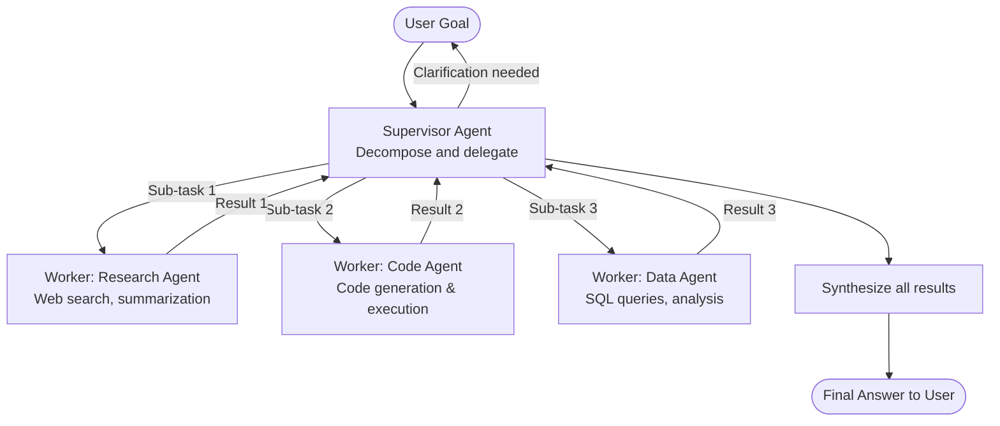

# Pattern: Supervisor

## Problem Statement

Complex tasks often require diverse capabilities — web search, code execution, data analysis, document drafting, and more. A single generalist agent handles all of these poorly: it cannot use specialized prompts, tools, or models for each domain; it accumulates a bloated context window mixing unrelated work; and failures in one capability cascade into all others. But without coordination, a collection of independent agents cannot collaborate to solve a unified goal.

## Solution Overview

The Supervisor pattern introduces a **central coordinator agent** that receives the top-level user goal, decomposes it into sub-tasks, and delegates each sub-task to a specialized **worker agent**. Workers operate within their own isolated contexts with domain-specific tools and prompts. Upon completion, they return results to the supervisor, which synthesizes the outputs into a coherent final response. The supervisor never executes domain tools directly — it only reasons, delegates, and integrates.

This mirrors how a manager in an organization assigns work to specialists and integrates their outputs, rather than doing all work themselves.

## Architecture Diagram (Mermaid)

## Key Components

- **Supervisor agent**: An LLM with a system prompt focused on task decomposition, delegation, and synthesis. It has access to a "delegate" meta-tool that invokes workers, but not to domain-specific tools (search, code execution, etc.). Using a high-capability model here is critical.
- **Worker agents**: Each worker has a narrow, well-defined role, a specialized system prompt, a curated tool set, and its own isolated context window. Workers are stateless from the supervisor's perspective — they receive a task description and return a result string.
- **Task dispatch protocol**: A structured format for the supervisor to issue tasks (e.g., a JSON object with `worker_id`, `task_description`, and `context`) and for workers to return results (structured output with `status`, `result`, and `metadata`).
- **Result aggregator**: The supervisor's final synthesis step, which combines worker outputs into a unified answer. This may itself be a ReAct loop if integration requires additional reasoning.
- **State tracker**: A record of which sub-tasks have been dispatched, completed, and integrated. Used to resume long-running workflows and detect workers that have timed out.

## Implementation Considerations

- **Worker granularity**: Workers should be narrow enough to be specialized but broad enough to complete meaningful sub-tasks without requiring many round trips to the supervisor. A good rule of thumb: one worker per distinct tool domain.
- **Parallel vs. sequential dispatch**: When sub-tasks are independent, dispatch them in parallel to minimize wall-clock time. When sub-tasks have dependencies (B requires A's output), dispatch sequentially.
- **Context isolation**: Each worker should receive only the context it needs for its sub-task. Avoid passing the full conversation history to workers — it wastes tokens and can confuse them.
- **Error propagation**: If a worker fails, the supervisor should reason about whether to retry with the same worker, delegate to an alternative worker, or report partial failure to the user.
- **Supervisor prompt scope creep**: As the number of worker types grows, the supervisor prompt can become unwieldy. Consider a tool registry pattern where available workers are described dynamically.

## Trade-offs

| Dimension | Benefit | Cost |
|-----------|---------|------|
| Specialization | Workers optimized for their domain | More agents to maintain and monitor |
| Isolation | Worker failures are contained | Extra round trips for delegation |
| Scalability | Add new workers without touching others | Supervisor becomes a bottleneck |
| Debuggability | Clear delegation trail | Multi-hop traces are harder to follow |

## When to Use / When NOT to Use

**Use when:**
- Tasks require clearly distinct capabilities (research + code + writing, etc.)
- You want to use different models for different sub-tasks (cost optimization)
- Individual worker failures should not crash the entire pipeline
- The system needs to scale — new capabilities added as new workers, not supervisor changes

**Do NOT use when:**
- The task is simple and fits within a single agent's capability
- All steps are tightly coupled and share state — context isolation becomes a liability
- You have a small number of tools (fewer than 5) that one agent can manage directly

## Variants

- **Hierarchical Supervisor**: The supervisor delegates to mid-level coordinators, which in turn delegate to leaf workers. Used for very large task graphs.
- **Supervisor with Human Workers**: Some "workers" are human-in-the-loop nodes — the supervisor routes certain tasks to a human approval queue.
- **Dynamic Worker Registry**: Workers register themselves at runtime; the supervisor discovers available workers via a registry rather than a hard-coded list.
- **Supervisor with Shared Memory**: Workers read from and write to a shared key-value store or vector memory, allowing them to collaborate without going through the supervisor for every data exchange.

## Related Blueprints

- [Plan & Execute Pattern](../orchestration/plan-execute.md) — the supervisor's decomposition step mirrors the planner
- [Parallel Execution Pattern](./parallel.md) — supervisor dispatches independent tasks in parallel
- [ReAct Pattern](../orchestration/react.md) — individual workers typically use ReAct internally
- [Debate & Critique Pattern](./debate-critique.md) — can be used for the supervisor's synthesis step when quality is critical
