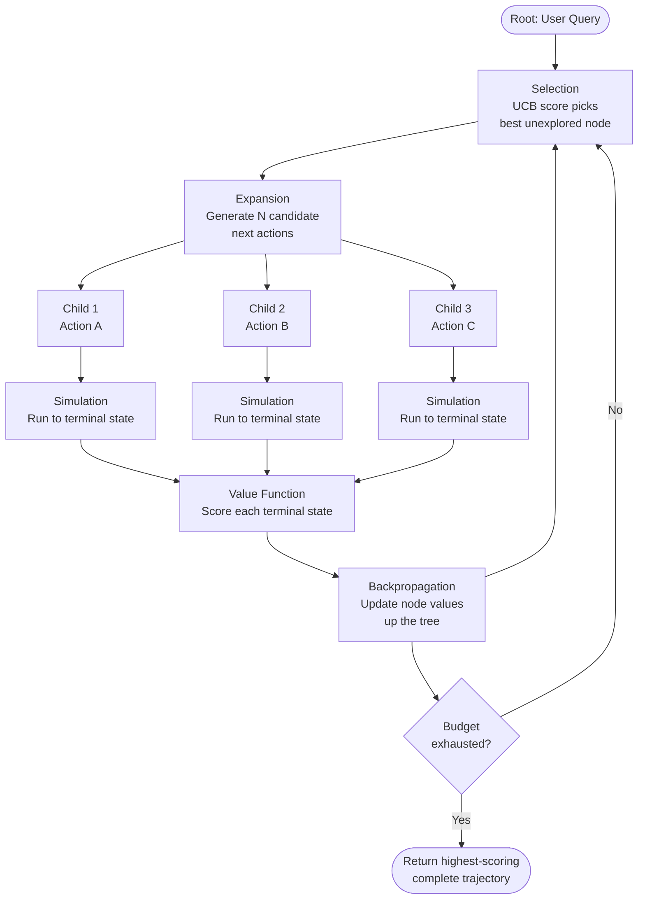

# Pattern: LATS (Language Agent Tree Search)

## Problem Statement

Both ReAct and Plan & Execute commit to a single trajectory through the solution space. If the agent takes a wrong turn early — chooses a bad tool, makes a flawed assumption, or misinterprets the query — the error propagates forward and the final answer suffers. Reflexion can recover from some errors via retries, but it still restarts from the beginning each time, failing to reuse partial progress from prior attempts. For hard tasks with many possible solution paths, a richer search strategy is needed.

## Solution Overview

LATS applies Monte Carlo Tree Search (MCTS) to language agent trajectories. Rather than committing to one path, the agent maintains a **search tree** where each node represents an agent state (the accumulated context, observations, and actions so far) and each edge represents a possible next action. The algorithm iteratively:

1. **Selects** the most promising unexplored node using an upper confidence bound (UCB) score
2. **Expands** it by generating multiple candidate next actions (children)
3. **Simulates** each child to a terminal state (answer or max depth)
4. **Evaluates** terminal states using a value function (LLM critic or programmatic scorer)
5. **Backpropagates** the score up the tree to update parent node values

This allows the agent to explore multiple branching paths and return the globally best trajectory rather than the first locally-reasonable one.

## Architecture Diagram (Mermaid)

## Key Components

- **Search tree**: Each node stores the full agent state: the conversation history, all tool calls and observations so far, and the cumulative score. Nodes are stored in memory (or a lightweight DB for very deep searches).
- **Selection policy (UCB)**: Balances exploration (try underexplored branches) and exploitation (continue promising branches). The standard UCB formula is: `score + C * sqrt(ln(parent_visits) / node_visits)`, where C is a tunable exploration constant.
- **Expansion**: At each selected node, the agent LLM is prompted to generate `k` diverse candidate next actions (k = 2–5 typically). Temperature should be non-zero to encourage diversity.
- **Simulation (rollout)**: Each candidate action is executed and the resulting state is rolled out to a terminal condition using a fast rollout policy (can be a cheaper/faster model).
- **Value function**: Scores terminal states. Can be:
  - A dedicated LLM-as-judge prompt
  - Programmatic (unit test pass rate, answer matches ground truth)
  - A trained reward model
- **Backpropagation**: Updates each ancestor node's visit count and cumulative score. This guides future selection toward high-value subtrees.

## Implementation Considerations

- **Cost is multiplicative**: LATS with branching factor k and depth d runs approximately k*d LLM calls per search iteration. Set tight budgets and use a cheaper model for rollouts.
- **State serialization**: To revisit nodes, you must be able to serialize and deserialize the full agent state (conversation history + observations). Design your state representation carefully.
- **Value function quality**: The search is only as good as the value function. A bad evaluator will waste search budget on worthless paths. Invest heavily here.
- **Depth limit**: Cap tree depth at 5–10 steps for most tasks. Deeper trees are exponentially expensive and rarely needed.
- **Diversity in expansion**: If all k children are identical (because temperature is too low), the tree degenerates into a linear search. Use temperature 0.7–1.0 during expansion.

## Trade-offs

| Dimension | Benefit | Cost |
|-----------|---------|------|
| Solution quality | Finds globally optimal paths | Very high token and latency cost |
| Robustness | Recovers from early wrong turns | Complexity of implementation |
| Exploration | Systematically covers solution space | Most paths are wasted computation |
| Interpretability | Best trajectory is fully logged | Tree structure is hard to explain |

## When to Use / When NOT to Use

**Use when:**
- The task is hard and the solution space has many branching points (competitive programming, theorem proving, complex multi-step research)
- You have a reliable programmatic evaluator (makes the value function cheap and accurate)
- Latency is not a constraint and quality is paramount
- Other patterns (ReAct, Plan & Execute) have already failed or plateau below acceptable quality

**Do NOT use when:**
- Tasks are straightforward — LATS overhead is completely unjustified for simple queries
- There is no reliable value function — blind search is no better than random
- Cost is constrained — LATS is the most expensive orchestration pattern
- You need fast, streaming responses — LATS must complete the search before returning

## Variants

- **Beam Search Agent**: Instead of MCTS, maintain the top-k best partial trajectories at each depth level. Simpler to implement, less principled than MCTS.
- **LATS with Learned Value**: Replace the LLM-judge value function with a trained value head fine-tuned on task-specific reward signals.
- **LATS with Pruning**: Prune branches that the value function scores below a threshold, reducing wasted computation in obviously bad subtrees.
- **Shallow LATS**: Limit the search to depth 1 (just selecting the best of k first actions) — a pragmatic compromise between quality and cost.

## Related Blueprints

- [ReAct Pattern](./react.md) — used as the rollout policy within each LATS simulation
- [Reflexion Pattern](./reflexion.md) — LATS generalizes Reflexion's retry mechanism to full tree search
- [Plan & Execute Pattern](./plan-execute.md) — LATS can be applied to select the best plan in the planning phase
- [Debate & Critique Pattern](../multi-agent/debate-critique.md) — debate can serve as a high-quality value function for LATS nodes
