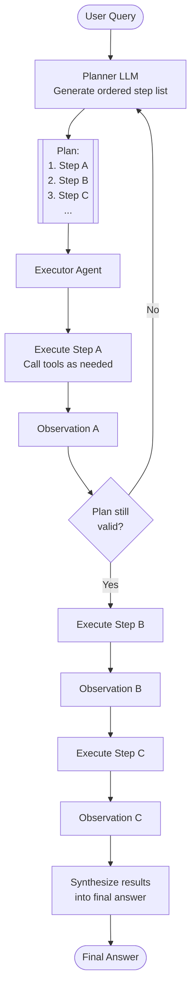

# Pattern: Plan & Execute

## Problem Statement

ReAct's step-by-step approach works well for short tasks but becomes fragile on complex, multi-step problems. Because each action is chosen locally based only on the previous observation, the agent can lose sight of the overall goal, repeat work, or take a globally suboptimal path. There is no mechanism to check whether the sequence of actions will actually converge on the desired outcome before execution begins.

## Solution Overview

Plan & Execute splits agent work into two distinct phases. In the **Planning phase**, a dedicated planner model or prompt analyzes the user's goal and produces an explicit, ordered list of steps before any tools are invoked. In the **Execution phase**, an executor works through the plan sequentially (or in parallel where steps are independent), updating the plan if new observations invalidate earlier assumptions. This separation of concerns allows the planner to reason globally while the executor focuses on local, grounded actions.

The pattern maps to classical AI's distinction between deliberative planning and reactive execution, modernized for LLM-based agents.

## Architecture Diagram (Mermaid)

## Key Components

- **Planner**: An LLM call (often with a high-capability model) that takes the user's goal and produces a structured plan — typically a numbered list of sub-tasks, each with a clear success criterion. The planner should also identify dependencies between steps.
- **Plan representation**: A structured data format (JSON array of step objects, each with `id`, `description`, `depends_on`, and `status` fields) allows the executor to track progress and the replanner to modify specific steps without regenerating the whole plan.
- **Executor**: A ReAct-style loop (or simple tool caller) that receives one step at a time and drives it to completion. The executor does not need to see the full plan — it only needs the current step and the relevant prior observations.
- **Replanner**: A conditional step that checks, after each completed step, whether the remaining plan is still valid given new observations. If not, it generates a revised plan from the current state.
- **Synthesizer**: A final LLM call that combines all observations from all steps into a coherent answer, summary, or artifact.

## Implementation Considerations

- **Plan granularity**: Overly fine-grained plans create overhead; coarse plans lose the benefit of explicit structure. Aim for steps that each correspond to 1–3 tool calls.
- **Replanning cost**: Calling the planner again mid-execution is expensive. Use a lightweight heuristic (e.g., "did the observation contain an error or unexpected data type?") to gate replanning.
- **Parallel execution**: After parsing the plan, identify steps with no interdependencies and execute them concurrently. This dramatically reduces wall-clock time for research-style tasks.
- **Plan persistence**: Store the plan and step statuses in a durable store so that long-running tasks can survive process restarts.
- **Model selection**: Use a large, capable model for planning (quality matters) and a smaller, faster model for execution (throughput matters).

## Trade-offs

| Dimension | Benefit | Cost |
|-----------|---------|------|
| Global coherence | Planner sees the full goal | Extra latency before first action |
| Debuggability | Plan is inspectable and editable | Replanning adds complexity |
| Parallelism | Independent steps can run concurrently | Dependency tracking required |
| Flexibility | Adapts via replanning | Replanning can loop or thrash |

## When to Use / When NOT to Use

**Use when:**
- Tasks have 5+ steps with non-trivial inter-dependencies
- You need to show users a progress plan before execution begins (UX requirement)
- Mistakes are costly and you want a "sanity check" before acting
- Different steps require different tools or specialized sub-agents

**Do NOT use when:**
- The task is simple and short (1–3 tool calls) — the planning overhead is wasted
- The environment is highly dynamic and plans go stale immediately (pure ReAct adapts faster)
- You need the fastest possible first response (planning adds 1–2 extra LLM round trips)

## Variants

- **Static Plan & Execute**: Plan is generated once and executed verbatim. No replanning. Suitable for well-defined, predictable workflows.
- **Dynamic Plan & Execute**: Full replanning after each failed or surprising step. Maximum adaptability but highest cost.
- **Hierarchical Plan & Execute**: The top-level plan contains sub-goals, each of which is planned independently by a sub-agent. Useful for very large tasks.
- **Plan & Execute with Human-in-the-Loop**: Present the plan to the user for approval before execution. Essential for high-stakes or irreversible actions.

## Related Blueprints

- [ReAct Pattern](./react.md) — the executor within each plan step typically uses ReAct
- [Reflexion Pattern](./reflexion.md) — can be used to evaluate the synthesized answer and trigger a replan
- [Supervisor Pattern](../multi-agent/supervisor.md) — the supervisor role is analogous to the planner
- [Parallel Execution Pattern](../multi-agent/parallel.md) — used to execute independent plan steps concurrently
