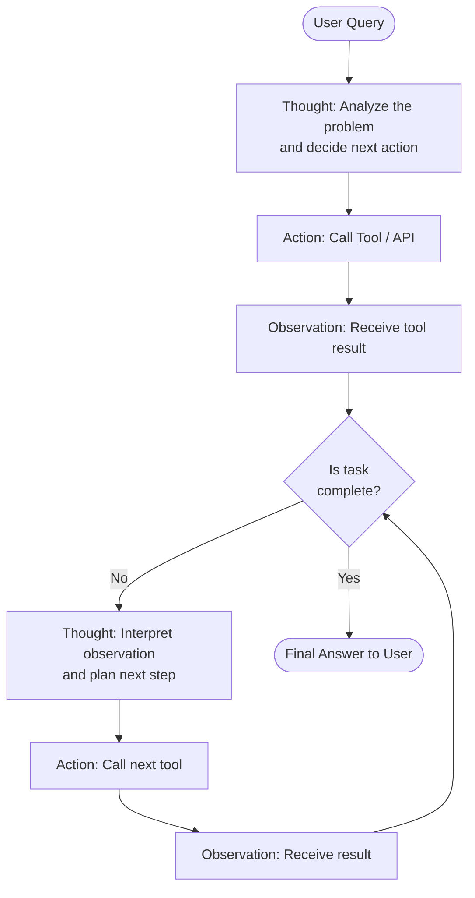

# Pattern: ReAct (Reasoning + Acting)

## Problem Statement

Agents that act without reasoning often make blind choices — selecting tools incorrectly, missing contextual clues, or failing to recognize when a task is complete. Pure chain-of-thought reasoning, on the other hand, can produce hallucinated answers because the agent never grounds its conclusions in real observations. The core challenge is combining deliberate thought with grounded action in a tight, iterative loop.

## Solution Overview

ReAct interleaves three alternating steps: **Thought**, **Action**, and **Observation**. At each step, the agent first articulates its current reasoning (Thought), then invokes a tool or takes an action (Action), then receives the result of that action (Observation). This triplet repeats until the agent determines it has enough information to produce a final answer. The reasoning trace serves double duty — it guides the next action and provides an auditable log of how the answer was reached.

The pattern was introduced in the paper "ReAct: Synergizing Reasoning and Acting in Language Models" (Yao et al., 2022) and has become the de facto baseline for tool-using agents.

## Architecture Diagram (Mermaid)

## Key Components

- **Thought step**: A natural-language scratchpad where the model reasons about its current situation. This should not be surfaced to end users but is critical for model performance.
- **Action step**: A structured invocation of a tool (search engine, calculator, code executor, database query, API call, etc.). The action schema must be parseable and validated before execution.
- **Observation step**: The raw or lightly formatted result returned by the tool. Observations should be concise enough not to overflow the context window.
- **Stopping condition**: A deterministic check or a model-generated signal (e.g., producing a `Final Answer:` token) that terminates the loop.
- **Max iterations guard**: A hard limit on the number of Thought-Action-Observation cycles to prevent infinite loops and runaway costs.

## Implementation Considerations

- **Prompt formatting**: The Thought/Action/Observation labels must be consistent and parseable. Many implementations use XML tags or JSON to separate fields.
- **Context growth**: Each cycle appends tokens. For long tasks, summarize or truncate older observations to stay within the model's context window.
- **Error handling**: Tool failures should be fed back as Observations so the model can reason about the failure and try an alternative approach.
- **Streaming**: Stream Thought steps to users as "thinking" UI, hide raw tool calls, and surface final answers cleanly.
- **Parallelism**: Vanilla ReAct is sequential. If the model identifies independent sub-tasks, consider upgrading to a parallel tool-calling variant.

## Trade-offs

| Dimension | Benefit | Cost |
|-----------|---------|------|
| Transparency | Full reasoning trace | Verbose token usage |
| Flexibility | Any tool can be plugged in | Tool schema design is critical |
| Reliability | Grounded in real observations | Slow — sequential round trips |
| Debuggability | Easy to inspect failures | Traces can be long |

## When to Use / When NOT to Use

**Use when:**
- Tasks require multiple heterogeneous tool calls whose order depends on prior results
- You need an auditable reasoning trail (compliance, debugging, user trust)
- The task structure is unknown in advance and must be discovered dynamically

**Do NOT use when:**
- The task can be solved in a single tool call (adds unnecessary overhead)
- Latency is critical and sequential round trips are unacceptable
- The tool set is so large that the model struggles to select the right one (consider hierarchical or retrieval-based tool selection instead)

## Variants

- **ReAct + Self-Consistency**: Run multiple ReAct traces in parallel and majority-vote on the final answer.
- **ReAct + Memory**: Persist Observations to a vector store so they can be retrieved across sessions.
- **Structured ReAct**: Replace free-text Thoughts with structured JSON plans to improve parseability.
- **ReAct with Reflection**: After each full trace, run a Reflexion step to critique the answer and retry if quality is insufficient (see `reflexion.md`).

## Related Blueprints

- [Reflexion Pattern](./reflexion.md) — adds self-evaluation on top of ReAct traces
- [Plan & Execute Pattern](./plan-execute.md) — separates planning from action loops
- [LATS Pattern](./lats.md) — replaces the linear loop with a tree search over action sequences
- [Parallel Tool Execution](../tools/parallel-tools.md) — extends ReAct with simultaneous tool calls
- [Tool Selection Strategies](../tools/tool-selection.md) — how to pick the right tool at each Action step
