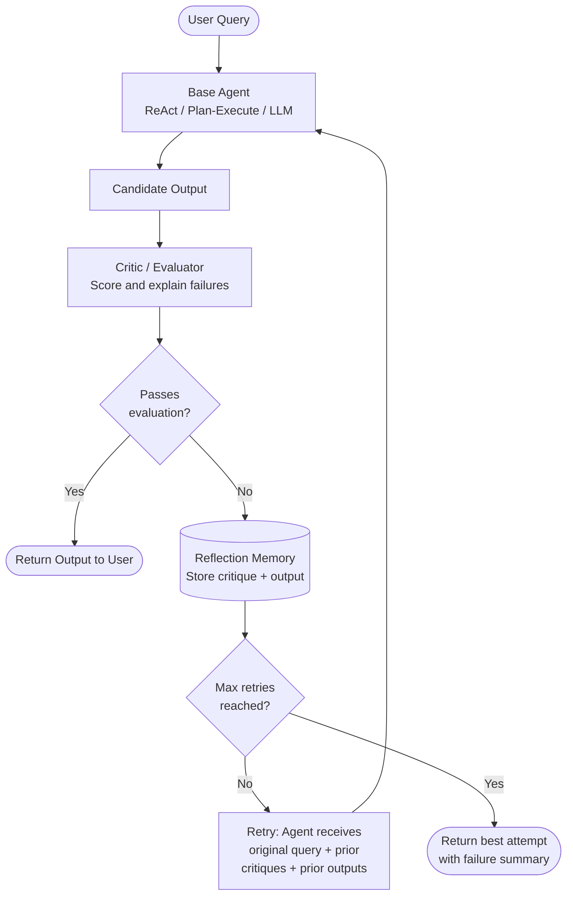

# Pattern: Reflexion

## Problem Statement

Most agent loops terminate as soon as a final answer is produced, with no mechanism to evaluate whether that answer is actually correct or high quality. The model may confidently produce a wrong answer, miss edge cases, fail a unit test, or return an incomplete response. Without a self-evaluation step, these errors are silently passed to the user.

## Solution Overview

Reflexion adds a self-evaluation loop around any base agent (ReAct, Plan & Execute, or even a simple LLM call). After the agent produces a candidate output, a **Critic** step evaluates the output against a rubric, test suite, or structured checklist. If the output fails evaluation, the agent receives its own critique as feedback and retries — potentially many times. Successful outputs pass through; persistent failures surface the best attempt with an attached error report.

The pattern is inspired by the paper "Reflexion: Language Agents with Verbal Reinforcement Learning" (Shinn et al., 2023), where verbal feedback acts as a lightweight reinforcement signal without gradient updates.

## Architecture Diagram (Mermaid)

## Key Components

- **Base Agent**: Any agent that produces a candidate output — a ReAct loop, a code generator, a summarizer, etc. Reflexion is a meta-pattern that wraps other patterns.
- **Critic / Evaluator**: The evaluation step can take many forms:
  - *LLM-as-judge*: A second LLM call with a structured rubric rates the output on specific dimensions (correctness, completeness, tone, safety).
  - *Programmatic tests*: For code generation, actually run the code against unit tests and capture pass/fail + stderr.
  - *External validator*: Check a fact against a database, run a linter, verify a URL, etc.
- **Reflection Memory**: A short buffer (in-context or stored externally) that accumulates all previous attempts, their outputs, and their critiques. This is fed back to the agent on each retry so it does not repeat the same mistakes.
- **Retry loop**: The agent receives: (1) the original query, (2) all prior outputs, (3) all critiques from the Critic. This full context allows it to reason about why it failed and take a different approach.
- **Max retries guard**: A hard limit (typically 2–5 retries) prevents infinite loops and bounds cost.

## Implementation Considerations

- **Critic design is critical**: A weak critic that approves bad outputs provides no benefit; an overly strict critic that rejects good outputs causes wasteful retries. Invest heavily in rubric design.
- **Evaluation granularity**: Prefer structured, dimension-specific feedback ("the calculation in step 3 is wrong") over vague feedback ("this is incorrect"). Specific critiques enable targeted fixes.
- **Memory overflow**: Each retry appends tokens. For models with small context windows, summarize older reflection rounds rather than including them verbatim.
- **Stopping criteria**: Consider passing on partial success (e.g., 80%+ unit tests pass) rather than requiring 100%, especially for fuzzy tasks.
- **Separate critic model**: Using a different (possibly smaller) model as the critic can be both cheaper and less susceptible to the self-consistency bias where a model tends to agree with its own outputs.

## Trade-offs

| Dimension | Benefit | Cost |
|-----------|---------|------|
| Output quality | Catches and corrects errors | Multiplies latency and cost by retry count |
| Self-correction | Improves without retraining | Only as good as the critic |
| Transparency | Critique trail is auditable | Verbose; users rarely see it |
| Robustness | Handles edge cases missed first-pass | Can get stuck in retry loops |

## When to Use / When NOT to Use

**Use when:**
- Output correctness can be evaluated (code that runs, facts that can be verified, structured data that can be validated)
- The cost of a wrong answer is high (legal, medical, financial drafts)
- You have a clear rubric or test suite for what "good" looks like
- Latency tolerance is high (offline batch jobs, async document processing)

**Do NOT use when:**
- There is no reliable way to evaluate output quality — a bad critic is worse than no critic
- Latency is critical (real-time applications cannot afford multiple retries)
- Tasks are subjective and preference-based — no objective ground truth exists
- The base agent is already operating near its capability ceiling (retries will not help)

## Variants

- **Code Reflexion**: Run generated code against a test suite; feed stderr and failed test cases back as critique. The most concrete and effective variant.
- **LLM-Judge Reflexion**: Use a stronger or different LLM to critique outputs on multiple rubric dimensions. Works for writing, reasoning, and planning tasks.
- **Self-Reflexion**: The same model evaluates its own output with a dedicated evaluation prompt. Cheaper but susceptible to self-consistency bias.
- **Ensemble Reflexion**: Run multiple base agents in parallel, use the critic to select the best output, then refine it. Combines Reflexion with ensemble methods.
- **Reflexion + Plan & Execute**: After synthesis, run a Reflexion loop on the final answer. If it fails, trigger a full replan rather than just a text revision.

## Related Blueprints

- [ReAct Pattern](./react.md) — common base agent wrapped by Reflexion
- [Plan & Execute Pattern](./plan-execute.md) — Reflexion can trigger replanning on failure
- [LATS Pattern](./lats.md) — LATS generalizes Reflexion to a full tree search with backpropagation of scores
- [Debate & Critique Pattern](../multi-agent/debate-critique.md) — externalizes the critic to a separate agent for stronger evaluation
