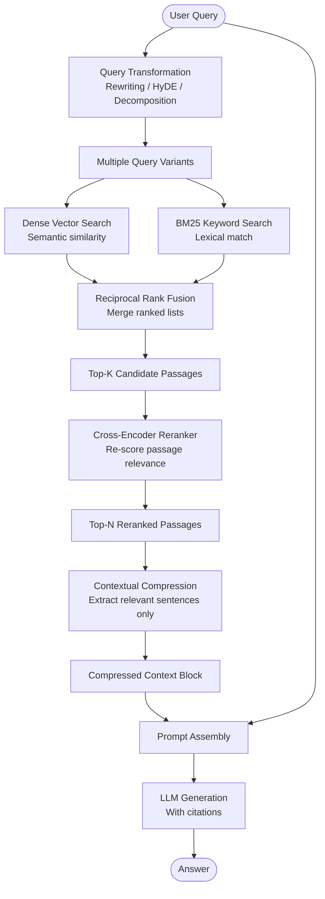

# Pattern: Advanced RAG

## Problem Statement

Basic RAG fails in predictable ways: poorly phrased user queries retrieve irrelevant passages; semantically similar but topically different documents pollute the results; a single retrieval pass misses complementary passages from different parts of the knowledge base; and long retrieved passages include much irrelevant surrounding text that dilutes the signal in the LLM's context window. These failures result in incomplete, inaccurate, or hallucinated answers despite the knowledge base containing the correct information.

## Solution Overview

Advanced RAG applies a series of targeted enhancements at each stage of the Basic RAG pipeline to address its failure modes:

- **Pre-retrieval**: Transform the user's query before retrieval to improve recall
- **Retrieval**: Use hybrid search combining dense and sparse methods for higher precision
- **Post-retrieval**: Rerank candidates and compress passages to improve signal-to-noise ratio in the context window
- **Generation**: Use structured prompts with explicit citation requirements

Each enhancement is independently composable — you can apply any subset based on your specific failure mode. Advanced RAG is not a single algorithm but a collection of best practices layered onto Basic RAG.

## Architecture Diagram (Mermaid)

## Key Components

### Pre-Retrieval: Query Transformation

- **Query rewriting**: Use an LLM to rephrase the user's query into cleaner, more precise retrieval language. Removes colloquialisms, expands acronyms, and clarifies ambiguous references ("it", "that thing", "the previous one").
- **Hypothetical Document Embedding (HyDE)**: Instead of embedding the query directly, ask the LLM to generate a hypothetical ideal document that would answer the query. Embed the hypothetical document and use that embedding for retrieval. Hypothetical documents live in the same embedding space as real documents, improving retrieval recall.
- **Query decomposition**: Break a complex, multi-faceted query into a set of simpler sub-queries. Retrieve separately for each sub-query and union the results. Critical for multi-hop questions.
- **Step-back prompting**: Generate a more abstract, general version of the query ("step back" from specifics) and retrieve for both the original and abstract query. Captures background knowledge needed to answer specific questions.

### Retrieval: Hybrid Search

- **BM25 (sparse) retrieval**: Classic TF-IDF-based keyword search. Excels at exact-match retrieval, proper nouns, and queries where specific terms are critical. Requires no embeddings.
- **Dense retrieval**: Vector similarity search using embedding models. Captures semantic meaning and paraphrase relationships.
- **Reciprocal Rank Fusion (RRF)**: Merges ranked lists from multiple retrievers. For each candidate, computes `sum(1 / (k + rank_i))` across all retrievers. Simple, parameter-free, and consistently outperforms single-retriever approaches.

### Post-Retrieval: Reranking and Compression

- **Cross-encoder reranker**: A bi-encoder (used for retrieval) encodes query and passage independently. A cross-encoder (used for reranking) processes the query and passage jointly, producing a much more accurate relevance score. Rerankers are slower than ANN search but only process the top-k candidates (typically 20–50), not the full corpus.
- **Contextual compression**: Instead of including entire retrieved passages, extract only the sentences or spans directly relevant to the query. Reduces context window consumption and removes noise. Can be done with an LLM or a lightweight extractive model.
- **Relevance score threshold**: After reranking, filter out candidates below a minimum relevance score. This prevents the model from being confused by marginally relevant passages.

## Implementation Considerations

- **Enhancement selection**: Apply enhancements in order of ROI for your specific failure mode. Query rewriting and hybrid search provide the highest impact for most use cases. Reranking is high-value when retrieval precision is critical. Contextual compression matters most when context windows are constrained.
- **Latency budget**: Each enhancement adds latency. Profile your pipeline: query rewriting (+200–500ms), hybrid search (+20–50ms vs. single retriever), reranking (+50–200ms), compression (+200–500ms). Total overhead can be 500ms–1.5s. Decide which enhancements fit your latency budget.
- **Reranker model selection**: Cross-encoder rerankers vary widely in quality and speed. Strong options include Cohere Rerank, BGE Reranker, and specialized domain models. Benchmark on your dataset before committing.
- **Evaluation-driven tuning**: Set up an evaluation pipeline (RAGAs or custom) that measures retrieval recall, answer faithfulness, and answer relevance. Add enhancements one at a time and measure the delta. This prevents adding complexity that does not help.

## Trade-offs

| Dimension | Benefit | Cost |
|-----------|---------|------|
| Retrieval quality | Significantly higher recall and precision | Latency grows with each stage |
| Answer quality | Higher faithfulness, fewer gaps | More complex pipeline to maintain |
| Context efficiency | Compressed context has higher signal | Compression may drop needed sentences |
| Robustness | Handles ambiguous and complex queries | More failure points to diagnose |

## When to Use / When NOT to Use

**Use when:**
- Basic RAG quality is insufficient and you have diagnosed specific failure modes
- Queries are complex, ambiguous, or multi-faceted
- The knowledge base is large and retrieval precision is critical
- You have a latency budget of >500ms and can absorb the enhancement overhead

**Do NOT use when:**
- Basic RAG already achieves acceptable quality — do not add complexity unnecessarily
- Query patterns are simple and well-structured (exact-match queries work fine with BM25 alone)
- Latency requirements are below 200ms
- The team lacks the infrastructure to operate and monitor a multi-stage pipeline

## Variants

- **Iterative Retrieval**: After generating a partial answer, use the answer to formulate a follow-up retrieval query. Bridges Advanced RAG and Agentic RAG.
- **Graph-Augmented RAG**: Add a knowledge graph on top of the vector index. Retrieve entity-linked passages using graph traversal rather than only vector similarity.
- **Long-Context RAG**: Use a model with a very large context window (e.g., 1M tokens) to include retrieved passages verbatim without compression. Trades context cost for simplicity.
- **Personalized RAG**: Apply user-profile-based pre-filtering before retrieval to weight passages from domains and sources the user has engaged with positively in the past.

## Related Blueprints

- [Basic RAG](./basic-rag.md) — the foundation this pattern enhances
- [Agentic RAG](./agentic-rag.md) — the next step: agent-driven adaptive retrieval
- [Vector Store Memory](../memory/vector-store.md) — underlying storage infrastructure
- [Debate & Critique Pattern](../multi-agent/debate-critique.md) — can be used to evaluate and improve RAG-generated answers
