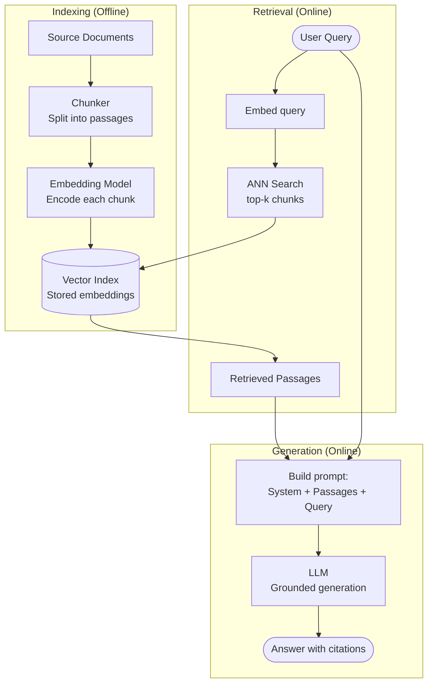

# Pattern: Basic RAG (Retrieval-Augmented Generation)

## Problem Statement

LLMs have static knowledge frozen at training time. They cannot answer questions about proprietary documents, recent events, or domain-specific knowledge not represented in training data. Fine-tuning is expensive, slow, and requires retraining when knowledge changes. There needs to be a lightweight mechanism to ground LLM responses in external, up-to-date knowledge without model retraining.

## Solution Overview

Basic RAG (Retrieval-Augmented Generation) augments LLM generation with a retrieval step. Before calling the LLM, the system retrieves the most relevant passages from an external knowledge base and includes them in the prompt as context. The LLM then generates its answer grounded in the retrieved passages rather than relying solely on parametric (training-time) knowledge.

The three-step pipeline — **Index, Retrieve, Generate** — is the foundation of all RAG variants. Basic RAG uses the simplest possible version of each step: dense vector retrieval and a single-pass generation.

## Architecture Diagram (Mermaid)

## Key Components

- **Document ingestion pipeline**: Loads source documents from their origins (files, databases, APIs, web crawlers) and normalizes them into plain text. Handles format conversion (PDF, DOCX, HTML, etc.) and metadata extraction (title, author, date, URL).
- **Chunker**: Splits documents into passages of a target size (typically 256–512 tokens). The chunking strategy significantly impacts retrieval quality:
  - *Fixed-size chunking*: Simple; may cut mid-sentence
  - *Sentence-aware chunking*: Splits at sentence boundaries; better coherence
  - *Recursive character splitting*: Respects paragraph and sentence boundaries hierarchically
  - *Semantic chunking*: Groups sentences with similar embeddings; highest quality but most expensive
- **Embedding model**: Converts chunks into dense vectors. The same model must be used for both indexing and query embedding. Asymmetric embedding models (separate query and passage encoders) often outperform symmetric models for retrieval.
- **Vector index**: Stores chunk embeddings and their associated metadata (source document, chunk offset, raw text). Supports approximate nearest-neighbor search (HNSW, IVF, etc.) for sub-100ms retrieval at scale.
- **Prompt assembler**: Combines the system prompt, retrieved passages (formatted as a numbered context block), and the user's query into the final LLM input. Passage ordering within the prompt affects answer quality — place the most relevant passage first.
- **LLM generator**: Produces the final answer grounded in the provided context. The system prompt should instruct the model to: (a) only use information from the provided context, (b) cite specific passages, and (c) acknowledge when the context does not contain the answer.

## Implementation Considerations

- **Retrieval depth (top-k)**: Retrieving too few passages (k=1–2) misses relevant information; too many (k=20+) dilutes the context and may confuse the model. k=3–7 is a common sweet spot. Tune empirically on your data.
- **Chunk overlap**: Use 10–20% overlap between adjacent chunks to prevent relevant information from being split across chunk boundaries and missed during retrieval.
- **Metadata filtering**: Always store metadata (document source, date, category) with each chunk and implement pre-retrieval filtering. This prevents the model from retrieving chunks from irrelevant documents.
- **Faithfulness vs. creativity**: The LLM should be constrained to answer only from retrieved context (high faithfulness) rather than blending parametric knowledge. This requires explicit instruction in the system prompt and reduces hallucination risk significantly.
- **Citation generation**: Instruct the model to cite which passage number supports each claim. Implement post-processing to verify citations and link them to source documents for user verification.
- **Evaluation**: Measure retrieval quality (recall@k: does the correct passage appear in the top-k results?) and generation quality (faithfulness, answer relevance) separately. They fail for different reasons.

## Trade-offs

| Dimension | Benefit | Cost |
|-----------|---------|------|
| Knowledge freshness | Knowledge base updated without retraining | Retrieval quality determines answer quality |
| Hallucination reduction | Grounded in retrieved facts | Model may still hallucinate if context is insufficient |
| Simplicity | Easy to implement and understand | Brittle for complex multi-hop questions |
| Transparency | Passages are citable | Users must trust retrieval ranking |

## When to Use / When NOT to Use

**Use when:**
- Answering questions over a specific, bounded document corpus (internal documentation, product manuals, research papers)
- Knowledge changes frequently and retraining is impractical
- Answer traceability to source documents is required (compliance, citations)
- Queries are single-hop: the answer can be found in one or two retrieved passages

**Do NOT use when:**
- Queries require synthesizing information across many documents simultaneously — the context window will overflow
- Queries are multi-hop (answer to question 1 determines what to look up for question 2) — use Agentic RAG instead
- The knowledge base is tiny (< 100 documents) — just put all documents in context directly
- Query types vary so much that a single retrieval strategy cannot serve all of them

## Variants

- **BM25 RAG**: Replace dense vector retrieval with classic BM25 keyword search. Faster, requires no embeddings, works well for exact-match queries. Misses semantic matches.
- **Sparse+Dense Hybrid RAG**: Combine BM25 and vector retrieval, merging ranked lists via Reciprocal Rank Fusion. Better than either alone.
- **Multi-Vector RAG**: Generate multiple embeddings per chunk (e.g., embed the chunk, its summary, and a hypothetical question it answers). Query against all embeddings and union the results.
- **Parent Document Retrieval**: Retrieve small chunks for precision but expand to their parent document sections for generation context. Balances retrieval precision with generation coherence.

## Related Blueprints

- [Advanced RAG](./advanced-rag.md) — adds query rewriting, reranking, and contextual compression on top of Basic RAG
- [Agentic RAG](./agentic-rag.md) — agent-driven iterative retrieval for complex, multi-hop queries
- [Vector Store Memory](../memory/vector-store.md) — the same vector retrieval infrastructure serves both RAG and agent memory
- [In-Context Memory](../memory/in-context.md) — retrieved passages are injected via in-context memory mechanisms
