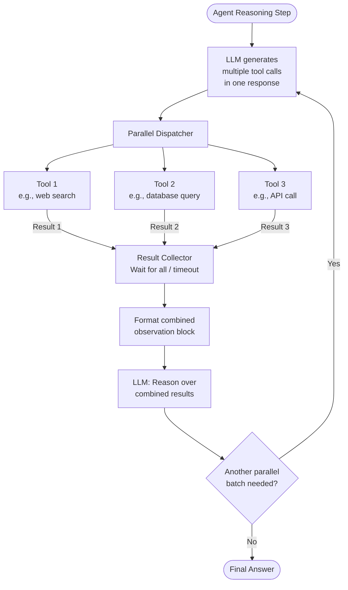

# Pattern: Parallel Tool Execution

## Problem Statement

Sequential tool execution within a single ReAct loop is a significant latency bottleneck. When an agent needs to call multiple tools whose results are independent — for example, fetching weather data and stock prices simultaneously, or running three database queries in parallel — waiting for each tool to complete before starting the next is wasteful. The total latency compounds linearly with the number of tool calls, making complex, multi-tool agents feel slow even when the model itself responds quickly.

## Solution Overview

Parallel Tool Execution allows an agent to identify and dispatch multiple tool calls simultaneously within a single reasoning step, wait for all results, and then reason over the combined observations. Modern LLM APIs support this natively through structured tool call responses that return an array of tool invocations rather than a single one. The runtime dispatches all calls concurrently, collects results, and returns them to the model in a single observation block.

This pattern reduces latency for multi-tool steps from O(n) to O(max), where n is the number of parallel tool calls and max is the slowest individual call.

## Architecture Diagram (Mermaid)

## Key Components

- **Multi-tool call generation**: The LLM must be prompted and/or configured to emit multiple tool calls in a single response. Most modern APIs (OpenAI, Anthropic, etc.) support returning an array of tool use blocks. The system prompt should explicitly state: "When multiple tools can be called independently, call them all at once."
- **Parallel dispatcher**: A runtime component that receives the array of tool call specifications and dispatches them concurrently using async I/O, thread pools, or worker queues. Each tool call runs in its own execution context.
- **Result collector**: A barrier that waits for all dispatched calls to complete (or times out). Results are tagged with their originating tool call ID so the model can associate each result with the correct invocation.
- **Combined observation formatter**: Formats the collected results into a structured observation block, clearly labeling which result corresponds to which tool call. This is critical — without clear labeling, the model may confuse results from different tools.
- **Error isolation**: If one parallel tool call fails, its error is captured and included in the observation (with the error message and tool ID), while successful calls proceed normally. The model then reasons over a mix of successes and failures.
- **Timeout policy**: Each individual tool call has its own timeout. The collector can use a "wait for all" or "wait for quorum" strategy with a global deadline.

## Implementation Considerations

- **API support for parallel tool calls**: Not all LLM APIs support multi-tool call responses natively. Verify your API version supports it and test whether the model reliably emits multiple calls in one response. Some models need explicit prompting to do this.
- **Dependency detection**: The agent (or a pre-processing step) must correctly identify which tool calls are independent. Calling tool B with tool A's result as an input is not parallelizable. Build a lightweight dependency check into your dispatcher.
- **Rate limit management**: Parallel tool calls that each trigger downstream API requests may collectively exceed rate limits. Implement a semaphore or rate limiter to cap total concurrent outbound requests.
- **Result ordering in model context**: Some models are sensitive to the order in which tool results appear in the context. Experiment with ordering results by (a) tool call order, (b) completion order, or (c) relevance to ensure the model correctly associates results.
- **Logging and tracing**: Parallel execution makes debugging harder — use distributed tracing (with trace IDs that link each parallel call to the parent request) for observability.
- **Partial result handling**: Decide upfront whether to proceed with partial results if some tools time out, or to block until all results are available. The answer depends on whether missing results would cause the model to produce an incorrect answer.

## Trade-offs

| Dimension | Benefit | Cost |
|-----------|---------|------|
| Latency | Reduces wall-clock time to max(calls) | Does not reduce total token input/output |
| Throughput | More work completed per reasoning step | Increases peak concurrent load |
| Correctness | No change (same results, faster) | Risk of result confusion without clear labeling |
| Complexity | Transparent to the model (API-level) | Dispatcher and collector add system complexity |

## When to Use / When NOT to Use

**Use when:**
- The agent regularly needs to call 2+ tools in sequence where results are independent
- Tool round trips are the dominant latency contributor (vs. model inference time)
- Your LLM API natively supports multi-tool call responses
- You can clearly identify independent vs. dependent tool calls

**Do NOT use when:**
- Tool B requires Tool A's output — sequential execution is mandatory
- All tasks only require a single tool call (no parallelism opportunity)
- Tools have high concurrency costs (e.g., each triggers expensive database writes) and parallelizing them causes contention
- Your infrastructure cannot reliably handle the burst concurrency of simultaneous tool dispatch

## Variants

- **Batched Parallel Calls**: Group tool calls into batches where within-batch calls are parallel and between-batch calls are sequential (for cases with partial dependencies).
- **Streaming Parallel Results**: Surface tool results to the model as they arrive rather than waiting for all to complete. The model can start reasoning about early results while slower calls finish.
- **Priority-Ordered Parallel**: Assign priority to each tool call. High-priority results are injected into context first, allowing the model to begin reasoning about critical data sooner.
- **Speculative Parallel Calls**: Pre-emptively dispatch tool calls that are likely to be needed based on the initial query, before the model explicitly requests them. Results are cached and served instantly when the model makes the expected call.

## Related Blueprints

- [Tool Selection Strategies](./tool-selection.md) — selects which tools to run before parallel dispatch
- [ReAct Pattern](../orchestration/react.md) — parallel tool calls extend the Action step of ReAct
- [Parallel Execution Pattern](../multi-agent/parallel.md) — the same fan-out principle at the agent (vs. tool) level
- [Plan & Execute Pattern](../orchestration/plan-execute.md) — parallel tool calls can accelerate individual plan step execution
