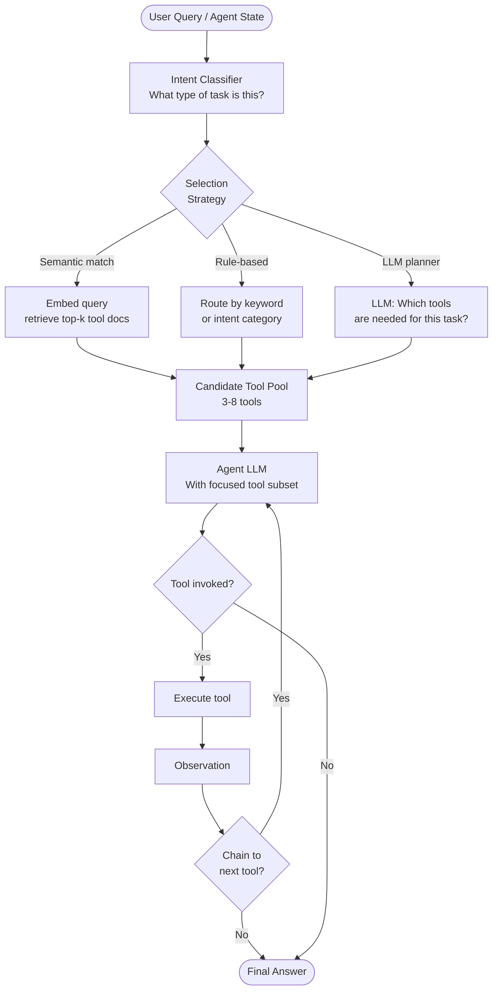

# Pattern: Tool Selection Strategies

## Problem Statement

As agent tool sets grow beyond 5–10 tools, selection quality degrades. Models presented with a large tool catalog struggle to identify the right tool consistently, often misusing similar tools (e.g., two search tools with subtly different behaviors), hallucinating tool names that do not exist, or ignoring relevant tools entirely. Static tool presentation — always listing all tools — is expensive in tokens and unreliable in practice. A principled tool selection strategy is needed.

## Solution Overview

Tool Selection Strategies govern how the agent decides which tools to use and when. This encompasses three distinct sub-problems:

1. **Catalog management**: How to store and represent the full tool catalog
2. **Tool retrieval**: How to dynamically select a relevant subset of tools for each context
3. **Tool chaining**: How to compose multiple tools into coherent multi-step pipelines

Rather than presenting all tools in every context, a well-designed selection strategy retrieves a focused, contextually relevant subset — typically 3–8 tools — reducing noise, token cost, and selection errors.

## Architecture Diagram (Mermaid)

## Key Components

- **Tool registry**: A centralized catalog where each tool is registered with:
  - `name`: Unique identifier
  - `description`: Rich natural-language description of what the tool does, when to use it, and when NOT to use it
  - `parameters`: Typed schema with field descriptions and examples
  - `examples`: 2–3 example invocations with expected outputs
  - `tags`: Categorical tags (e.g., "search", "compute", "io", "database")
  - `cost_tier`: Rough indicator of latency and expense
- **Semantic tool retrieval**: Embed tool descriptions at registration time. At inference time, embed the query and retrieve the most similar tool descriptions via vector search. Works well for large, heterogeneous tool sets.
- **Rule-based routing**: A fast, deterministic layer that maps query patterns to tool subsets. E.g., queries containing "calculate" always include the math tool; queries about "files" include filesystem tools. Runs before semantic retrieval to provide a baseline.
- **LLM-based tool planning**: For complex tasks, use a dedicated LLM call to analyze the task and explicitly list which tools will be needed. More accurate than pure retrieval but adds latency and cost.
- **Tool chaining logic**: After each tool result, the agent evaluates whether another tool is needed. Explicit chaining constraints (e.g., "always run validator after code generator") can be encoded as tool dependencies in the registry.

## Implementation Considerations

- **Tool description quality is paramount**: The model selects tools primarily based on their descriptions. Invest significant effort in writing precise, unambiguous descriptions that clearly differentiate similar tools. Include counter-examples ("use this tool for X, NOT for Y").
- **Avoid tool name collisions**: Similar tool names cause consistent misselection. Prefer descriptive, action-oriented names: `web_search_recent_news` rather than `search1`.
- **Dynamic tool loading**: For very large catalogs (100+ tools), implement lazy loading — only include a tool's full schema in the context after it has been selected. Show only name and one-line description in the selection phase.
- **Tool versioning**: When tools are updated, update their registry descriptions and re-embed. Stale descriptions cause misuse of updated tool behaviors.
- **Observability**: Log every tool selection decision (query, candidate set, selected tool, invocation parameters). This data is invaluable for improving selection quality over time.
- **Fallback strategy**: When no tool matches the query, the agent should either ask for clarification or return a graceful "I don't have a tool for this" response rather than hallucinating a tool invocation.

## Trade-offs

| Dimension | Benefit | Cost |
|-----------|---------|------|
| Dynamic retrieval | Scales to large tool catalogs | Adds retrieval latency |
| Focused subset | Reduces selection errors | Risk of excluding needed tools |
| Rule-based routing | Zero latency, deterministic | Brittle, requires manual maintenance |
| LLM planning | Highest accuracy | Slowest and most expensive |

## When to Use / When NOT to Use

**Use when:**
- Tool catalog has more than 10 tools
- Multiple tools have similar surface-level descriptions (disambiguation is needed)
- Tool usage costs vary significantly (avoid invoking expensive tools unnecessarily)
- You need observability into which tools are used most frequently for optimization

**Do NOT use when:**
- The agent has a fixed, small set of 3–5 tools — just include all of them statically
- All tasks require all available tools — dynamic selection adds overhead without benefit
- Tool selection errors have been diagnosed as model capability issues rather than catalog design issues

## Variants

- **Category-Based Routing**: Classify the query into a category (e.g., "data analysis", "web research") and present only the tools for that category. Fast and effective when categories are well-defined.
- **Progressive Tool Disclosure**: Start with a minimal tool set. After each tool call, expose additional related tools based on what was just invoked. Reduces initial cognitive load.
- **Tool Recommendation via User Feedback**: Track which tool invocations led to successful task completions and use this signal to improve retrieval ranking over time.
- **Constrained Tool Sequences**: Define allowed tool chains as a finite automaton. Prevent invalid sequences (e.g., running code before writing it) at the dispatch layer rather than relying on the model.

## Related Blueprints

- [ReAct Pattern](../orchestration/react.md) — tool selection happens at each Action step of the ReAct loop
- [Parallel Tool Execution](./parallel-tools.md) — once tools are selected, they may be dispatched in parallel
- [Supervisor Pattern](../multi-agent/supervisor.md) — tool selection at agent level mirrors worker selection at supervisor level
- [Agentic RAG](../rag/agentic-rag.md) — retrieval tools are dynamically selected based on query complexity
