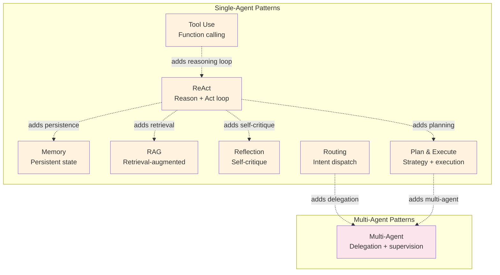

# Agent Patterns

Agent patterns are architectures where **the LLM controls the flow**. Unlike [workflows](../workflows/README.md) where the developer defines the execution path, agents decide at runtime which tools to call, when to continue, and when to stop.

Every agent pattern in this section builds on one or more [workflow patterns](../workflows/README.md). Each includes an `evolution.md` document that traces the bridge from workflow to agent — showing exactly what changes when you hand control to the LLM.

## Why Agents?

Workflows break down when:
- You can't enumerate the steps in advance
- The right action depends on what the LLM discovers during execution
- Your conditional branching logic becomes unmanageable
- The task requires adaptive, exploratory behavior

Agents solve this by letting the LLM reason about the next step dynamically. The tradeoff: you gain flexibility at the cost of predictability, testability, and cost control.

## The Eight Agent Patterns

| Pattern | Complexity | Evolves From (Workflow) | Best For |
|---------|-----------|----------------------|----------|
| [ReAct](./react/overview.md) | Beginner | Prompt Chaining | Open-ended tasks with tool use |
| [Tool Use](./tool-use/overview.md) | Beginner | Prompt Chaining | Structured function calling |
| [Memory](./memory/overview.md) | Intermediate | Prompt Chaining | Multi-session context |
| [RAG](./rag/overview.md) | Intermediate | Parallel Calls | Knowledge-grounded generation |
| [Reflection](./reflection/overview.md) | Intermediate | Evaluator-Optimizer | Self-improving output |
| [Routing](./routing/overview.md) | Intermediate | Parallel Calls | Intent-based dispatch |
| [Plan & Execute](./plan-and-execute/overview.md) | Advanced | Orchestrator-Worker | Complex multi-step tasks |
| [Multi-Agent](./multi-agent/overview.md) | Advanced | Orchestrator-Worker + Routing | Collaborative task solving |

## Reading Order

If you're new to agent patterns, start with **ReAct** — it's the simplest and most foundational. From there:

1. **[ReAct](./react/overview.md)** — The core agent loop. Every other pattern builds on this.
2. **[Tool Use](./tool-use/overview.md)** — How agents interact with external systems.
3. **[RAG](./rag/overview.md)** — Adding external knowledge to agent reasoning.
4. **[Memory](./memory/overview.md)** — Persisting context across conversations.
5. **[Reflection](./reflection/overview.md)** — Self-critique for higher quality output.
6. **[Routing](./routing/overview.md)** — Directing inputs to specialized handlers.
7. **[Plan & Execute](./plan-and-execute/overview.md)** — Strategic planning before execution.
8. **[Multi-Agent](./multi-agent/overview.md)** — Multiple agents collaborating.

## Documentation Tiers

Each pattern has three levels of documentation:

- **overview.md** (Tier 1) — What it does, when to use it, architecture diagram. Start here.
- **design.md** (Tier 2) — Component breakdown, data flow, error handling, scaling.
- **implementation.md** (Tier 3) — Pseudocode, interfaces, state management, testing strategy.
- **evolution.md** — How this pattern evolves from its parent workflow pattern.
