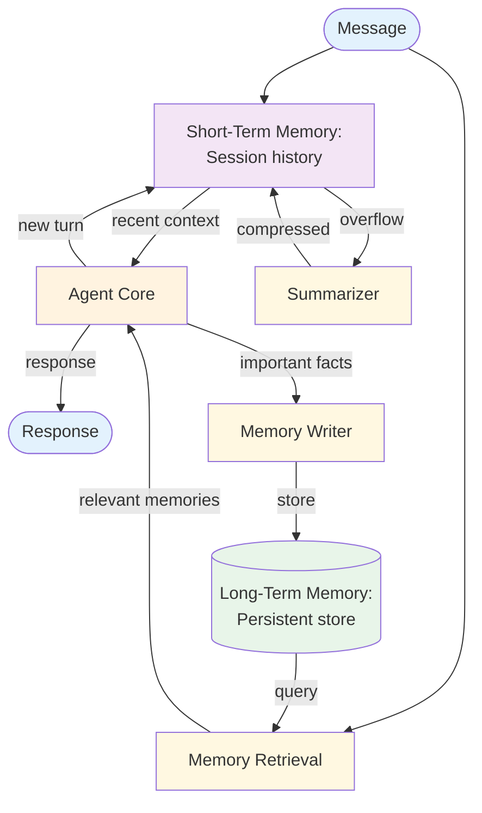

# Memory — Design

## Component Breakdown

### Short-Term Memory
The current session's message history. Managed within the context window using truncation or summarization.

### Long-Term Memory
A persistent store (vector database, key-value store, or file system) that holds information across sessions: user preferences, past decisions, learned facts.

### Memory Retrieval
Queries the long-term store for memories relevant to the current context. Uses semantic search (embeddings) or keyword matching.

### Memory Writer
Extracts important information from the current session and stores it persistently. Decides *what* to remember based on salience heuristics.

### Summarizer
Compresses old short-term memory when approaching the context window limit. Preserves key facts while reducing token count.

## Data Flow

Each turn: retrieve relevant long-term memories → include with short-term context → generate response → update short-term → optionally write to long-term.

## Error Handling
- **Retrieval failure:** Proceed without long-term context (graceful degradation)
- **Stale memories:** Include timestamps; agent can assess recency
- **Contradictory memories:** Surface both; let the agent resolve
- **Storage failure:** Log and continue; don't block the response

## Scaling
- **Context management** is the critical bottleneck — summarization keeps costs bounded
- **Retrieval quality** determines value — tune embedding model and top-K
- **Storage scales** independently from the agent

## Composition
- **+ RAG:** Share the same vector store — documents on one side, memories on the other
- **+ Multi-Agent:** Shared memory enables agent collaboration across sessions
