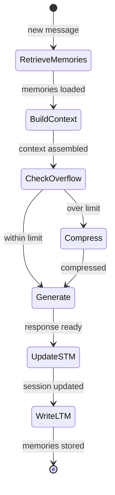

# Memory — Implementation

## Core Interfaces

```
MemoryEntry:
  id: string
  content: string
  metadata: {timestamp, session_id, type, importance}
  embedding: vector

MemoryStore:
  store(entry: MemoryEntry) → void
  search(query: string, top_k: integer) → list of MemoryEntry
  delete(id: string) → void

SessionHistory:
  messages: list of Message
  summary: string or null
  token_count: integer
```

## Core Pseudocode

### respond_with_memory

```
function respond_with_memory(user_message, session, memory_store, config):
  // Retrieve relevant long-term memories
  relevant = memory_store.search(user_message, top_k: config.retrieval_top_k)
  memory_context = format_memories(relevant)

  // Build context
  system = config.base_system_prompt
  if memory_context:
    system += "\n\nRelevant context from past interactions:\n" + memory_context

  // Manage session history (short-term memory)
  session.messages.append({role: "user", content: user_message})
  if token_count(session.messages) > config.max_context_tokens:
    session = compress_session(session, config)

  // Generate response
  response = call_llm(system: system, messages: session.messages)
  session.messages.append({role: "assistant", content: response.text})

  // Extract and store important information
  store_memories(user_message, response.text, memory_store, config)

  return response.text
```

### compress_session

```
function compress_session(session, config):
  // Split messages into old and recent
  split_point = find_split_point(session.messages, config.keep_recent_tokens)
  old_messages = session.messages[:split_point]
  recent_messages = session.messages[split_point:]

  // Summarize old messages
  summary = call_llm(
    system: "Summarize this conversation, preserving key facts, decisions, and context.",
    messages: [{role: "user", content: format_messages(old_messages)}]
  ).text

  // Replace old messages with summary
  session.messages = [
    {role: "system", content: "Previous conversation summary: " + summary}
  ] + recent_messages
  session.summary = summary

  return session
```

### store_memories

```
function store_memories(user_message, response, memory_store, config):
  // Extract memorable facts using LLM
  extraction = call_llm(
    system: "Extract important facts, preferences, or decisions from this exchange. " +
            "Return JSON list: [{\"content\": \"...\", \"type\": \"fact|preference|decision\"}]. " +
            "Return empty list if nothing worth remembering.",
    messages: [{role: "user", content: "User: " + user_message + "\nAssistant: " + response}]
  )

  facts = parse_json(extraction.text)
  for fact in facts:
    entry = {
      id: generate_id(),
      content: fact.content,
      metadata: {timestamp: now(), type: fact.type, importance: "normal"},
      embedding: embed(fact.content)
    }
    memory_store.store(entry)
```

## State Management



## Prompt Engineering Notes

### Memory Retrieval Injection
```
System: ...your base instructions...

Relevant context from past interactions:
- [2026-03-20] User prefers concise responses
- [2026-03-22] User is working on a Python ML project
- [2026-03-24] User decided to use PostgreSQL for the backend
```

### Memory Extraction Prompt
Include examples of what's worth remembering vs. what's not. Stated preferences, key decisions, and important facts are worth storing. Generic conversation, pleasantries, and already-known information are not.

## Testing Strategy

- **Retrieval tests:** Store known memories → search → verify relevant ones returned
- **Compression tests:** Overflow session → verify summary preserves key facts
- **Extraction tests:** Provide conversations → verify correct facts extracted
- **End-to-end:** Multi-turn conversation → verify context persists correctly

## Common Pitfalls

- **Over-remembering:** Storing everything floods retrieval with noise. Fix: salience filter.
- **Stale memories:** Old preferences override current ones. Fix: include timestamps, weight recency.
- **Summarization loss:** Critical details dropped during compression. Fix: extract key facts before summarizing.
- **Retrieval noise:** Irrelevant memories injected into context. Fix: similarity threshold + top-K tuning.
