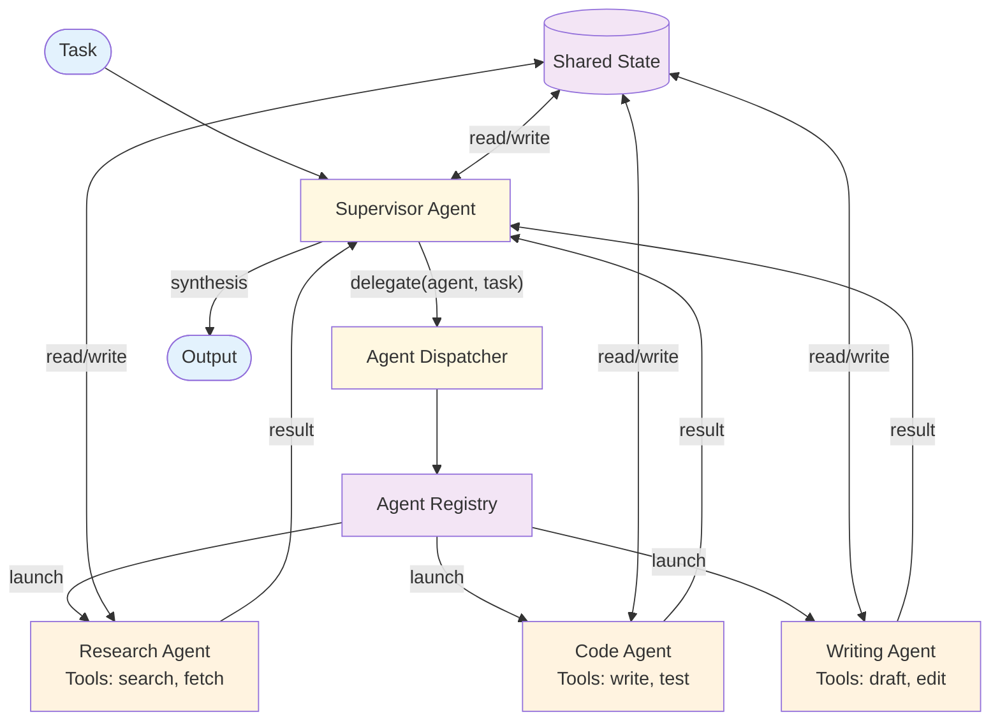

# Multi-Agent — Design

## Component Breakdown



### Supervisor Agent
An agent (ReAct loop) whose primary tool is `delegate_to_agent`. Reasons about which worker to call, what to delegate, and when to synthesize. The supervisor is the orchestration intelligence.

### Agent Registry
Maps agent names to configurations: system prompt, tools, model, and capabilities description. The supervisor receives the registry as context to inform delegation decisions.

### Worker Agents
Each worker is a full [ReAct](../react/overview.md) agent with specialized tools and system prompts. Workers run autonomously within a bounded iteration budget.

### Shared State
A key-value store accessible to all agents. Workers write their results; the supervisor and other workers read them. Enables inter-agent communication without direct messaging.

### Agent Dispatcher
Creates and runs worker agents based on delegation requests. Manages worker lifecycle and collects results.

## Data Flow

```
AgentConfig:
  name: string
  description: string                    // What this agent is good at
  system_prompt: string
  tools: list of ToolEntry
  max_iterations: integer

DelegationRequest:
  agent_name: string
  task: string
  context: string                        // Additional info for the worker

SharedState:
  entries: map of string → any           // Key-value pairs
  history: list of {agent, action, timestamp}  // Audit trail
```

## Error Handling
- **Worker failure:** Supervisor receives error, can retry with different instructions or different agent
- **Supervisor loops:** Max delegation rounds prevents infinite supervisor cycles
- **State conflicts:** Last-write-wins for shared state; log conflicts
- **Missing agent:** Return error to supervisor; it can choose an alternative

## Scaling
- **Cost:** Supervisor calls + sum of worker calls. Can be very expensive.
- **Latency:** Supervisor decision + sequential worker runs (or parallel if independent)
- **At scale:** Pool workers, use cheaper models for simple delegations

## Decision Matrix: Communication Protocol

| Protocol | Description | Use When |
|----------|------------|----------|
| **Hub-and-spoke** | All communication through supervisor | Clear hierarchy, simple coordination |
| **Peer-to-peer** | Agents communicate directly | Tight collaboration between specific agents |
| **Blackboard** | Agents read/write shared state | Loose coupling, asynchronous work |

**Guideline:** Start with hub-and-spoke (simplest). Add shared state for read-only cross-agent context.

## Composition
- **+ Plan & Execute:** Supervisor generates a plan, delegates steps to agents
- **+ Memory:** Shared long-term memory across agents
- **+ RAG:** Knowledge-grounded agents with shared document store
