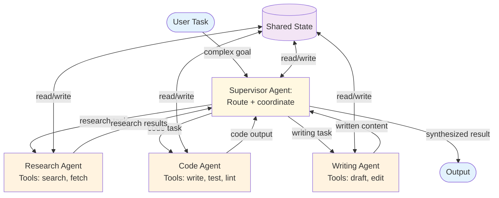

# Multi-Agent (Delegation / Supervision) — Overview

The multi-agent pattern uses multiple specialized agents coordinated by a supervisor. Each agent has its own tools, prompts, and domain expertise. The supervisor decides which agent to delegate to, interprets results, and orchestrates the overall task.

**Evolves from:** [Orchestrator-Worker](../../workflows/orchestrator-worker/overview.md) + [Routing](../routing/overview.md) — adds agent-to-agent communication, shared state, and supervisor oversight.

## Architecture

*Figure: A supervisor agent routes subtasks to specialized worker agents, each with their own tools. Shared state enables agents to read each other's results. The supervisor synthesizes the final output.*

## How It Works

1. **Receive** — The supervisor agent receives a complex task from the user.
2. **Analyze** — The supervisor reasons about the task and identifies which worker agent(s) are needed.
3. **Delegate** — The supervisor sends focused subtasks to worker agents via tool calls (e.g., `delegate_to("research_agent", "Find data on X")`).
4. **Execute** — Worker agents run autonomously, using their specialized tools to complete their subtasks. Each worker is a full agent (typically a ReAct loop).
5. **Return** — Worker results are returned to the supervisor.
6. **Iterate** — The supervisor may delegate additional tasks, refine previous results, or request corrections from workers.
7. **Synthesize** — Once all needed work is done, the supervisor combines results into a final output.

## Input / Output

- **Input:** A complex task requiring multiple specialized capabilities
- **Output:** A synthesized result combining work from multiple agents
- **Delegation:** `{agent: string, task: string, context?: object}`
- **Shared state:** Accumulated results accessible to all agents

## Key Tradeoffs

| Strength | Limitation |
|----------|-----------|
| Each agent is specialized and focused | High complexity — multiple agents to design, prompt, and debug |
| Naturally handles multi-domain tasks | Cost scales with number of agents and delegation rounds |
| New agents can be added without changing others | Inter-agent communication design is critical and hard |
| Supervisor provides oversight and quality control | Supervisor is a single point of failure |
| Parallelizable when worker tasks are independent | Shared state management adds coordination overhead |

## When to Use

- Tasks spanning multiple domains (research + code + writing)
- When different subtasks need different tool sets
- When the system needs distinct "expertise areas"
- Large-scale tasks that benefit from divide-and-conquer
- When you want clear separation of concerns between capabilities

## When NOT to Use

- When a single agent with multiple tools suffices — use [ReAct](../react/overview.md)
- When the task decomposition is static — use [Orchestrator-Worker](../../workflows/orchestrator-worker/overview.md)
- For simple routing without agent autonomy — use [Routing](../routing/overview.md)
- When the overhead of multiple agents isn't justified by the task complexity

## Related Patterns

- **Evolves from:** [Orchestrator-Worker](../../workflows/orchestrator-worker/overview.md) + [Routing](../routing/overview.md) — see [evolution.md](./evolution.md)
- **Workers use:** [ReAct](../react/overview.md) (each worker runs an agent loop), [Tool Use](../tool-use/overview.md)
- **Combines with:** [Memory](../memory/overview.md) (shared memory across agents), [Plan & Execute](../plan-and-execute/overview.md) (supervisor generates a plan, workers execute steps)

## Deeper Dive

- **[Design](./design.md)** — Agent registry, communication protocols, shared state, supervisor prompting, worker design
- **[Implementation](./implementation.md)** — Pseudocode, delegation mechanics, state management, testing strategies
- **[Evolution](./evolution.md)** — How multi-agent evolves from orchestrator-worker and routing
