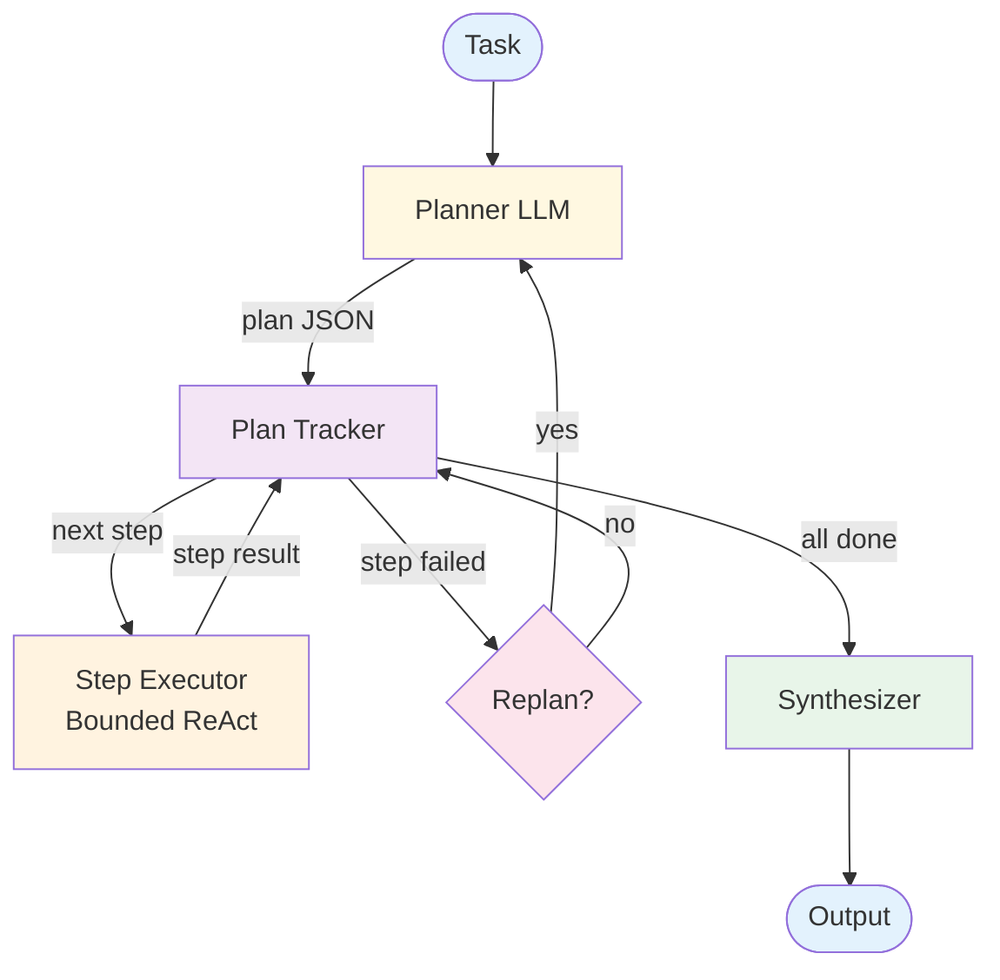

# Plan & Execute — Design

## Component Breakdown



### Planner LLM
Generates a structured plan: an ordered list of steps with descriptions, expected outputs, and dependencies. Replans when called with context about completed steps and failures.

### Plan Tracker
Maintains plan state: which steps are pending, in-progress, completed, or failed. Determines execution order and provides context to the executor.

### Step Executor
A bounded [ReAct](../react/overview.md) loop for each step. Has its own iteration budget (e.g., 5 tool calls max). Receives the step description plus results from prior steps.

### Replanner
Decides whether to replan after a step failure. Factors: how many replans have occurred, how far along the plan is, whether the failure is recoverable.

### Synthesizer
Merges all step results into a coherent final output.

## Data Flow

```
Plan:
  steps: list of {id, description, expected_output, depends_on: list of ids}
  reasoning: string

StepResult:
  step_id: string
  status: "completed" | "failed"
  output: any
  error: string or null

PlanState:
  plan: Plan
  step_results: map of step_id → StepResult
  current_step: integer
  replan_count: integer
```

## Error Handling

- **Step fails, retries available:** Re-run the step executor with failure context
- **Step fails, no retries:** Trigger replanning with failure info
- **Replan limit reached:** Return best partial results with failure report
- **Planning fails:** Fall back to direct ReAct (skip planning)

## Scaling Considerations

- **Cost:** 1 plan call + N step executions (each up to M tool calls) + 1 synthesis + replanning
- **Latency:** Sequential steps. Partially parallelizable if steps are independent.
- **At scale:** Cache common plans for similar tasks. Use lighter models for simple steps.

## Composition Notes

- **+ Multi-Agent:** Delegate steps to specialized worker agents instead of a generic executor
- **+ Memory:** Store successful plans for similar tasks to speed future planning
- **+ Reflection:** Reflect on plan quality before execution
