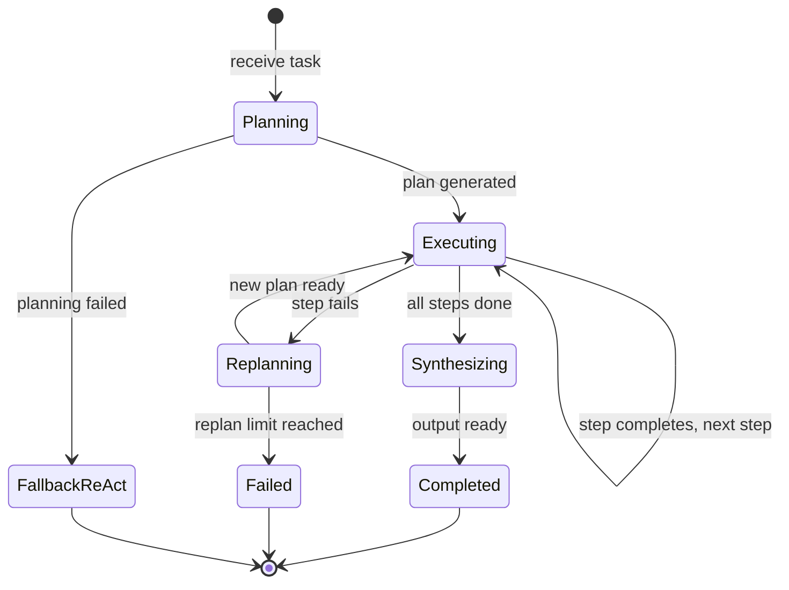

# Plan & Execute — Implementation

## Core Interfaces

```
PlanStep:
  id: string
  description: string
  expected_output: string
  depends_on: list of step_ids

Plan:
  steps: list of PlanStep
  reasoning: string

StepResult:
  step_id: string
  status: "completed" | "failed"
  output: any
  error: string or null

PlanExecConfig:
  planner_prompt: string
  executor_tools: list of ToolEntry
  synthesizer_prompt: string
  max_steps: integer                    // Default: 10
  max_tool_rounds_per_step: integer     // Default: 5
  max_replans: integer                  // Default: 2
```

## Core Pseudocode

### plan_and_execute

```
function plan_and_execute(task, config):
  replan_count = 0
  completed_results = {}

  // Phase 1: Plan
  plan = generate_plan(task, config)
  if plan == null:
    // Fallback to direct ReAct
    return agent_loop(task, {tools: config.executor_tools, max_iterations: 10})

  // Phase 2: Execute steps
  for step in plan.steps:
    // Gather context from completed dependencies
    dep_context = ""
    for dep_id in step.depends_on:
      if dep_id in completed_results:
        dep_context += "Result of step " + dep_id + ": " + completed_results[dep_id].output + "\n"

    // Execute step with bounded ReAct
    result = execute_step(step, dep_context, config)

    if result.status == "completed":
      completed_results[step.id] = result
    else:
      // Step failed — try replanning
      if replan_count < config.max_replans:
        replan_count += 1
        plan = replan(task, plan, completed_results, step, result.error, config)
        if plan == null:
          return {status: "failed", partial_results: completed_results}
        // Restart execution from the new plan
        // (completed results carry over)
        continue
      else:
        return {status: "failed", partial_results: completed_results}

  // Phase 3: Synthesize
  output = synthesize(task, plan, completed_results, config)
  return {status: "completed", output: output}
```

### generate_plan

```
function generate_plan(task, config):
  response = call_llm(
    system: config.planner_prompt,
    message: "Create a step-by-step plan for: " + task +
             "\nReturn JSON: {\"steps\": [{\"id\": \"1\", \"description\": \"...\", " +
             "\"expected_output\": \"...\", \"depends_on\": []}], \"reasoning\": \"...\"}"
  )
  plan = parse_json(response.text)

  if plan.steps.length > config.max_steps:
    return null  // Plan too complex

  return plan
```

### execute_step

```
function execute_step(step, dependency_context, config):
  // Run a bounded ReAct loop for this step
  result = agent_loop(
    task: "Step: " + step.description +
          "\nExpected output: " + step.expected_output +
          "\nContext from prior steps:\n" + dependency_context,
    config: {
      tools: config.executor_tools,
      max_iterations: config.max_tool_rounds_per_step,
      system_prompt: "Complete this step using the available tools. " +
                     "When done, provide your result clearly."
    }
  )

  return {
    step_id: step.id,
    status: result.status == "completed" ? "completed" : "failed",
    output: result.answer,
    error: result.status != "completed" ? "Step execution failed" : null
  }
```

### replan

```
function replan(task, original_plan, completed, failed_step, error, config):
  response = call_llm(
    system: config.planner_prompt,
    message: "Original task: " + task +
             "\n\nOriginal plan failed at step " + failed_step.id + ": " + error +
             "\n\nCompleted steps: " + summarize_completed(completed) +
             "\n\nCreate a revised plan to complete the remaining work."
  )
  return parse_json(response.text)
```

## State Management



## Prompt Engineering Notes

### Planner Prompt
```
System:
You create step-by-step plans for complex tasks.
Each step should be specific, actionable, and completable with available tools.
Order steps logically — later steps can depend on earlier results.
Keep plans concise: 3–7 steps for most tasks.
```

## Testing Strategy

- **Planner tests:** Verify plan structure, step count bounds, valid dependencies
- **Step execution tests:** Stub ReAct loop, verify step completes or fails correctly
- **Replanning tests:** Fail a step, verify replanning produces a valid revised plan
- **End-to-end:** Stub all LLM calls, verify full plan-execute-synthesize flow

## Common Pitfalls

- **Over-planning:** Plans with 10+ steps for simple tasks. Fix: enforce max_steps.
- **Vague steps:** "Research the topic" is too vague. Fix: include examples in planner prompt.
- **Infinite replanning:** Each replan fails, triggers another replan. Fix: enforce max_replans.
- **Lost context:** Step executor doesn't receive prior step results. Fix: always pass dependency context.
