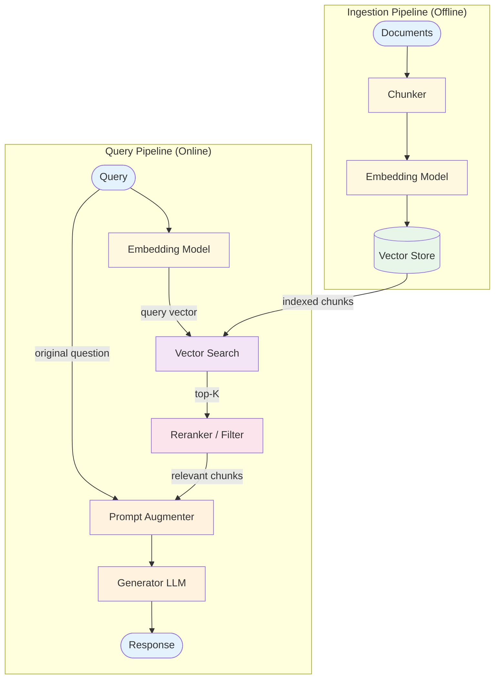

# RAG — Design

## Component Breakdown

### Chunker
Splits documents into retrieval-sized pieces. Strategies:
- **Fixed-size:** Split every N tokens with overlap
- **Semantic:** Split at paragraph/section boundaries
- **Recursive:** Split hierarchically (document → section → paragraph → sentence)

Key parameters: chunk_size (200–1000 tokens), chunk_overlap (10–20% of size).

### Embedding Model
Converts text to vector representations. Same model must be used for both ingestion and query to ensure compatible vector spaces.

### Vector Store
Stores and indexes embedding vectors for similarity search. Supports approximate nearest neighbor (ANN) algorithms for fast retrieval at scale.

### Reranker / Relevance Filter
Refines retrieval results:
- **Similarity threshold:** Drop chunks below a cosine similarity score
- **Cross-encoder reranker:** A model scores (query, chunk) pairs more accurately than embedding similarity alone
- **Metadata filter:** Filter by document source, date, category

### Prompt Augmenter
Assembles the final prompt: question + retrieved context + instructions for grounded generation.

## Data Flow

**Ingestion:** documents → chunks → embeddings → stored in vector index

**Query:** question → embedding → vector search (top-K) → filter/rerank → augment prompt → LLM → grounded response

## Error Handling
- **No relevant results:** Return "I don't have information on this topic" rather than hallucinating
- **Low-quality retrieval:** Reranker filters out irrelevant chunks
- **Context overflow:** Limit chunks to fit within context budget (reserve tokens for generation)
- **Embedding failure:** Retry; fall back to keyword search if persistent

## Scaling
- **Ingestion:** Batch process documents; parallelize chunking and embedding
- **Query latency:** Embedding (~50ms) + vector search (~10ms for ANN) + LLM call
- **At scale:** Use approximate search (HNSW, IVF), cache frequent queries, shard vector store

## Decision Matrix: Chunk Size

| Size | Retrieval Precision | Context per Chunk | Chunks Needed |
|------|-------------------|-------------------|---------------|
| Small (200 tokens) | High | Low | More chunks needed |
| Medium (500 tokens) | Balanced | Balanced | Moderate |
| Large (1000 tokens) | Lower | High | Fewer chunks |

**Guideline:** Start with 500 tokens, 50-token overlap. Adjust based on retrieval quality.

## Composition
- **+ ReAct:** Agent decides when and what to retrieve (Agentic RAG)
- **+ Memory:** Same vector store for documents and conversation history
- **+ Reflection:** Evaluate answer quality against retrieved sources
