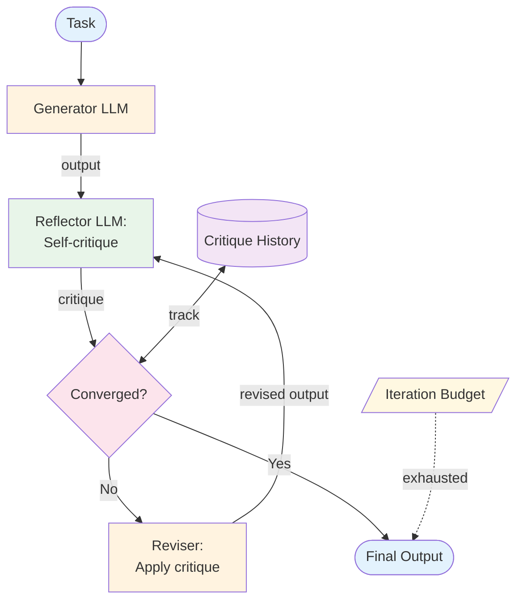

# Reflection — Design

## Component Breakdown



### Generator
Produces the initial output. The same LLM and prompt used for generation can also be the reflector — or they can be separate.

### Reflector
Self-critiques the output. Produces structured feedback: strengths, weaknesses, specific issues, and suggestions. Richer than a numeric score.

### Reviser
Takes the output + critique and produces an improved version. Must be instructed to *address specific issues*, not start over.

### Convergence Detector
Analyzes critique history to determine if improvements are plateauing. Checks for: no major issues found, critique is substantially similar to previous iteration, or score isn't improving.

## Data Flow

```
Critique:
  strengths: list of string
  weaknesses: list of string
  issues: list of {description, severity, suggestion}
  overall_assessment: string
  should_continue: boolean
```

## Error Handling
- **Self-congratulatory critique:** LLM declares output perfect prematurely. Fix: prompt for adversarial critique.
- **Oscillating revisions:** Fix one issue, break another. Fix: track which issues were addressed.
- **Over-polishing:** Minor edits that don't improve quality. Fix: convergence detection.

## Scaling
- 2+ LLM calls per iteration (reflect + revise). Total = 2K + 1 (initial generation).
- Diminishing returns after 2–3 iterations. Default max = 3.

## Composition
- **+ ReAct:** Reflect on the agent's final output before returning
- **+ Plan & Execute:** Reflect on plan quality before execution
- **+ Any generator:** Reflection wraps any generation pattern as a quality layer

## Production concerns

Cognitive concerns this repo covers; operational concerns belong in [agent-deployments](https://github.com/jagguvarma15/agent-deployments).

| Concern | This pattern's surface | Where to read |
|---|---|---|
| Prompt injection | a poisoned critic can rubber-stamp bad generation or reject good generation | [foundations/security-and-safety.md](../../foundations/security-and-safety.md) |
| Hallucination & grounding | the pattern itself is a grounding mechanism; the critic needs its own grounding | [foundations/hallucination-and-grounding.md](../../foundations/hallucination-and-grounding.md) |
| Cost & model selection | 2–N× per iteration; iteration cap is the lever | [foundations/cost-and-model-selection.md](../../foundations/cost-and-model-selection.md) |
| Rate limiting & retries | inherited | [agent-deployments cross-cutting](https://github.com/jagguvarma15/agent-deployments/tree/main/docs/cross-cutting) |
| Idempotency | inherited | [agent-deployments cross-cutting](https://github.com/jagguvarma15/agent-deployments/blob/main/docs/cross-cutting/idempotency.md) |
| Observability hooks | see `observability.md` alongside this file | [foundations](../../foundations/README.md) |
