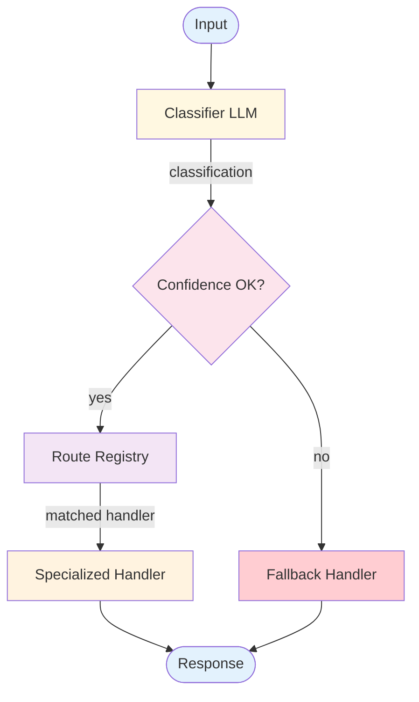

# Routing — Design

## Component Breakdown



### Classifier LLM
Analyzes input and produces a structured classification: route name, confidence score, and extracted entities. Can use a cheaper/faster model since classification is simpler than generation.

### Confidence Thresholder
Checks if the classification confidence meets the minimum threshold. Below threshold → fallback handler. This prevents misrouting on ambiguous inputs.

### Route Registry
Maps route names to handler configurations: system prompt, tools, model, and handler logic. Supports dynamic registration of new routes.

### Specialized Handlers
Purpose-built processing for each route. Each handler can be a workflow, an agent, or a simple LLM call with a specialized prompt and toolset.

### Fallback Handler
Handles unclassified or low-confidence inputs. Typically a general-purpose handler that provides a safe, if less specialized, response.

## Data Flow

```
Classification:
  route: string
  confidence: float
  entities: map of string → any         // Optional extracted data

RouteConfig:
  name: string
  description: string
  handler: function(input, entities) → response
  system_prompt: string
  tools: list of ToolSchema
  model: string                         // Optional per-route model
```

## Error Handling
- **Misclassification:** Monitor route accuracy; retrain classifier or add examples
- **Handler failure:** Fall back to general handler
- **Unknown route:** Return to classifier with more context, or use fallback
- **Confidence edge cases:** Tune threshold based on error analysis

## Scaling
- Classification: cheap, fast (can use smaller model)
- Handlers: cost/latency varies by route (use appropriate model per route)
- Add new routes without modifying existing handlers

## Composition
- **+ Multi-Agent:** Route to specialized agents instead of handlers
- **+ RAG:** One route handler uses RAG for knowledge questions
- **+ Memory:** Per-route or shared memory for continuity

## Production concerns

Cognitive concerns this repo covers; operational concerns belong in [agent-deployments](https://github.com/jagguvarma15/agent-deployments).

| Concern | This pattern's surface | Where to read |
|---|---|---|
| Prompt injection | crafted input can spoof intent — enforce allow-listed enumeration of routes | [foundations/security-and-safety.md](../../foundations/security-and-safety.md) |
| Hallucination & grounding | classifier hallucinates outside the enumeration; explicit `unknown`/`escalate` class catches this | [foundations/hallucination-and-grounding.md](../../foundations/hallucination-and-grounding.md) |
| Cost & model selection | 1 classifier call (cheap) + downstream pattern cost | [foundations/cost-and-model-selection.md](../../foundations/cost-and-model-selection.md) |
| Rate limiting & retries | inherited | [agent-deployments cross-cutting](https://github.com/jagguvarma15/agent-deployments/tree/main/docs/cross-cutting) |
| Idempotency | inherited | [agent-deployments cross-cutting](https://github.com/jagguvarma15/agent-deployments/blob/main/docs/cross-cutting/idempotency.md) |
| Observability hooks | see `observability.md` alongside this file | [foundations](../../foundations/README.md) |
