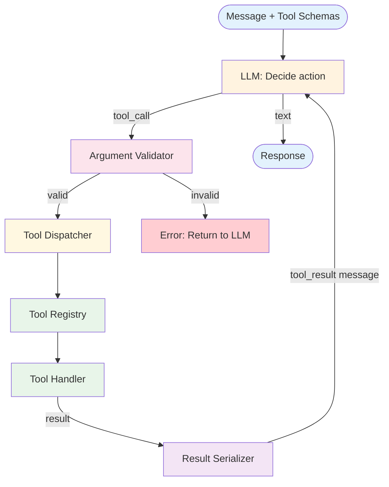

# Tool Use — Design

## Component Breakdown



### Tool Registry
Maps tool names to schemas and handlers. Supports registration, lookup, and listing. The registry is the single source of truth for what tools are available.

### Argument Validator
Validates tool call arguments against the tool's JSON Schema. Catches type errors, missing required fields, and invalid values before execution.

### Tool Dispatcher
Routes validated tool calls to the correct handler function. Handles execution errors and timeouts.

### Result Serializer
Converts tool execution results into a standardized string format for injection into the message history.

## Data Flow

```
// Single tool call cycle:
response = llm(messages, tool_schemas)
if response.has_tool_call:
  errors = validate(response.tool_call.args, tool_schema)
  if errors:
    inject_error(messages, errors)
  else:
    result = registry[tool_call.name](tool_call.args)
    messages.append(tool_result_message(result))
```

## Error Handling
- **Hallucinated tool name:** Return "Tool not found" with available tool list
- **Invalid arguments:** Return validation errors with expected schema
- **Execution failure:** Return error message; let LLM adapt
- **Parallel tool calls:** Execute independently; collect all results

## Scaling
- Cost: 1 LLM call per tool decision. Tool execution cost varies.
- Latency: LLM decision time + tool execution time per call.
- Parallel tool calls reduce latency when multiple tools are independent.

## Composition
Tool Use is a foundation for all agent patterns. It provides the mechanism; other patterns provide the control flow (ReAct adds the loop, Plan & Execute adds the planning).
