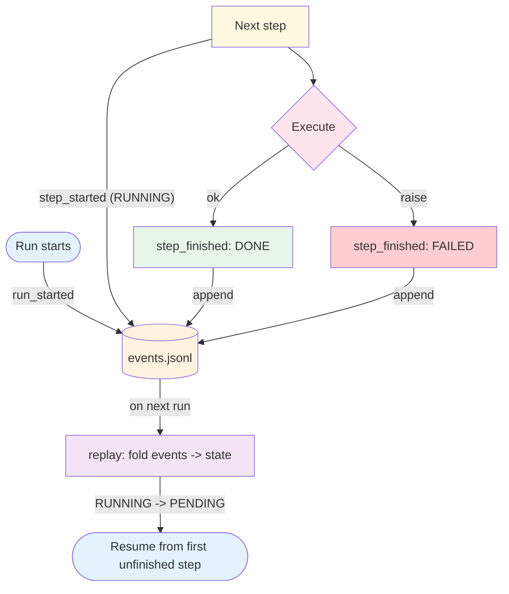

# Step Log — Overview

```yaml level=concepts
intent: "The run's state is an append-only event log: record each step as it happens, replay the log to resume."
when_to_use:
  - "A multi-step run must survive a crash, a timeout, or a deploy and pick up where it left off."
  - "You need an audit trail of what the agent did, in order, without standing up a database."
when_to_avoid:
  - "A single-shot request/response with no steps worth resuming."
```

A step log makes a run's state durable by writing it down as it happens. Each step's lifecycle — started, finished, failed — is appended to an event log; the log *is* the state, so replaying it reconstructs exactly where the run got to. That is the substrate for pause, resume, retry, and trace, without a database or a workflow engine.

The key move: a step left `RUNNING` when the process died is replayed as `PENDING`, so a resume re-runs it rather than skipping a half-finished side effect.

**Evolves from:** [Tool Use](../tool_use/overview.md) — where Tool Use makes one action structured and validated, Step Log makes a *sequence* of actions durable and resumable.

## Architecture



*Figure: Each step transition is appended to the event log; on the next run, replaying the log folds the events back into per-step state and resumes from the first step that never finished.*

## How It Works

1. **Open the log** — A run gets a unique id and its own directory (`.agent/runs/<run_id>/`) holding an `events.jsonl` sink. Opening it records a `run_started` event.
2. **Start a step** — Marking a step `RUNNING` appends a `step_started` event and returns a `StepRecord` you can carry through the work.
3. **Do the work** — Your code runs the step. Nothing about the step log constrains what a step is — a tool call, an LLM turn, a subprocess.
4. **Finish the step** — Recording the terminal status (`DONE` / `FAILED` / `SKIPPED`) appends a `step_finished` event with any compacted error.
5. **Close the run** — The run records a terminal event and the log is complete.
6. **Resume** — On a later run, `replay` folds the events back into per-step state. A step still `RUNNING` (the process died mid-step) comes back `PENDING`, so it re-runs; finished steps are skipped.

The log is append-only and line-buffered, so a crash mid-run still leaves a readable, replayable tail.

## Minimal Example

Record three steps — one succeeds, one fails, one is interrupted — then replay to see what a resume would re-run.

```python
from primitives.step_log.code.python.step_log import StepLog, replay
from primitives.step_log.schemas.state import StepStatus

log = StepLog(run_id="demo-0001", goal="fetch, parse, write")

fetch = log.start("fetch")
log.finish(fetch, StepStatus.DONE)

parse = log.start("parse")
log.finish(parse, StepStatus.FAILED, error="ValueError: bad row")

log.start("write")  # process dies here — never finished

resumed = replay(log.state)
# resumed == {"fetch": DONE, "parse": FAILED, "write": PENDING}
# a resume re-runs only "write" (and retries "parse" if the policy says so)
```

### Code variants

| Implementation | Language | Path |
|----------------|----------|------|
| Framework-agnostic recorder (offline demo) | Python | [`code/python/step_log.py`](code/python/step_log.py) |

The Python file rolls the recorder and the replay fold by hand to make the contract explicit. The deployments `core.step_log` capability emits a slimmed, jsonl-sink version of this exact shape into generated projects as `agent/steplog.py`.

## Input / Output

- **Input:** Step transitions — `start(step_id)` and `finish(step, status)` calls as the run proceeds.
- **Output:** An append-only `events.jsonl` (the durable record) and, on replay, a per-step status map.
- **Event:** One line of the log: `{ts, kind, payload}` — e.g. `{"ts": ..., "kind": "step_finished", "payload": {"step_id": "fetch", "status": "done"}}`.
- **State:** `StepLogState` — `run_id`, `goal`, the list of `StepRecord`s, and the `StepEvent` log.

## Key Tradeoffs

| Strength | Limitation |
|----------|-----------|
| Survives crashes / timeouts / deploys — the run is resumable | Only as durable as the sink's flush; a lost tail loses the last events |
| No database — a directory and an append-only file | Not a query engine; reconstructing state means replaying the log |
| Full audit trail, in order, for free | The log grows with the run; long runs need pruning or rotation |
| Framework-agnostic — a step is whatever your code does | Resume correctness depends on steps being idempotent or safely retryable |
| Redaction at the sink keeps secrets off disk | Redaction is best-effort pattern matching, not a guarantee |

## When to Use

- When a multi-step run must survive interruption and resume without redoing finished work.
- When you need a durable, ordered record of what the agent did — for debugging, audit, or trace.
- As the state layer under [ReAct](../../patterns/react/overview.md), [Plan & Execute](../../patterns/plan_and_execute/overview.md), or [Multi-Agent](../../patterns/multi_agent/overview.md) runs.

## When NOT to Use

- When the task is a single request/response with no steps worth resuming — the log is overhead.
- When you already run on a durable workflow engine (Temporal, Step Functions) — it owns the state; don't double-log.
- When state is large or highly relational — a step log is an event stream, not a database.

## Related Patterns

- **Evolves from:** [Tool Use](../tool_use/overview.md) — one durable, resumable sequence of the actions Tool Use makes structured.
- **State layer for:** [ReAct](../../patterns/react/overview.md), [Plan & Execute](../../patterns/plan_and_execute/overview.md), [Multi-Agent](../../patterns/multi_agent/overview.md) — any pattern whose runs are worth resuming.
- **Composes with:** every multi-step pattern — the step log is a component, not a standalone system.

## Deeper Dive

- **[Design](./design.md)** — The event-log model, the replay fold, redaction, retention, and failure modes.
- **[Implementation](./implementation.md)** — Interfaces, the record/replay pseudocode, the emitted `agent/steplog.py`, and testing.

## Next steps

- Production version: see [Blueprints → Deployments](../../composition/blueprints-to-deployments.md) for how the deployment agents persist run state.
- Generate a starter project: see [Blueprint → Spec → Scaffold](../../composition/blueprint-to-spec-to-scaffold.md) — a T2 recipe emits `agent/steplog.py`.
- Combine with other patterns: see the [Composition guide](../../composition/README.md).
