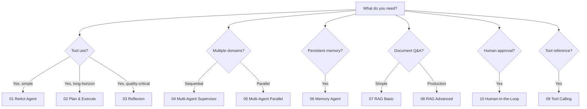

# Blueprints

Each blueprint is a **complete, runnable reference implementation** of an AI agent design pattern. They are self-contained: copy any single directory into your project and it works without touching the rest of the repository.

Every blueprint includes:
- Annotated **Mermaid architecture diagram** with design rationale
- **Python** implementation (Python 3.11+, managed with `uv`)
- **TypeScript** implementation (Node 20+, managed with `pnpm`)
- **Test suite** — unit + integration tests against a local LLM stub
- **Docker Compose** environment with all required backing services

---

## Scaffold any blueprint instantly

```bash
npx agent-blueprints@latest init
```

Or scaffold directly with flags:

```bash
# Blueprint 04 in TypeScript into ./my-supervisor-agent
npx agent-blueprints@latest init --blueprint 04 --lang typescript --out ./my-supervisor-agent
```

---

## All Blueprints

### 01 — ReAct Agent

**Complexity:** Beginner &nbsp;|&nbsp; **Pattern:** Orchestration

The foundational agentic pattern. The agent alternates between **Reason** (generating a thought about what to do next) and **Act** (executing a tool call), iterating until the task is complete or a stop condition is reached.

**When to use:** Any task requiring tool use with a small, bounded set of actions. Best starting point for anyone new to agent development.

[View Blueprint →](/blueprints/react-agent)

---

### 02 — Plan & Execute

**Complexity:** Intermediate &nbsp;|&nbsp; **Pattern:** Orchestration

Separates planning from execution using two distinct agents: a **Planner** that decomposes the user's goal into ordered steps, and an **Executor** that carries them out one at a time. The Planner can revise the plan mid-execution based on Executor feedback.

**When to use:** Long-horizon tasks where upfront decomposition improves reliability. Particularly effective for code generation, research, and data processing pipelines.

[View Blueprint →](/blueprints/plan-execute)

---

### 03 — Reflexion

**Complexity:** Intermediate &nbsp;|&nbsp; **Pattern:** Orchestration

Implements the **Reflexion** paper (Shinn et al., 2023). After each attempt the agent critiques its own output, stores the critique in a persistent scratchpad, and retries — iterating until the output passes a quality threshold or a maximum number of attempts is reached.

**When to use:** Tasks where output quality matters more than latency. Ideal for essay writing, code review, mathematical reasoning, and any domain with a clear correctness signal.

[View Blueprint →](/blueprints/reflexion)

---

### 04 — Multi-Agent Supervisor

**Complexity:** Intermediate &nbsp;|&nbsp; **Pattern:** Multi-agent

A **Supervisor** agent receives the user request, selects the most appropriate **Sub-Agent** (e.g. a researcher, a coder, a summariser), and delegates to it. Sub-agents report back to the Supervisor, which decides whether the task is complete or needs another delegation round.

**When to use:** Tasks that span multiple specialised domains. The Supervisor pattern keeps each sub-agent focused on a single capability while providing unified coordination.

[View Blueprint →](/blueprints/multi-agent-supervisor)

---

### 05 — Multi-Agent Parallel

**Complexity:** Intermediate &nbsp;|&nbsp; **Pattern:** Multi-agent

Fans out a task to **N agents running in parallel**, then aggregates their results. Uses an Aggregator agent to synthesise, de-duplicate, and reconcile the outputs into a single coherent response.

**When to use:** Tasks that can be decomposed into independent subtasks — e.g. analysing multiple documents simultaneously, running parallel web searches, or generating multiple candidate solutions to pick the best.

[View Blueprint →](/blueprints/multi-agent-parallel)

---

### 06 — Memory Agent

**Complexity:** Intermediate &nbsp;|&nbsp; **Pattern:** Memory

Extends a base ReAct agent with **four types of memory**:
- **In-context (short-term):** the current conversation window
- **External (long-term):** a vector store (Chroma) for semantic retrieval of past interactions
- **Episodic:** structured logs of past task executions
- **Semantic:** a knowledge graph of extracted facts

**When to use:** Assistants that need to remember user preferences, accumulated knowledge across sessions, or domain facts that exceed the context window.

[View Blueprint →](/blueprints/memory-agent)

---

### 07 — RAG Basic

**Complexity:** Beginner &nbsp;|&nbsp; **Pattern:** RAG

The canonical **Retrieval-Augmented Generation** pipeline: embed the user query → retrieve the top-K chunks from a vector store → prepend them to the prompt → generate. Minimal dependencies, easy to understand and extend.

**When to use:** Q&A over a private document corpus, knowledge base assistants, and as a stepping stone to the more sophisticated RAG Advanced blueprint.

[View Blueprint →](/blueprints/rag-basic)

---

### 08 — RAG Advanced

**Complexity:** Advanced &nbsp;|&nbsp; **Pattern:** RAG

Production-grade RAG with:
- **Query decomposition** — complex questions split into sub-queries
- **Hybrid retrieval** — dense (embedding) + sparse (BM25) fusion via Reciprocal Rank Fusion
- **Cross-encoder re-ranking** — top-K candidates rescored for precision
- **Self-correction** — retrieved context validated for relevance before generation
- **Semantic caching** — repeated or similar queries served from cache

**When to use:** Production document Q&A systems where accuracy, latency, and cost all matter. Replace individual components as your infrastructure evolves.

[View Blueprint →](/blueprints/rag-advanced)

---

### 09 — Tool Calling

**Complexity:** Beginner &nbsp;|&nbsp; **Pattern:** Tools

A focused deep-dive into **structured tool use**: defining tools with JSON Schema, handling parallel tool calls, implementing retries with exponential backoff, and gracefully recovering from tool errors. Includes examples of built-in tools (web search, code execution) and custom tools.

**When to use:** As a standalone reference for tool integration patterns, or as a component of any other blueprint.

[View Blueprint →](/blueprints/tool-calling)

---

### 10 — Human-in-the-Loop

**Complexity:** Intermediate &nbsp;|&nbsp; **Pattern:** Control Flow

Extends a base agent with **checkpoints** where execution pauses and waits for a human to approve, reject, or provide additional input before proceeding. Implements durable execution using a state machine so interrupted workflows can be resumed across process restarts.

**When to use:** Any agentic workflow where full automation is not yet trusted — e.g. financial transactions, infrastructure changes, content publishing, or high-stakes decisions.

[View Blueprint →](/blueprints/human-in-the-loop)

---

## Choosing the right blueprint



## Complexity reference

| Level | Description | Typical setup time |
|-------|-------------|-------------------|
| **Beginner** | Single-agent, minimal dependencies, ideal starting point | < 15 minutes |
| **Intermediate** | Multi-step reasoning, external state, or agent coordination | 30–60 minutes |
| **Advanced** | Production-scale: caching, re-ranking, hybrid retrieval, observability | 1–3 hours |
