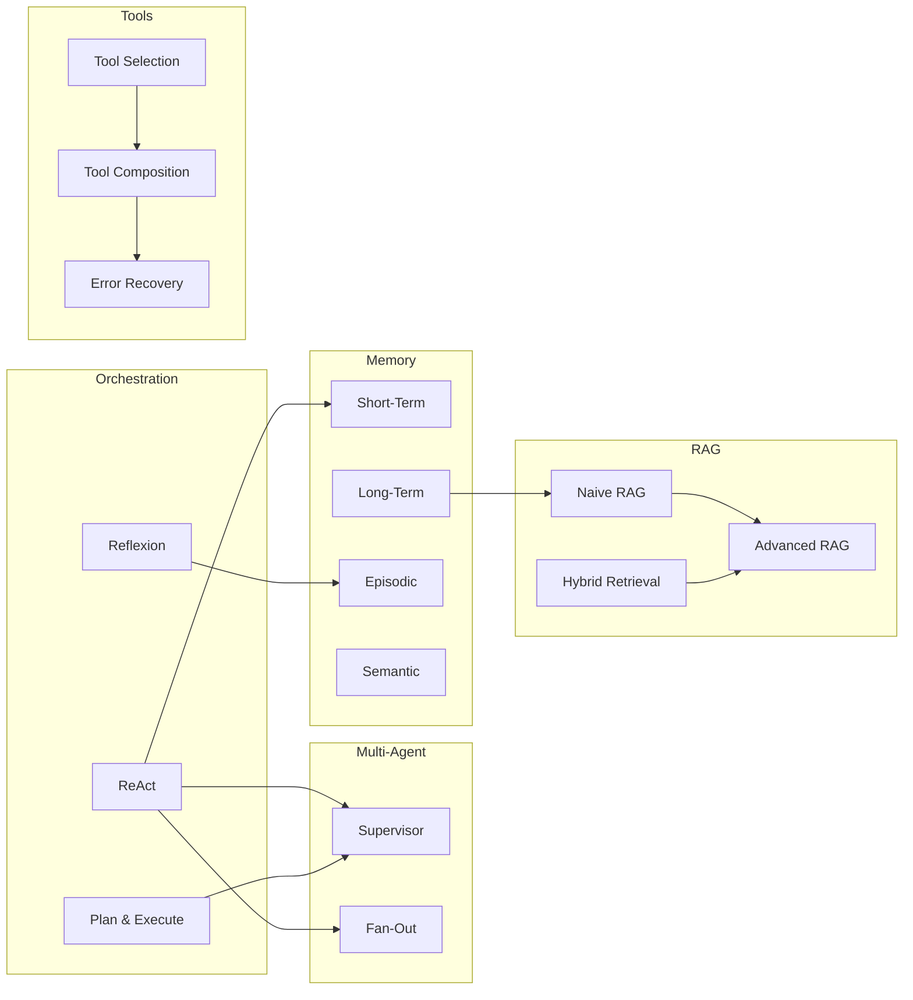

# Patterns

Patterns are the **conceptual building blocks** behind each blueprint. Where a Blueprint is a complete runnable implementation, a Pattern guide explains:

- **What it is** — the core idea and intuition
- **When to use it** — the problems it solves and the conditions where it excels
- **Trade-offs** — latency, cost, complexity, and reliability considerations
- **Variations** — common adaptations and how to combine it with other patterns
- **Pitfalls** — what goes wrong and how to avoid it

---

## Pattern Categories

### Orchestration Patterns

Orchestration patterns control **how an agent decides what to do next**. They govern the agent's reasoning loop, planning horizon, and self-correction behaviour.

| Pattern | Summary | Best for |
|---------|---------|---------|
| [ReAct Loop](/patterns/orchestration/react-loop) | Interleave reasoning traces with tool calls in a tight loop | General-purpose tool-using agents |
| [Plan & Execute](/patterns/orchestration/plan-execute) | Separate upfront planning from step-by-step execution | Long-horizon, multi-step tasks |
| [Reflexion Loop](/patterns/orchestration/reflexion-loop) | Self-critique and iterative retry until quality threshold | Quality-critical outputs |
| [Chain-of-Thought](/patterns/orchestration/chain-of-thought) | Explicit intermediate reasoning steps before the final answer | Complex reasoning without tool use |

Orchestration patterns are the foundation of every blueprint. Even the multi-agent blueprints use an orchestration pattern internally in each sub-agent.

[Explore Orchestration Patterns →](/patterns/orchestration/react-loop)

---

### Multi-Agent Patterns

Multi-agent patterns define **how multiple agents are structured and how they communicate**. They become necessary when a single agent cannot hold all required context, when specialisation improves quality, or when parallelism reduces latency.

| Pattern | Summary | Best for |
|---------|---------|---------|
| [Supervisor](/patterns/multi-agent/supervisor) | Central coordinator delegates to specialised sub-agents | Tasks spanning multiple capability domains |
| [Parallel Fan-Out](/patterns/multi-agent/parallel-fan-out) | Task fanned out to N agents concurrently, results aggregated | Independent subtasks where latency matters |
| [Peer-to-Peer](/patterns/multi-agent/peer-to-peer) | Agents communicate directly without a central coordinator | Negotiation, debate, and collaborative refinement |

:::tip When to introduce multiple agents
A second agent is only warranted when the task genuinely benefits from specialisation or parallelism. A well-prompted single agent with a clear tool set will outperform a poorly orchestrated multi-agent system every time. Start with Blueprint 01 (ReAct) and reach for multi-agent only when you hit a clear ceiling.
:::

[Explore Multi-Agent Patterns →](/patterns/multi-agent/supervisor)

---

### Memory Patterns

Memory patterns control **what the agent remembers, how it stores information, and how it retrieves it**. LLM context windows are finite and expensive; memory patterns let agents operate effectively across sessions, documents, and time.

| Pattern | Summary | Best for |
|---------|---------|---------|
| [Short-Term Memory](/patterns/memory/short-term) | In-context conversation window with summarisation | Within-session continuity |
| [Long-Term Memory](/patterns/memory/long-term) | Persistent vector store for cross-session recall | User personalisation, accumulated knowledge |
| [Episodic Memory](/patterns/memory/episodic) | Structured logs of past task executions | Learning from past successes and failures |
| [Semantic Memory](/patterns/memory/semantic) | Knowledge graph of extracted facts and relationships | Structured domain knowledge, entity tracking |

Memory patterns are orthogonal to orchestration and can be layered on top of any blueprint. Blueprint 06 (Memory Agent) demonstrates all four types working together.

[Explore Memory Patterns →](/patterns/memory/short-term)

---

### Tool Patterns

Tool patterns define **how an agent discovers, selects, calls, and recovers from tool use**. As the number of available tools grows, naive tool selection degrades — these patterns keep tool use reliable at scale.

| Pattern | Summary | Best for |
|---------|---------|---------|
| [Tool Selection](/patterns/tools/tool-selection) | Dynamic selection from a large tool registry | Agents with 10+ available tools |
| [Tool Composition](/patterns/tools/tool-composition) | Chaining multiple tools into compound operations | Complex workflows requiring multiple steps |
| [Error Recovery](/patterns/tools/error-recovery) | Retry strategies, fallbacks, and graceful degradation | Production reliability |

Blueprint 09 (Tool Calling) provides a focused deep-dive into all three tool patterns with runnable examples.

[Explore Tool Patterns →](/patterns/tools/tool-selection)

---

### RAG Patterns

Retrieval-Augmented Generation patterns govern **how an agent accesses external knowledge**. They range from the simplest embed-retrieve-generate pipeline to sophisticated systems with query decomposition, hybrid retrieval, and self-correction.

| Pattern | Summary | Best for |
|---------|---------|---------|
| [Naive RAG](/patterns/rag/naive-rag) | Embed → retrieve top-K → generate | Prototypes, small corpora |
| [Advanced RAG](/patterns/rag/advanced-rag) | Hybrid retrieval + re-ranking + self-correction | Production document Q&A |
| [Agentic RAG](/patterns/rag/agentic-rag) | Agent controls retrieval strategy dynamically | Complex multi-hop questions |
| [Hybrid Retrieval](/patterns/rag/hybrid-retrieval) | Dense + sparse retrieval fused via RRF | High-precision recall |

Blueprints 07 and 08 implement Naive RAG and Advanced RAG respectively. Agentic RAG will be covered in the upcoming Blueprint 13.

[Explore RAG Patterns →](/patterns/rag/naive-rag)

---

## Pattern Relationships

Patterns compose naturally. The diagram below shows how the patterns used across the 10 blueprints relate to each other:

---

## How to read a pattern guide

Each pattern guide follows the same structure:

1. **Overview** — one-paragraph summary of the pattern
2. **Intuition** — the core idea explained without jargon
3. **Architecture** — annotated Mermaid diagram
4. **When to use** — the conditions that make this pattern a good fit
5. **Trade-offs** — an honest table of pros, cons, and cost/latency implications
6. **Variations** — common adaptations with links to relevant blueprints
7. **Implementation notes** — key implementation decisions and gotchas
8. **Pitfalls** — what commonly goes wrong and how to avoid it
9. **Further reading** — papers, blog posts, and related blueprints

---

## Contributing a new pattern

If you have identified a pattern that is not covered here, we welcome contributions. Read the [Contributing Guide](https://github.com/anthropics/agent-blueprints/blob/main/CONTRIBUTING.md) and open an issue using the **New Blueprint** template — new patterns typically accompany a new blueprint.
