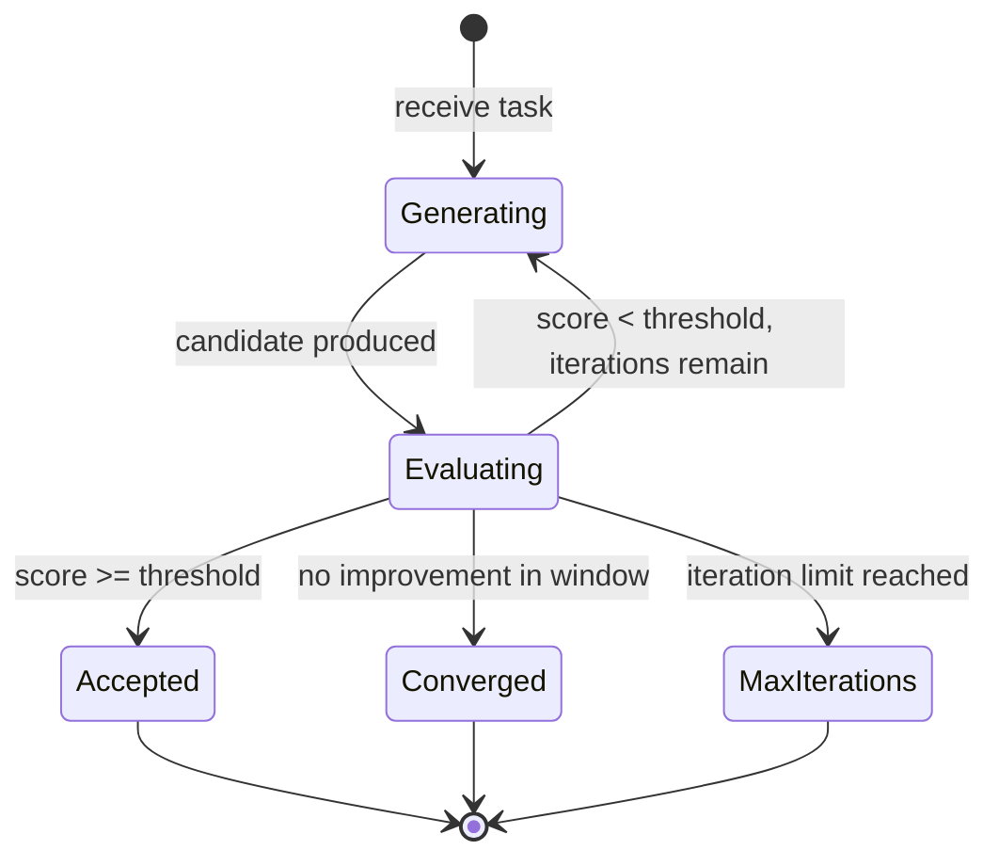

# Evaluator-Optimizer — Implementation

Pseudocode, interfaces, state management, and testing strategy for building a generate-evaluate loop.

## Core Interfaces

```
EvaluationResult:
  score: float                           // 0.0–1.0
  feedback: string                       // Actionable improvement suggestions
  dimensions: map of string → float      // Optional per-criterion scores
  passed: boolean                        // score >= threshold

Attempt:
  iteration: integer
  output: any
  evaluation: EvaluationResult

OptimizeConfig:
  generator_prompt: string
  evaluator_prompt: string
  threshold: float                       // Acceptance score (default: 0.8)
  max_iterations: integer                // Default: 3
  convergence_window: integer            // Iterations to check for convergence (default: 2)
  convergence_min_improvement: float     // Min score improvement to not be "converged" (default: 0.05)
```

## Core Pseudocode

### optimize

```
function optimize(task, config):
  history = []
  best = {score: -1, output: null, iteration: 0}

  for i in 1..config.max_iterations:
    // Generate
    if i == 1:
      candidate = generate_initial(task, config)
    else:
      previous = history[history.length - 1]
      candidate = generate_revision(task, previous, config)

    // Evaluate
    evaluation = evaluate(candidate, task, config)

    // Track
    attempt = {iteration: i, output: candidate, evaluation: evaluation}
    history.append(attempt)

    // Update best
    if evaluation.score > best.score:
      best = {score: evaluation.score, output: candidate, iteration: i}

    // Check acceptance
    if evaluation.passed:
      return {
        status: "accepted",
        output: best.output,
        iterations: i,
        final_score: best.score,
        history: history
      }

    // Check convergence
    if i >= config.convergence_window and is_converged(history, config):
      return {
        status: "converged",
        output: best.output,
        iterations: i,
        final_score: best.score,
        history: history
      }

  return {
    status: "max_iterations",
    output: best.output,
    iterations: config.max_iterations,
    final_score: best.score,
    history: history
  }
```

### generate_initial

```
function generate_initial(task, config):
  response = call_llm(
    system: config.generator_prompt,
    message: task
  )
  return response.text
```

### generate_revision

```
function generate_revision(task, previous_attempt, config):
  response = call_llm(
    system: config.generator_prompt,
    message: "Task: " + task +
             "\n\nYour previous attempt:\n" + previous_attempt.output +
             "\n\nFeedback on your attempt:\n" + previous_attempt.evaluation.feedback +
             "\n\nScore: " + previous_attempt.evaluation.score +
             "\n\nPlease revise your output to address the feedback."
  )
  return response.text
```

### evaluate

```
function evaluate(candidate, task, config):
  response = call_llm(
    system: config.evaluator_prompt,
    message: "Task: " + task +
             "\n\nOutput to evaluate:\n" + candidate +
             "\n\nScore from 0.0 to 1.0 and provide specific feedback." +
             "\nReturn JSON: {\"score\": float, \"feedback\": string, \"dimensions\": {}}"
  )

  result = parse_json(response.text)
  result.passed = result.score >= config.threshold
  return result
```

### is_converged

```
function is_converged(history, config):
  if history.length < config.convergence_window:
    return false

  recent = history[-(config.convergence_window):]
  scores = [a.evaluation.score for a in recent]

  // Check if scores are improving
  max_improvement = max(scores) - min(scores)
  return max_improvement < config.convergence_min_improvement
```

## State Management

```
OptimizerState:
  task: string
  history: list of Attempt
  best: {score, output, iteration}
  current_iteration: integer
  status: "running" | "accepted" | "converged" | "max_iterations"
```



## Prompt Engineering Notes

### Generator Prompt

```
System:
You are generating high-quality output for a task.
When revising, carefully address each point in the feedback.
Do not start from scratch — improve your previous attempt.
Focus on the specific issues identified.
```

### Evaluator Prompt

```
System:
You evaluate output quality against these criteria:
1. Completeness — Does it address all aspects of the task?
2. Accuracy — Is the information correct?
3. Clarity — Is it well-organized and easy to understand?
4. Relevance — Does it stay focused on the task?

Score from 0.0 to 1.0 where:
  0.0-0.3: Major issues, fundamental problems
  0.4-0.6: Partially meets criteria, significant room for improvement
  0.7-0.8: Good quality with minor issues
  0.9-1.0: Excellent, meets all criteria

Provide specific, actionable feedback. Don't just say "improve quality" —
say exactly what needs to change and how.

Return JSON: {"score": float, "feedback": "specific feedback", "dimensions": {"completeness": float, ...}}
```

### Key Principles
- **Evaluator specificity matters most.** Vague feedback produces vague improvements.
- **Generator must use feedback.** Prompt must instruct it to revise, not regenerate.
- **Evaluator consistency.** Use low temperature (0.0–0.2) for evaluator to reduce score variance.
- **Calibration.** Test the evaluator on known-quality examples before running the loop.

## Testing Strategy

### Evaluator Tests
- Provide known-good output → verify high score
- Provide known-bad output → verify low score
- Provide same output twice → verify consistent score (low variance)
- Verify feedback is specific and actionable

### Generator Tests
- Provide feedback → verify revision addresses it
- Verify generator doesn't regress (output should improve or stay stable)
- Test initial generation quality

### Loop Tests
- Stub generator and evaluator → verify correct iteration count
- Test convergence detection with plateauing scores
- Test that best-so-far tracker returns the best, not the last
- Test max_iterations boundary

### Regression Tests
- Verify later iterations don't produce worse output than earlier ones (check best-so-far)
- Track score trajectories across evaluation test sets

## Common Pitfalls

### Oscillating Scores
**Problem:** Score bounces between 0.6 and 0.7 without converging. Generator fixes one issue, breaks another.
**Fix:** Track score variance. If variance exceeds a threshold over the convergence window, stop and return best-so-far.

### Evaluator Gaming
**Problem:** Generator learns superficial patterns that satisfy the evaluator without genuine quality improvement. Example: adding keywords the evaluator looks for.
**Fix:** Use diverse evaluation criteria. Include dimension scores. Periodically validate with human review.

### False Convergence
**Problem:** Scores plateau at a low value (e.g., 0.4). The system stops because there's no improvement, but quality is still poor.
**Fix:** Separate convergence detection from minimum quality. If converged below the threshold, flag it as "converged at low quality" — don't silently return bad output.

### Over-Iteration
**Problem:** Running 5+ iterations when improvement stopped at iteration 2.
**Fix:** Default to max_iterations = 3. Monitor score improvement per iteration. If iteration 2→3 improvement is less than 0.05, iteration 3→4 will likely be negligible.

### Evaluator Inflation
**Problem:** Evaluator gives 0.85+ to mediocre output. Threshold is met on first attempt, no optimization happens.
**Fix:** Calibrate threshold against labeled examples. Start with a higher threshold (0.9) and lower if needed.

## Migration Paths

### From Single Generation
If you have a generate-only system:
1. Write an evaluation prompt
2. Run on sample outputs to calibrate scoring
3. Add the optimization loop with max_iterations = 2
4. Measure quality improvement

### To Reflection
When the generator should evaluate its own output:
1. Merge generator and evaluator into a single agent with self-critique instructions
2. Replace structured score with rich self-analysis
3. See [Reflection evolution](../../patterns/reflection/evolution.md)
