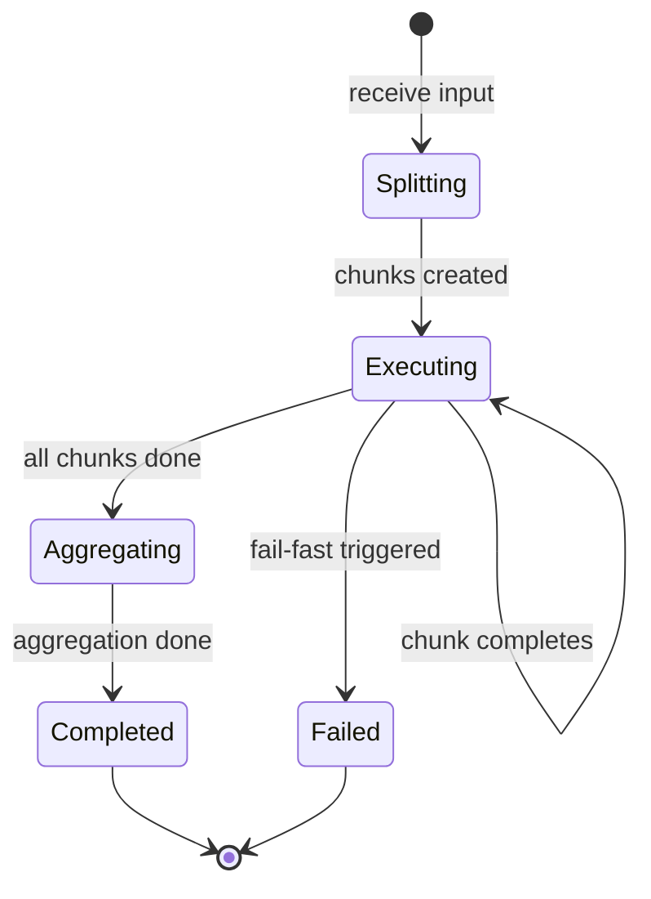

# Parallel Calls — Implementation

Pseudocode, interfaces, state management, and testing strategy for building a fan-out/fan-in workflow.

## Core Interfaces

```
SplitResult:
  chunks: list of {id: string, data: any}

ExecutorResult:
  chunk_id: string
  status: "success" | "error"
  output: any
  error: string or null
  latency_ms: integer

AggregateConfig:
  strategy: "concatenate" | "merge" | "summarize" | "vote" | "rank" | "custom"
  custom_aggregator: function(results) → output   // Used when strategy = "custom"
  summarize_prompt: string or null                 // Used when strategy = "summarize"

ParallelConfig:
  max_concurrency: integer             // Max simultaneous LLM calls (default: 5)
  failure_mode: "fail_fast" | "best_effort" | "retry_then_continue"
  max_retries_per_chunk: integer       // Default: 1
  timeout_ms: integer                  // Per-executor timeout
```

## Core Pseudocode

### parallel_execute

```
function parallel_execute(input, splitter, prompt, aggregate_config, config):
  // Split
  split = splitter(input)
  chunks = split.chunks

  // Fan-out with bounded concurrency
  results = bounded_parallel_map(
    items: chunks,
    max_concurrency: config.max_concurrency,
    executor: function(chunk):
      return execute_chunk(chunk, prompt, config)
  )

  // Check failure mode
  failures = [r for r in results if r.status == "error"]
  if config.failure_mode == "fail_fast" and failures.length > 0:
    return {status: "failed", errors: failures}

  successes = [r for r in results if r.status == "success"]
  if successes.length == 0:
    return {status: "failed", error: "All chunks failed"}

  // Fan-in
  output = aggregate(successes, aggregate_config)
  return {
    status: "success",
    output: output,
    stats: {total: chunks.length, succeeded: successes.length, failed: failures.length}
  }
```

### execute_chunk

```
function execute_chunk(chunk, prompt, config):
  start_time = now()

  for attempt in 1..(config.max_retries_per_chunk + 1):
    try:
      response = call_llm(
        prompt: prompt.replace("{chunk}", chunk.data),
        timeout: config.timeout_ms
      )
      return {
        chunk_id: chunk.id,
        status: "success",
        output: response.text,
        latency_ms: now() - start_time
      }
    catch error:
      if attempt == config.max_retries_per_chunk + 1:
        return {
          chunk_id: chunk.id,
          status: "error",
          error: error.message,
          latency_ms: now() - start_time
        }
      // Retry with backoff
      wait(attempt * 1000)
```

### bounded_parallel_map

```
function bounded_parallel_map(items, max_concurrency, executor):
  results = []
  semaphore = create_semaphore(max_concurrency)

  parallel for item in items:
    semaphore.acquire()
    result = executor(item)
    results.append(result)
    semaphore.release()

  return results
```

### aggregate

```
function aggregate(results, config):
  // Sort by chunk_id to maintain original order
  sorted = sort_by(results, "chunk_id")

  if config.strategy == "concatenate":
    return join([r.output for r in sorted], "\n\n")

  if config.strategy == "merge":
    merged = {}
    for r in sorted:
      merged = deep_merge(merged, parse_json(r.output))
    return merged

  if config.strategy == "summarize":
    combined = join([r.output for r in sorted], "\n---\n")
    return call_llm(
      prompt: config.summarize_prompt.replace("{results}", combined)
    ).text

  if config.strategy == "vote":
    // Count occurrences of each answer, return most common
    return majority_vote([r.output for r in sorted])

  if config.strategy == "custom":
    return config.custom_aggregator(sorted)
```

## State Management

```
ParallelState:
  chunks: list of {id, data}
  pending: set of chunk_ids
  completed: list of ExecutorResult
  failed: list of ExecutorResult
  start_time: timestamp
```



## Prompt Engineering Notes

### Data-Parallel Prompt
One prompt reused for each chunk:
```
System: Analyze the following text segment. Extract key themes, entities, and sentiment.
Return as JSON: {"themes": [...], "entities": [...], "sentiment": "positive"|"negative"|"neutral"}

User: {chunk}
```

### Task-Parallel Prompts
Different prompts for the same input:
```
// Sentiment prompt:
System: Determine the sentiment of this text. Return: {"sentiment": "...", "confidence": 0.0-1.0}

// Entity prompt:
System: Extract all named entities. Return: {"people": [...], "orgs": [...], "locations": [...]}

// Summary prompt:
System: Summarize this text in 2-3 sentences.
```

### Aggregation Prompt (for summarize strategy)
```
System: Synthesize these analysis results into a single coherent report.
Each section below is an independent analysis of a portion of the input.
Combine them without losing key details, resolving any minor inconsistencies.

User: {results}
```

## Testing Strategy

### Unit Tests

**Splitter tests:**
- Verify correct chunk count for known inputs
- Verify chunks are independent (no cross-references)
- Verify chunk IDs are unique

**Aggregator tests:**
- Test each strategy with known result sets
- Test with partial results (some failures)
- Test ordering is maintained

### Integration Tests

**Full pipeline tests:**
- Stub all LLM calls with predetermined responses
- Verify end-to-end flow: split → execute → aggregate
- Verify concurrency limit is respected (use timing assertions)

**Failure mode tests:**
- Fail one chunk → verify fail-fast aborts
- Fail one chunk → verify best-effort continues
- Fail one chunk → verify retry-then-continue retries first

### Load Tests

- Verify the system handles N chunks without exceeding concurrency limits
- Verify rate limiting doesn't cause cascading failures

## Common Pitfalls

### Unbounded Concurrency
**Problem:** Sending all chunks simultaneously overwhelms the API with rate limit errors.
**Fix:** Always use bounded concurrency. Start with 5–10 and adjust based on API limits.

### Inconsistent Results
**Problem:** Parallel LLM calls on similar data produce inconsistent outputs (different formats, conflicting answers).
**Fix:** Use lower temperature for consistency. Add format validation per chunk. For critical consistency, use voting.

### Order Dependence
**Problem:** Aggregation assumes ordered results, but parallel execution completes out of order.
**Fix:** Always tag results with chunk_id and sort before aggregation.

### Aggregation Bottleneck
**Problem:** Summarization aggregation (LLM call on all results) chokes on large result sets.
**Fix:** Hierarchical aggregation — first aggregate pairs, then aggregate aggregates.

### Partial Failure Confusion
**Problem:** Best-effort mode returns partial results, but the consumer doesn't know what's missing.
**Fix:** Always return stats (succeeded/failed counts) alongside the output. Let the consumer decide if partial results are acceptable.

## Migration Paths

### From Sequential Processing
If you're processing items one at a time:
1. Verify that items are independent (no inter-item dependencies)
2. Wrap the existing per-item logic as an executor
3. Add a splitter and aggregator
4. Start with max_concurrency = 3 and increase

### To RAG
When you add a retrieval step before the parallel execution, you're building toward [RAG](../../patterns/rag/overview.md):
1. The "splitter" becomes a query generator
2. The "executors" become retrieval queries
3. The "aggregator" becomes context assembly + generation
